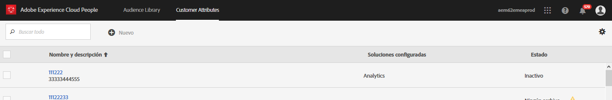
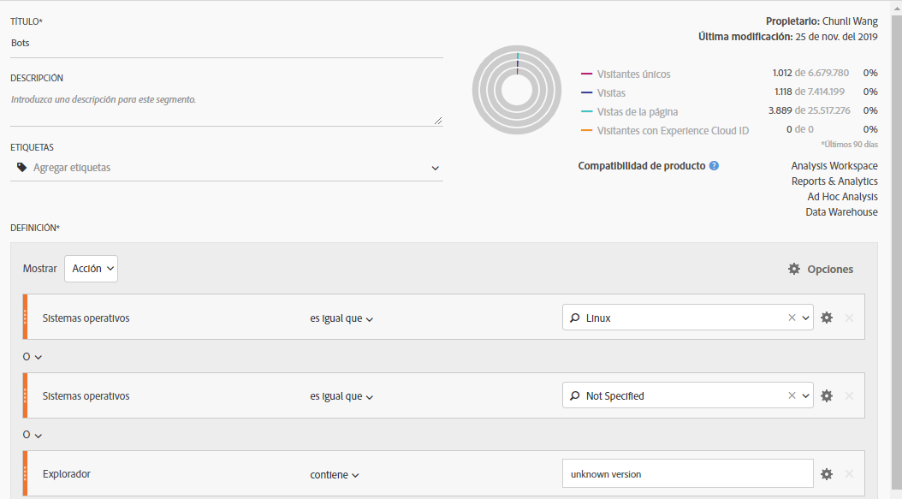
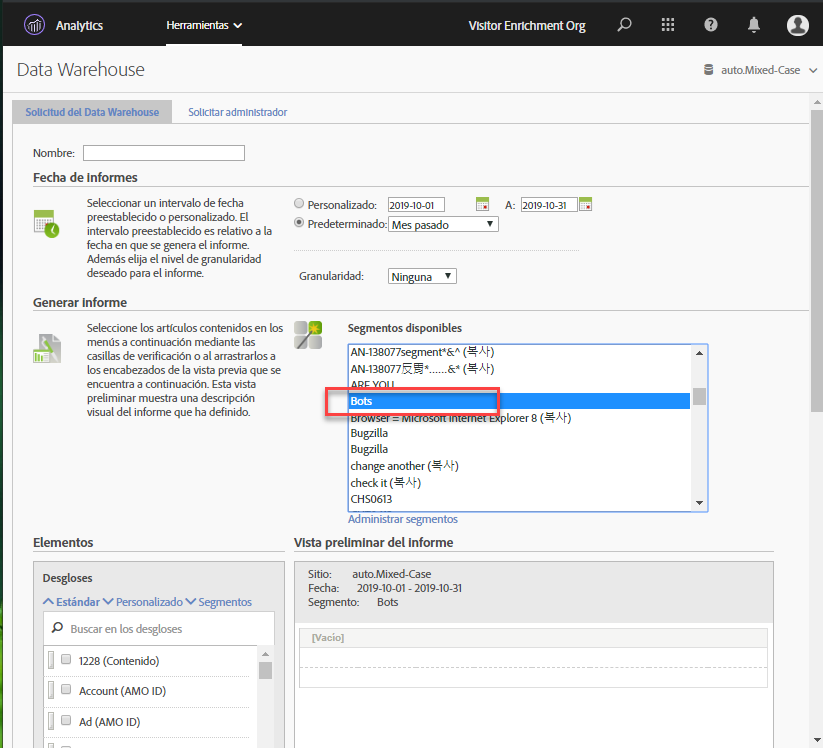
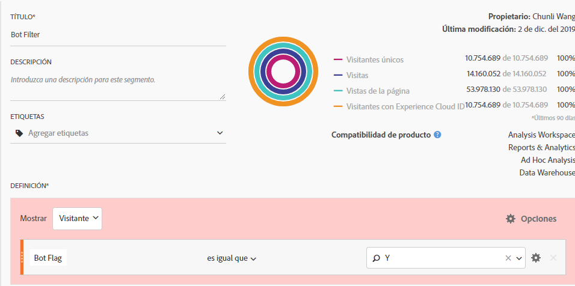
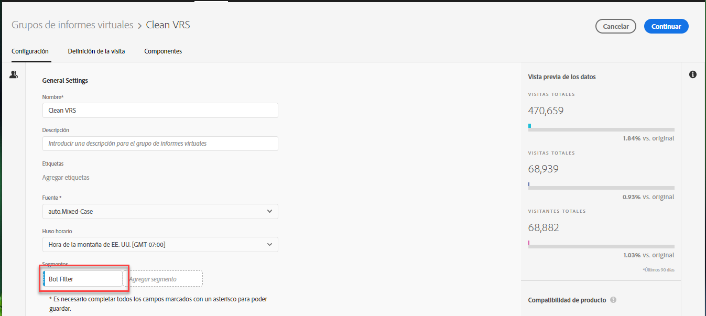

# Eliminación de bots en Adobe Analytics

En Adobe Analytics, tiene varias opciones para eliminar el tráfico de bots de los informes:

## Usar reglas de bots

Los métodos de filtrado de bots estándar y personalizados se admiten en **[!UICONTROL Analytics]** > **[!UICONTROL Administración]** > **[!UICONTROL Grupos de informes]** > **[!UICONTROL Editar configuración]** > **[!UICONTROL General]** > **[!UICONTROL Reglas de bots]**:

| Tipo de regla | Descripción |
|--- |--- |
| Reglas de bots estándar IAB | Al seleccionar **[!UICONTROL Activar las reglas de filtrado de bots de la IAB]**, se utiliza la Lista internacional de arañas web y bots de la [IAB](https://www.iab.com/) (International Advertising Bureau&#39;s) para eliminar el tráfico de bots. La mayoría de los clientes selecciona esta opción como mínimo. |
| Reglas de bots personalizadas | Puede definir y agregar reglas de bots personalizadas basadas en agentes de usuario, direcciones IP o intervalos de IP. |

Para obtener más información, consulte [Descripción general de las reglas de bots](/help/admin/admin/bot-removal/bot-rules.md).

## Utilice el complemento [!UICONTROL websiteBot] para identificar los bots

El complemento [!UICONTROL websiteBot] le permite identificar dinámicamente si los visitantes de escritorio son bots. Puede utilizar estos datos para aumentar la precisión en todos los tipos de creación de informes, lo que le permite medir mejor el tráfico legítimo del sitio.

Este plug-in realiza dos comprobaciones:

* En primer lugar, determina si el dispositivo es de escritorio o móvil usando la variable navigator.UserAgent . Los dispositivos móviles se ignoran.
* Si es un dispositivo de escritorio, agrega un detector de evento para el movimiento del ratón.

Para obtener más información, consulte la [Guía de implementación de Adobe Analytics](https://experienceleague.adobe.com/docs/analytics/implementation/vars/plugins/websitebot.html).

## Uso de una combinación de Herramientas de Adobe

Además, como los bots cambian rápidamente, Adobe ofrece otras funciones útiles que, combinadas correctamente y de forma regular, pueden ayudar a eliminar estos enemigos de la calidad de los datos. Estas funciones son: Servicio de Experience Cloud ID, Segmentación, Data Warehouse, Atributos del cliente y Grupos de informes virtuales. A continuación se muestra una descripción general de cómo puede utilizar estas herramientas.

### Paso 1: Pase el Experience Cloud ID de sus visitantes a un ID declarado nuevo

Para empezar, cree un nuevo ID declarado en el [Servicio principal People](https://experienceleague.adobe.com/docs/core-services/interface/audiences/audience-library.html). Pase el ID de Experience Cloud del visitante a este nuevo ID declarado, que se puede hacer rápida y fácilmente con [Adobe Experience Platform Launch](https://experienceleague.adobe.com/docs/launch/using/extensions-ref/adobe-extension/id-service-extension/overview.html). Usemos el nombre “ECID” para el ID declarado.



A continuación, se muestra cómo que se puede capturar este ID mediante el elemento de datos. Asegúrese de rellenar correctamente el identificador de organización del Experience Cloud en el elemento de datos.

```return Visitor.getInstance("REPLACE_WITH_YOUR_ECORG_ID@AdobeOrg").getExperienceCloudVisitorID();```

Una vez configurado este elemento de datos, siga [estas instrucciones](https://experienceleague.adobe.com/docs/launch/using/extensions-ref/adobe-extension/id-service-extension/overview.html) para pasar los ID declarados a la herramienta ECID en Adobe Launch.

### Paso 2: Use la segmentación para identificar bots

Ahora que el ECID de su visitante se ha pasado a un ID declarado, puede utilizar la [segmentación en Analysis Workspace](https://docs.adobe.com/content/help/es-ES/analytics/analyze/analysis-workspace/components/t-freeform-project-segment.html) para identificar a los visitantes que actúan como bots. Los bots suelen definirse por su comportamiento: visitas de acceso único, agentes de usuario inusuales, información desconocida sobre dispositivos y exploradores, sin referentes, visitantes nuevos, páginas de aterrizaje inusuales, etc. Utilice los capacidades de los desgloses y la segmentación de Workspace para identificar los bots que han evadido el filtrado de IAB y las reglas de bots del grupo de informes. Por ejemplo: a continuación se muestra una captura de pantalla de un segmento que puede usar:



### Paso 3: Exporte todos los [!DNL Experience Cloud IDs] desde el segmento a través de Data Warehouse

Ahora que ha identificado los bots mediante segmentos, el siguiente paso es utilizar la Data Warehouse para extraer todos los ID de Experience Cloud asociados a este segmento. Esta captura de pantalla muestra cómo debe configurar su solicitud de [Data Warehouse](/help/export/data-warehouse/data-warehouse.md):



Recuerde usar el ID de visitante de Experience Cloud como dimensión y aplicar el segmento &quot;Bots&quot;.

### Paso 4: Devuelva esta lista a Adobe como atributo de cliente

Una vez que llega el informe de Data Warehouse, tiene una lista de ECID que debe filtrarse a partir de los datos históricos. Copie y pegue estos ECID en un archivo .CSV en blanco con solo dos columnas, ECID e Indicador de bots.

* **ECID**: Asegúrese de que el encabezado de esta columna coincide con el nombre que dio al nuevo ID declarado anterior.
* **Indicador de bots**: Agregue &quot;Indicador de bots&quot; como dimensión de esquema de atributo de cliente.

Utilice este archivo .CSV como archivo de importación de atributos del cliente y, a continuación, suscriba los grupos de informes al atributo del cliente como se describe en esta [publicación de blog](https://theblog.adobe.com/link-digital-behavior-customers).


### Paso 5: Cree un segmento que aproveche el nuevo atributo de cliente

Una vez que el conjunto de datos se haya procesado e integrado en Analysis Workspace, cree otro segmento que aproveche la nueva dimensión de atributos del cliente &quot;Indicador de bots&quot; y un contenedor [!UICONTROL Excluir]:



### Paso 6: Utilice este segmento como filtro de grupo de informes virtuales

Finalmente, cree un [grupo de informes virtuales](/help/components/vrs/vrs-about.md) que utilice este segmento para filtrar los bots identificados:



Este grupo de informes virtuales recién segmentado ahora resultará en un conjunto de datos más limpio, con los bots identificados eliminados.

### Paso 7: Repita los pasos 2, 3 y 4 con regularidad

Configure al menos un recordatorio mensual para identificar y filtrar nuevos bots, tal vez antes de un análisis programado regularmente.
