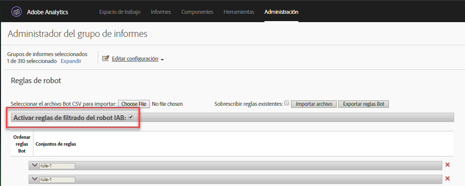

# Resumen sobre reglas Bot

Las reglas de bots permiten eliminar el tráfico del grupo de informes generado por arañas y bots conocidos. Al eliminar el tráfico de bots, la medición de la actividad de los usuarios en el sitio web es más exacta.

Una vez definidas las reglas de bots, todo el tráfico entrante se compara con las reglas definidas. El tráfico que coincida con alguna de estas reglas no se recogerá en el grupo de informes ni se incluirá en las métricas de tráfico.

To update or upload bot rules, navigate to **[!UICONTROL Analytics]** &gt; **[!UICONTROL Admin]** &gt; **[!UICONTROL Report Suites]**. Select the correct Report Suite, and then go to **[!UICONTROL Edit Settings]** &gt; **[!UICONTROL General]** &gt; **[!UICONTROL Bot Rules]**.

Por lo general, al eliminar el tráfico de bots se reduce el volumen de las métricas de conversión y tráfico. Muchos clientes consideran que eliminar el tráfico de bots provoca tasas de conversión superiores y aumenta otras métricas de uso. Antes de eliminar el tráfico de bots, es necesario ponerse en contacto con los interesados para asegurarse de que realicen los ajustes necesarios en los indicadores de rendimiento clave con relación a este cambio. Si es posible, recomendamos eliminar primero el tráfico de bots de un grupo de informes pequeño para así realizar una estimación del impacto potencial.

Los datos del tráfico de bots se almacenan en un repositorio independiente para mostrarlos en los informes Bots y Páginas de bots. Existen dos opciones para activar el filtrado de bots:

| Tipo de regla | Descripción |
|--- |--- |
| Reglas de bots estándar de IAB | Al seleccionar [!UICONTROL Habilitar reglas] de filtrado para bots de IAB, se utiliza la [lista internacional de bots y arañas de Web de IAB](https://www.iab.com) (International Advertising Bureau's International Advertising Bureau) para eliminar el tráfico de bots. La mayoría de los clientes selecciona esta opción como mínimo. |
| Reglas de bots personalizadas | Puede definir y agregar reglas de bots personalizadas basadas en agentes de usuario, direcciones IP o intervalos IP. |

## Reglas de bots estándar de IAB

Las reglas de bots estándar de IAB se pueden activar marcando la [!UICONTROL casilla Activar reglas] de filtrado de bots de IAB. Esta selección eliminará bots de la lista internacional de bots y arañas de Web de IAB (International Advertising Bureau's International Advertising Bureau) para eliminar el tráfico de bots. La IAB actualiza esta lista mensualmente.



Adobe no puede proporcionar la lista detallada de bots de la IAB a los clientes, pero se puede usar el informe de bots para ver una lista de los bots que han accedido a un sitio. Para enviar un bot a la lista de IAB, visite [IAB](https://www.iab.com).

## Reglas de bots personalizadas

>[!Note]
>La interfaz de usuario permite definir 500 reglas manualmente. Una vez alcanzado este límite, las reglas deben gestionarse de forma masiva mediante las opciones de Importar archivo y Exportar reglas de bots.

Las reglas de bots personalizadas permiten filtrar el tráfico en función de las condiciones definidas.

Las reglas de bots personalizadas se definen usando los tipos de condición siguientes:

* Agente de usuario
* Dirección IP
* Rango IP

Para una sola regla se pueden definir varias condiciones. Las diversas condiciones se comparan usando “or”. Por ejemplo, si proporciona un valor para agente de usuario y dirección IP, el tráfico se considera tráfico de bots si se cumple cualquiera de las condiciones.

### Agente de usuario

Una condición de agente de usuario comprueba el valor de agente de usuario para ver si **[!UICONTROL comienza con]** o **contiene]la cadena especificada.[!UICONTROL ** Si se selecciona **[!UICONTROL contiene], la subcadena se hace coincidir si tiene lugar en cualquier parte del agente de usuario.**

Se pueden incluir valores opcionales en la lista **[!UICONTROL no contiene]para definir valores que el agente de usuario no debe contener para que la coincidencia tenga éxito.** Se pueden especificar varios valores incluyendo un valor por línea. Si el agente de usuario cumple con los criterios especificados en la cadena de coincidencia, pero además contiene una cadena en la lista “no contiene”, no se considerará una coincidencia.

El campo **[!UICONTROL contiene]está limitado a 100 caracteres.** La lista no contiene está limitada a 255 caracteres menos un carácter separador para cada línea nueva. (Esto es igual al número de cadenas - 1. Para especificar 4 cadenas *no contiene* se necesitan 3 caracteres separador). Todas las coincidencias de cadena distinguen entre mayúsculas y minúsculas.

### Dirección IP (incluyendo coincidencias de comodín)

Hace coincidir una dirección IP o varias direcciones en el mismo bloque usando comodines (*). Proporcione los valores numéricos de la dirección IP que desee hacer coincidir. Sustituya * en los valores que desee hacer coincidir usando un comodín. La lista siguiente contiene ejemplos de cadena de coincidencia de dirección IP:

```
10.10.10.1
10.10.10.*
```

### Rango de direcciones IP

Proporcione el rango inicial y final de las direcciones IP para buscar coincidencias. Sustituya * en los valores que desee hacer coincidir usando un comodín.

### Definición de una regla de bots personalizada

1. Go to **[!UICONTROL Analytics]** &gt; **[!UICONTROL Admin]**, select one or more report suites and click **[!UICONTROL General]** &gt; **[!UICONTROL Bot Rules]**.
1. Click **[!UICONTROL Add Rule]** and define one or more match conditions.
1. Haga clic en **[!UICONTROL Guardar]**. El cambio puede tardar 30 minutos en implementarse.

## Cargar reglas de bots

Para importar reglas de bots de forma masiva, puede cargarse un archivo CSV que defina las reglas.

Cree un archivo CSV con las columnas siguientes en el orden presentado:

| Columna 1 | Columna 2 | Columna 3 | Columna 4 | Columna 5 |
|--- |--- |---|---|---|
| Nombre de Bot | IP Start | IP End | Agent Match Rule<br>(contains or starts with)</br> | Agent Exclude<br>(límite de 255 caracteres)</br> |

Puede definir tres tipos de reglas de bots:

* Agente de usuario contiene o comienza con
* Coincidencia de dirección IP única o comodín
* Coincidencia de rango de IP

Cada fila del archivo de importación puede contener una sola de las siguientes definiciones de bots:

* **Agente de usuario contiene o comienza con**: proporcione una cadena del agente de usuario único en la columna Agent Include. Especifique el tipo de coincidencia que desea estableciendo *contiene* o *comienza con* en el campo Agent Match Rule. An optional value can be included in the Agent Exclude column that defines one or more pipe-delimited ( `|` ) strings that the Agent does not contain. Las coincidencias de cadena distinguen entre mayúsculas y minúsculas. Las columnas IP Start e IP End deben estar vacías.

* **Coincidencia de dirección IP única o comodín**: Para hacer coincidir una dirección IP única ( `10.10.10.1`) o dirección IP comodín ( `10.10.*.*`), coloque el mismo valor en las columnas IP Start e IP End. Match Rule, Agent Include y Agent Exclude deben estar vacías.

* **Coincidencia de rango IP**: defina un intervalo de direcciones IP usando las columnas IP Start e IP End. Wildcards can be used to match IP ranges, for example `10.10.10.*` to `10.10.20.*`. Match Rule, Agent Include y Agent Exclude deben estar vacías.

### Varias reglas combinadas con OR

Para buscar coincidencias de un bot utilizando una combinación de reglas unidas con OR (por ejemplo, agente de usuario o dirección IP), proporcione un nombre idéntico para todas las reglas que desee combinar en el campo de nombre de bot. No se admiten coincidencias AND.

### Sobrescribir todas las reglas con un archivo de carga

Seleccione la casilla **[!UICONTROL Sobrescribir reglas existentes]para eliminar todas las reglas existentes y sustituirlas por las reglas definidas en el archivo de carga.**

### Reglas de exportación

El botón **[!UICONTROL Exportar archivo de bots cargado]exporta todas las reglas definidas en la IU en formato CSV.**


## Impact of bot rules on data collection {#section_F01A3130E7A04A9993371CF26F6586F2}

Las reglas de bots se aplican a todos los datos de análisis. Los datos que quitan las reglas de bots solo se pueden ver en los informes Bots y Páginas de bots.

VISTA rules are applied after Bot Rules (see [Processing Order](../../../admin/admin/c-processing-rules/c-processing-rules-configuration/processing-rule-order.md#concept_8A6BBEA7F50C40C8A8D8755D4F579B1E)).

**Procesamiento de visitas intensivas:** si en una visita se registran más de 100 entradas, el informe determinará si el tiempo en segundos asignado a la visita es inferior o igual al número de entradas que contiene. En este caso, debido al costo de las visitas intensivas que requieren un procesamiento prolongado, el informe comienza de nuevo con una nueva lista. Por lo general, las visitas intensivas se deben a ataques de bots y no se consideran eventos de exploración de visitantes corrientes.

>[!NOTE]
>
>Las visitas marcadas como *`bots`* se facturan como [llamadas al servidor](https://docs.adobe.com/content/help/en/analytics/admin/server-call-usage/overage-overview.html).

## Impact of IP Obfuscation on bot filtering {#section_92E60B95BE8940D983F28C79E0CD6B12}

La lista de bots de la IAB se basa exclusivamente en agente usuario, por lo que el filtrado en función de esa lista no afecta a los ajustes de confusión de IP. Para el filtrado de bots que no son IAB (reglas personalizadas), IP puede formar parte de los criterios de filtrado. Si filtra bots con IP, el filtrado de bots ocurre después de que el último octeto ha sido eliminado si ese ajuste está habilitado, pero antes de las otras opciones de confusión de IP, como la eliminación de la IP completa o la sustitución con algún ID único.

Si la confusión de la IP está habilitada, la exclusión de la IP se produce antes de que la dirección IP se confunda, por lo que los clientes no necesitan cambiar nada cuando habilitan la confusión de la IP.

Si se elimina el último octeto, será antes del filtrado de la IP. Como tal, el último octeto se sustituye por un 0 y las reglas de exclusión de la IP se deben actualizar para coincidir con las direcciones de IP que tengan un cero al final. Un * coincidente debe corresponder a un 0.
