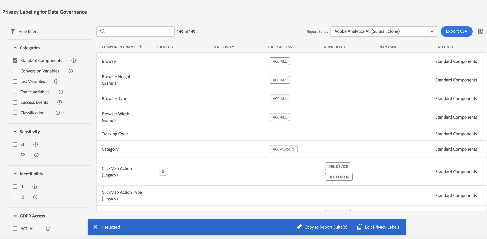

# Etiquetado de datos de grupos de informes

Al etiquetar los datos de los grupos de informes, se asignan etiquetas de identidad, confidencialidad y administración de datos a cada variable de un grupo de informes determinado. Asegúrese de familiarizarse primero con las [etiquetas y sus definiciones](/help/admin/admin/c-data-governance/data-labeling/gdpr-labels.md).

>[!NOTE]
>
>Recuerde que el etiquetado debe revisarse cada vez que se crea un nuevo grupo de informes o cuando se activa una nueva variable dentro de un grupo de informes existente. También es posible que necesite revisar el etiquetado cuando se activen nuevas integraciones de la solución, ya que pueden exponer nuevas variables que pueden requerir etiquetado. Una reimplementación de sus aplicaciones móviles o sitios web puede cambiar la forma en la que se utilizan las variables existentes, las cuales también pueden necesitar la actualización de las etiquetas.

## Asignación o edición de etiquetas de privacidad de grupos de informes {#assign-edit}

**Ejemplo**: usted, como responsable del tratamiento de datos, pretende recopilar direcciones de correo electrónico e ID de cookie de los interesados para tratar sus solicitudes de privacidad de datos. Estos ID de cookie se almacenan en un grupo de informes en Adobe Analytics.

1. En Adobe Analytics, vaya a **[!UICONTROL Administrador]** > **[!UICONTROL Todos los administradores]** > **[!UICONTROL Configuración y recopilación de datos]** > **[!UICONTROL Administración de datos]**.

   

1. Seleccione un grupo de informes en el selector **[!UICONTROL Grupos de informes]** situado en la parte superior.

1. En la sección de filtro de la izquierda, seleccione qué grupos de variables desea etiquetar. Solo puede etiquetar un grupo de variables a la vez.

   * **Componentes estándar**: los componentes estándar son dimensiones y métricas de Analytics integradas que se recopilan de forma predeterminada dentro de una implementación de Analytics.
   * **Variables de conversión**: la variable de conversión de Custom Insight (o eVar) se coloca en el código de Adobe en las páginas web del sitio seleccionadas. Su principal función es segmentar las métricas de éxito de conversión en los informes de marketing personalizados. Una eVar puede basarse en visitas y funcionar de modo similar a las cookies. Los valores pasados a las variables eVar siguen al usuario durante un período de tiempo predeterminado.
   * **Variables de lista**: las variables de lista son variables personalizadas que se pueden utilizar como desee. Funcionan de manera similar a las eVars, excepto que pueden contener varios valores en la misma visita. Las variables de lista no tienen un límite de caracteres.
   * **Variables de tráfico**: las variables (o props) de tráfico de Custom Insight permiten correlacionar datos personalizados con eventos específicos relacionados con el tráfico. Las variables prop están incorporadas en el código de implementación de cada página del sitio web.
   * **Eventos de éxito**: los eventos de éxito (también conocidos como eventos de conversión o eventos personalizados) son acciones de las que se puede realizar un seguimiento. Usted determina lo que es un evento de éxito. Por ejemplo, si un visitante compra un artículo, el evento de compra puede considerarse un evento de éxito.
   * **Clasificaciones**: los desgloses de clasificación se utilizan para asignar datos de informes de Analytics a propiedades relacionadas. Las clasificaciones pueden utilizarse para distintos fines, pero el más común es la clasificación de los códigos de seguimiento de campaña (tanto internos como externos) y los ID de productos.

1. Para seleccionar una variable, haga clic en su casilla de verificación y, a continuación, haga clic en **[!UICONTROL Editar etiquetas de privacidad]** en la barra azul que aparece en la parte inferior de la pantalla.

   

   Esta pantalla muestra las etiquetas aplicadas actualmente y le permite aplicar etiquetas adicionales. Es posible que no pueda aplicar o modificar todas las etiquetas, según el componente.

   

1. Haga clic en **[!UICONTROL Aplicar]** una vez haya completado todo el etiquetado.

