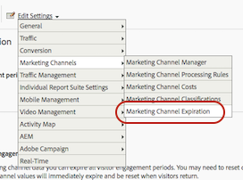

# Caducidad del canal de marketing

>[!NOTE]
>
> Para obtener información general sobre los canales de marketing, consulte [Introducción a los canales de marketing](/help/components/c-marketing-channels/c-getting-started-mchannel.md).
>
> Para maximizar la eficacia de los canales de marketing para Attribution y Customer Journey Analytics, hemos publicado algunas [prácticas recomendadas revisadas](/help/components/c-marketing-channels/mchannel-best-practices.md).

**[!UICONTROL Analytics]** > **[!UICONTROL Administración]** > **[!UICONTROL Grupos de informes]** > **[!UICONTROL Editar configuración]** > **[!UICONTROL Canales de marketing]** > **[!UICONTROL Caducidad del canal de marketing]**

Obtenga información sobre cómo especificar la caducidad o el periodo de participación de visitantes para los canales de marketing.

El compromiso del visitante especifica la cantidad de tiempo que desea permitir para que la actividad previa del visitante en su sitio web se atribuya al canal de primer contacto. El valor predeterminado de la caducidad es de 30 días.

Si el visitante utiliza el sitio con frecuencia, la ventana de participación se abrirá. Debe estar inactivo durante 30 días para que caduque el periodo y se restablezcan los canales. Los canales de primer y último contacto de un visitante se restablecen tras 30 días de inactividad en ese navegador.

Ejemplo:

* Día 1: el usuario llega al sitio y este aparece en la pantalla. Los canales de primer y último contacto se definirán como “Pantalla”.
* Día 2: el usuario entra al sitio a través de una búsqueda natural. El primer contacto permanece como “Pantalla” y el último contacto se establece como “Búsqueda natural”.
* Día 35: el usuario no ha accedido al sitio en 33 días y regresa usando la pestaña que había abierto en su navegador. Suponiendo que se trate de una ventana de participación de 30 días, la ventana se habría cerrado y las cookies del canal de marketing habrían caducado. El canal de primer contacto y último contacto se restablecerán y se configurarán en Actualización de sesión, ya que el usuario accedió con una URL interna.

## Configuración de caducidad del canal de marketing

La configuración de caducidad consiste en lo siguiente:

| Campo | Definición |
|--- |--- |
| Días de inactividad | Cantidad de días que deben transcurrir antes de que caduque el compromiso de primer contacto del visitante. El valor predeterminado es 30. |
| Nunca | El período de compromiso del visitante no caduca. |
| Restablecimiento del canal | Termina todos los periodos de compromiso de los visitantes.  Si necesita restablecer todos los datos de canal de marketing, puede hacer que expiren todos los períodos de compromiso de los visitantes. Podría necesitar restablecer los datos si las reglas de procesamiento están mal configuradas. Todos los valores de canales de primer y último contacto expirarán inmediatamente y se restablecerán cuando vuelvan los visitantes. |

## Definición de la caducidad del canal de marketing {#define-expiration}

Especificar la caducidad de la participación del visitante.

1. Haga clic en **[!UICONTROL Analytics]** > **[!UICONTROL Administración]** > **[!UICONTROL Grupos de informes]**.
2. En el [!UICONTROL Administrador del grupo de informes], haga clic en **[!UICONTROL Editar configuración]** > **[!UICONTROL Canales de marketing]** > **[!UICONTROL Caducidad de canal de marketing]**.

   

3. Configurar los campos de caducidad de la participación del visitante.
4. Haga clic en **[!UICONTROL Guardar]**.
