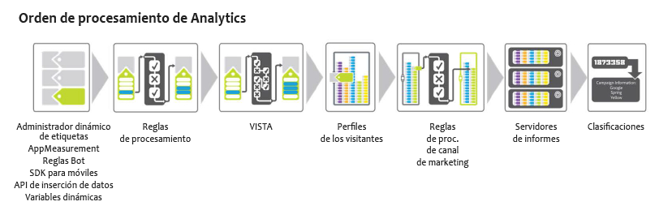

# Orden de procesamiento

Para utilizar de forma eficaz las reglas de procesamiento, es esencial comprender cuándo se aplican durante la recopilación de datos.

Las siguientes tablas indican los datos que suelen estar disponibles antes y después de aplicar las reglas de procesamiento:

## Antes de las reglas de procesamiento

| Dimensión | Descripción |
|--- |--- |
| Búsqueda de variables dinámicas | Las variables se rellenan dinámicamente extrayendo información de los encabezados HTTP u otras variables. For example, `s.eVar5="D=c1"` will put the value of prop1 into eVar5. |
| AppMeasurement | Las funciones y los plugins usados en AppMeasurement se ejecutan en el navegador o en la aplicación cliente. |
| Dynamic Tag Management | Las reglas definidas en la herramienta Dynamic Tag Management se ejecutan tal como están definidas. |
| Reglas de bots | [Las reglas de bots](../../../../admin/admin/bot-removal/bot-rules.md) permiten eliminar de un grupo de informes el tráfico generado por arañas de web y bots conocidos. |

## Después de las reglas de procesamiento

| Dimensión | Descripción |
|--- |--- |
| Datos agregados por VISTA | Las reglas de procesamiento se aplican antes de VISTA. |
| Número de página de visita | En general, las reglas de procesamiento solo tienen en cuenta los datos contenidos en la visita actual. El número de página de visita se compila después de aplicar las reglas de procesamiento. |
| La dirección URL limpia se agrega como nombre de página si no está definido | Tras aplicar las reglas de procesamiento y de VISTA, la dirección URL limpia se agrega como nombre de página si no se ha definido ninguno. Dado que esto ocurre después de aplicar las reglas de procesamiento, se recomienda agregar una condición para comprobar si el nombre de página está vacío.  If you run the  Site Content &gt;  Pages Report and you see  https:// values for page names, it is likely the page name is blank and the URL is being used.  Puede configurar una condición para comprobar si un nombre de página está vacío, o para ver si el nombre de página o la URL de la página contiene un determinado valor. A continuación, se puede definir el nombre de página según sea necesario. |
| Reglas de procesamiento de canal de marketing | Con las reglas de procesamiento pueden prepararse los datos para su procesamiento con las [reglas de procesamiento del canal de marketing](https://marketing.adobe.com/resources/help/en_US/mchannel/c_rules.html). |
| Búsqueda GEO | Incluye los valores de Estado del visitante y Código postal del visitante. |
| Persistencia de eVars | Las eVars incluidas en alguna visita anterior no persisten en cada visita durante el procesamiento de las reglas. Solo están disponibles las eVars definidas en la visita que se está procesando actualmente. |

## Aplicación de las reglas de procesamiento al copiar visitas usando VISTA {#section_576EE8C240A24CBA979BD614E8D5338D}

Si tiene una regla de VISTA configurada para copiar visitas a otro grupo de informes, las visitas se envían aunque haya reglas de procesamiento definidas en el otro grupo de informes.

Si tiene reglas de procesamiento definidas en el grupo de informes original, pueden aplicarse o no en función de cómo configuraron la regla de VISTA los servicios de ingeniería. Para averiguarlo, puede preguntarle a su especialista en implementaciones si la regla de VISTA copia los valores “pre” o “post” en el grupo de informes original. Si se copia un valor “pre”, las reglas de procesamiento definidas en el grupo de informes original no se aplican. Si se copia el valor “post”, las reglas de procesamiento se aplican antes de que se copie la visita.
