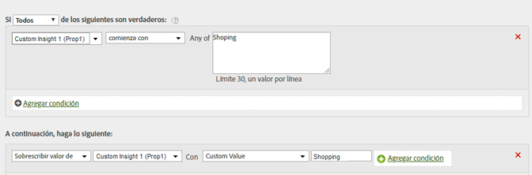

# Limpiar los valores de un informe

Puede hacer coincidir los valores con los errores de escritura más comunes y actualizarlos de modo que aparezcan correctamente en los informes.

Si se desea garantizar que no coincidirán con otros valores de forma involuntaria, debe utilizarse la opción de coincidencia disponible más restrictiva. Puede ejecutar un informe en la variable (Prop1 en el ejemplo anterior) y buscar los términos que desea reemplazar para asegurarse de que no coinciden con valores no deseados. Al comparar cadenas, no se distingue entre mayúsculas y minúsculas.

| Conjunto de reglas | Valor |
|---|---|
| Condición | Si prop1 Comienza con Compra |
| Acción | Sobrescribir el valor de prop1 con el valor personalizado Compra |

Por ejemplo:

