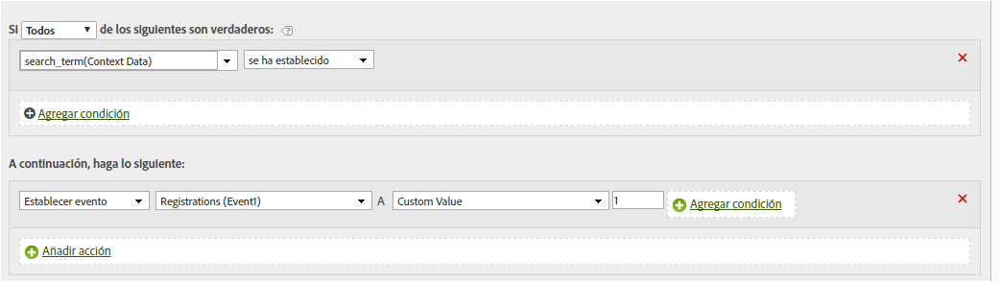

# Definir un evento con una variable de datos de contexto

Las reglas de procesamiento pueden activar eventos basados en variables de datos de contexto.

Las variables de datos de contexto se especifican en AppMeasurement con el formato siguiente:

```
 s.contextData['search_term']
```

La lista de [!UICONTROL variables de contexto] incluye todas las variables que se enviaron al grupo de informes durante los 30 días previos. Si conoce el nombre de la variable de datos de contexto pero no la ha enviado al grupo de informes actual, puede agregar un valor escribiendo el nombre de la variable y haciendo clic en **[!UICONTROL Agregar datos de contexto de nombre de variable]**:


La siguiente definición de regla se expande en la regla [Copiar una variable de datos de contexto a una eVar](/help/admin/admin/c-processing-rules/processing-rules-examples/processing-rules-copy-context-data.md) para establecer también un evento en cada visita que contenga una variable de datos de contexto específica:

| Conjunto de reglas | Valor |
|---|---|
| Condición | Si los datos de contexto &#39;término_de_búsqueda&#39; están definidos |
| Acción | Definir el evento &quot;búsquedas&quot; |

Por ejemplo:



Consulte [Variables de datos de contexto](https://experienceleague.adobe.com/docs/analytics/implementation/vars/page-vars/contextdata.html) en la ayuda de implementación.
