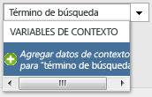
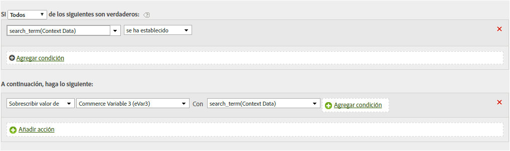
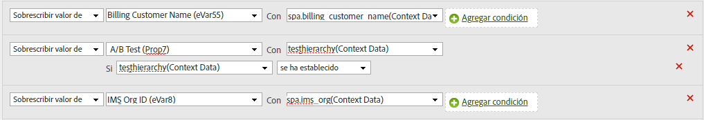

# Copiar una variable de datos de contexto en una eVar

Las reglas de procesamiento se utilizan para mover valores desde variables de datos de contexto a props y eVars. Sin reglas de procesamiento, las variables de datos de contexto no tienen sentido y no rellenan ningún informe en Analytics.

La lista de [!UICONTROL variables de contexto] incluye todas las variables que se enviaron al grupo de informes durante los 30 días previos. Si conoce el nombre de la variable de datos de contexto pero no la ha enviado al grupo de informes actual, puede agregar un valor escribiendo el nombre de la variable y haciendo clic en **[!UICONTROL Agregar datos de contexto de nombre de variable]**:

El ejemplo siguiente toma la variable de datos de contexto `search_term` e introduce su valor en `eVar3`:

El ejemplo anterior funciona bien cuando solo hay unas pocas eVars que rellenar. Si su organización tiene cientos de variables de datos de contexto y cada una necesita su propia eVar, puede utilizar afirmaciones condicionales. Puede introducir docenas de afirmaciones condicionales dentro de una sola regla de procesamiento, lo que permite a la organización completar todas las eVars en un grupo de informes sin alcanzar el límite de 150 reglas de procesamiento.

El ejemplo siguiente rellena `prop7` con la variable de datos de contexto `testhierarchy`, pero solo si `testhierarchy` está configurada:

Para obtener más información sobre la implementación de variables de datos de contexto, consulte [Variables de datos de contexto](/help/implement/vars/page-vars/contextdata.md) en la Guía de usuario de implementación.
