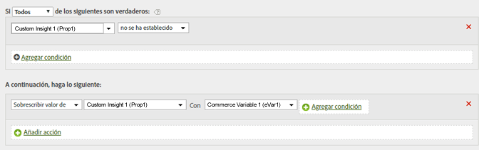

# Determinar una ruta copiando un valor eVar en una propiedad

Puede copiar el valor de una eVar en una propiedad para permitir las rutas.

Al definir valores, la variable de la izquierda recibe el valor (incluso si está vacío) de la variable de la derecha.

| Conjunto de reglas | Valor |
|---|---|
| Condición | Ninguno (ejecutar siempre) |
| Acción | Sobrescribir el valor de Prop1 con eVar1 |

Puede modificar esta regla para configurar el valor de Prop1, pero solamente si todavía no contiene un valor, de modo similar al siguiente:

| Conjunto de reglas | Valor |
|---|---|
| Condición | Si Prop1 no está definido |
| Acción | Sobrescribir el valor de Prop1 con eVar1 |

Por ejemplo:

