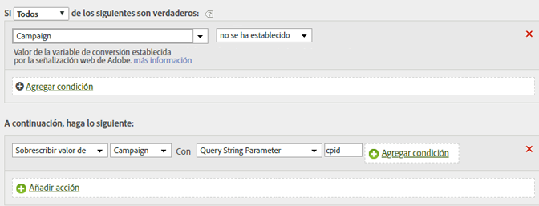

# Rellene un ID de campaña desde un parámetro de cadena de consulta

Puede rellenar una variable usando un parámetro de cadena de consulta.

En la mayoría de los casos, utiliza un plug-in para rellenar variables desde la cadena de consulta. Si algún error tipográfico o un problema similar impide que se rellene el valor, puede rellenar la variable utilizando reglas de procesamiento.

Siempre debe comprobar si un valor está vacío o si contiene el valor esperado antes de sobrescribirlo.

| Conjunto de reglas | Valor |
|---|---|
| Condición | Campaña no está definida |
| Acción | Sobrescribir el valor de Campaña con el del parámetro de la cadena de consulta cpid |

Por ejemplo:

