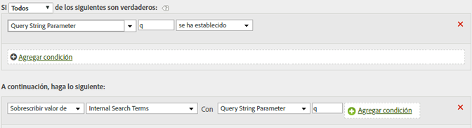

# Rellenar términos de búsqueda internos utilizando un parámetro de cadena de consulta

Si utiliza una variable común, como &quot;q&quot;, para rellenar términos de búsqueda, puede utilizar reglas de procesamiento para rellenar las eVar de los términos de búsqueda internos con esos valores.

Los valores de las cadenas de consulta deben estar codificados en Unicode o UTF-8 para que puedan leerlos las reglas de procesamiento.

| Conjunto de reglas | Valor |
|---|---|
| Condición | Si está definido el parámetro de cadena de consulta q |
| Acción | Sobrescribir el valor de los términos de búsqueda internos con el parámetro de cadena de consulta q |

Por ejemplo:

