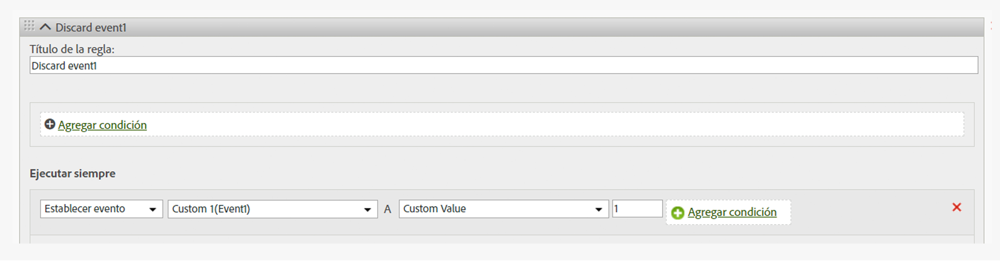

# Eliminar un evento de una visita

Muestra cómo se elimina o descarta un evento de una visita mediante una regla de procesamiento, sin necesidad de implementar un cambio en la página.

## Remove an event from a hit {#topic_9548385BFE344FC08CA99718A24FC093}

Muestra cómo se elimina o descarta un evento de una visita mediante una regla de procesamiento, sin necesidad de implementar un cambio en la página.

Configure una regla de procesamiento que establezca para el evento el valor personalizado = 0, como se muestra en la imagen siguiente:

