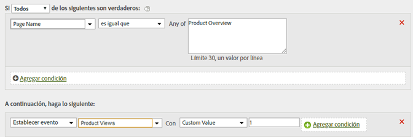

# Definir el evento de vistas de producto desde la página de información general del producto

Los eventos se pueden definir según los valores de la página o determinados valores de una variable.

| Conjunto de reglas | Valor |
|---|---|
| Condición | Si el nombre de página es igual que la información general del producto |
| Acción | Definir el evento de vistas de producto con el valor personalizado 1 |

Por ejemplo:

