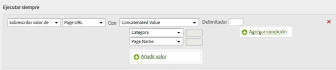

# Agregar una subcategoría concatenando la categoría y el nombre de página

Puede utilizar la opción de concatenación para rellenar valores combinando otros valores.

<table id="table_FF761C2011CD456B9A466C054A54FC30"> 
 <thead> 
  <tr> 
   <th colname="col1" class="entry"> Conjunto de reglas </th> 
   <th colname="col2" class="entry"> Valor </th> 
  </tr> 
 </thead>
 <tbody> 
  <tr> 
   <td colname="col1"> Condición </td> 
   <td colname="col2"> Ninguno (ejecutar siempre) </td> 
  </tr> 
  <tr> 
   <td colname="col1"> Acción </td> 
   <td colname="col2">Sobrescribir el valor de la subcategoría con un valor concatenado 
Categoría 
 
Nombre de la página 
 </td> 
  </tr> 
 </tbody> 
</table>

Por ejemplo:

