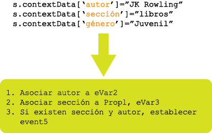

# Información general sobre reglas de procesamiento

Las reglas de procesamiento simplifican la recopilación de datos y administran el contenido a medida que se envía a los informes. Las reglas de procesamiento ayudan a simplificar la interacción con los grupos de TI y los desarrolladores Web, porque ofrecen una interfaz para:

* Definir un evento en la página de información general del producto
* Rellenar una campaña utilizando un parámetro de cadena de consulta
* Concatenar una categoría y un nombre de página en una propiedad para crear informes más fácilmente
* Copiar una eVar a una propiedad para ver las rutas
* Corregir las secciones de sitios mal escritas
* Obtener términos de búsqueda interna o un ID de campaña de la cadena de consulta para una eVar

>[!VIDEO](https://tv.adobe.com/embed/1181/16506/)

*Mire la formación y descripción general de las reglas de procesamiento de Adobe Summit para conocer por qué debería usar reglas de procesamiento.*

## Obtener autorización para utilizar reglas de procesamiento {#section_8A4846688050453784DAE4D89355169A}

Antes del 20 de abril de 2017, todos los usuarios (administradores incluidos) debían superar un examen y recibir autorización del Servicio de atención al cliente de Adobe para utilizar reglas de procesamiento.

En este momento, los administradores tienen **de forma predeterminada** permiso para utilizar reglas de procesamiento. Ya no necesitan realizar el examen. Además, pueden conceder este mismo derecho a los demás usuarios desde la interfaz de las Herramientas de administración. A continuación se muestra cómo:

1. Si aún no lo ha hecho, [cree un grupo](../../../admin/user-management2/c-user-groups/groups.md) que solo incluya aquellos usuarios que no son administradores y que necesitan autorización para utilizar reglas de procesamiento.
1. [Agregue a los usuarios no administradores a ese grupo](../../../admin/user-management2/c-user-management/t-add-user-to-group.md).
1. Then go to **[!UICONTROL Analytics]** &gt; **[!UICONTROL Admin]** &gt; **[!UICONTROL User Management]** &gt; **[!UICONTROL Groups]** &gt; **[!UICONTROL[group name]]** &gt; **[!UICONTROL Edit]** &gt; **[!UICONTROL Report Access]** &gt; **[!UICONTROL Report Suite Tools]** &gt; **[!UICONTROL Customize]** &gt; **[!UICONTROL Report Suite Management]**.
1. Marque la casilla que está junto a [!UICONTROL Reglas de procesamiento] y haga clic en **[!UICONTROL Aceptar]**.

>[!IMPORTANT]
>
>Dado que las reglas de procesamiento afectan permanentemente a los datos de Analytics, recomendamos enfáticamente que los administradores de reglas de procesamiento reciban formación de certificación en Adobe Analytics y estén familiarizados con todas las fuentes de datos para sus grupos de informes (sitios web estándar, sitios móviles, aplicaciones móviles, API de inserción de datos, etc.). El conocimiento de las variables de datos de contexto y las variables estándar completadas en diversas plataformas ayudará a impedir la eliminación o modificación accidentales de los datos.

## Simplificar la recopilación de datos con datos de contexto {#section_09EEA03612D24C15839631AA9E9668D8}

Las variables de datos de contexto son un nuevo tipo de variable y están disponibles solamente para las reglas de procesamiento. Para utilizar variables de datos de contexto, su implementación envía los pares de datos clave/valor, y se utilizan reglas de procesamiento para capturar estos valores en variables estándar de Analytics. Esto evita a los programadores tener que entender exactamente qué propiedad o eVar debería contener cada valor.

Consulte [Variables de datos de contexto](https://marketing.adobe.com/resources/help/en_US/sc/implement/index.html?f=context_data_variables) en la ayuda de implementación.

## Transformar datos de visitas y activar eventos con reglas de procesamiento {#section_8284E72E999244E091CD7FB1A22342B6}

Las reglas de procesamiento pueden supervisar los valores entrantes para transformar errores tipográficos comunes y definir eventos según los datos de los informes. Las props se pueden copiar en eVars, los valores se pueden concatenar para los informes y se pueden definir eventos.

## Uso de variables de datos de contexto en informes {#section_BD098BC503024A0B8703596628071134}

Una vez que las variables de datos de contexto se definen en la implementación, se deben copiar en variables como las eVars para poder utilizarse en los informes.

Para obtener más información, vaya a [aquí](../../../admin/admin/c-processing-rules/processing-rules-examples/processing-rules-copy-context-data.md#concept_43AA4980A2D847D6A3BEC50BCC0780E7) y [aquí](../../../admin/admin/c-processing-rules/processing-rules-examples/processing-rules-copy-context-data-event.md#concept_359B4E165ED442938A8EB6A55A725682).
