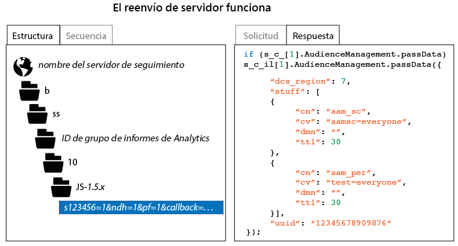

# Cómo verificar la implementación de reenvío del lado del servidor

Para comprobar que el reenvío del lado del servidor esté correctamente habilitado, debe inspeccionar la respuesta HTTP a la solicitud de seguimiento de Analytics. Puede hacerse empleando las herramientas para desarrolladores de un navegador o una herramienta para proxys, como Charles Web Debugger. Las siguientes instrucciones ilustran qué indicadores debe haber presentes para garantizar que el reenvío del lado del servidor esté correctamente habilitado.

Para comprobar el estado del reenvío del lado del servidor:

1. Cargue una página de prueba que contenga código de AppMeasurement actualizado.
1. En las herramientas de depuración del navegador, o utilizando su software proxy, inspeccione la respuesta HTTP de la solicitud de seguimiento de Analytics (puede filtrarla fácilmente seleccionando cualquier ruta que contenga “b/ss”).
1. Inspeccione la respuesta HTTP. Si la respuesta contiene datos de Audience Manager (como se ilustra a continuación), el reenvío del lado del servidor está funcionando.

>[!CAUTION]
>
>If the response contains the key value pair `"status":"SUCCESS"` or a 2 x 2 image, then server-side forwarding * is not* configured correctly. Verifique que el servicio de identidad esté correctamente implementado, que haya implementado el módulo de medición de aplicaciones, que el grupo de informes aplicable esté asignado a la organización IMS correcta y que el reenvío de servidor esté habilitado en la consola de administración de Analytics.

>[!MORE_LIKE_THIS]
>
>* [Charles Web Debugger](https://www.charlesproxy.com/)

