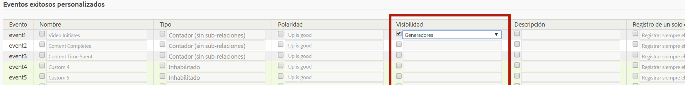

# Configurar eventos de éxito

Instrucciones sobre cómo configurar eventos de éxito.

1. Click **[!UICONTROL Analytics]** &gt; **[!UICONTROL Admin]** &gt; **[!UICONTROL Report Suites]**.
1. Seleccione un grupo de informes.
1. Click **[!UICONTROL Edit Settings]** &gt; **[!UICONTROL Conversion]** &gt; **[!UICONTROL Success Events]**.

   

1. En la columna **Nombre**, active la casilla que hay junto a cada elemento para activar la edición y, a continuación, especifique el nombre que desee.
1. En la columna **Tipo**, active la casilla que hay junto a cada elemento para activar la lista desplegable y, a continuación, seleccione el tipo que desee.

   >[!NOTE]
   >
   >Before you change an event type, see [Change event type](../../../admin/admin/c-success-events/event-type.md#concept_2A6FCC19E7FC429DBDFA65BC640BD448).

   Consulte [Página Eventos de éxito: descripciones](../../../admin/admin/c-success-events/success-event.md#section_681ECEC981694CABBDBF00E18165B447) para obtener más información sobre estos elementos.

1. In the **[!UICONTROL Polarity]** column, specify whether an upward trend for this metric is good or bad.
1. In the **[!UICONTROL Visibility]** column, you can hide standard (built-in) metrics, custom events, and built-in events in the Menu, Metric Selectors, Calculated Metrics Builder, and the Segment Builder.

   Esta configuración no afecta a la recopilación de datos de esa métrica o evento. Solo afecta a su visibilidad en la interfaz de usuario. [Más...](../../../admin/admin/metric-visibility.md#concept_A85EB68D27534C4581AF1DCF5702DDE5) 1. Proporcione una descripción.
1. Compruebe si desea registrar siempre el evento.
1. Enable or disable [participation metrics](/help/components/c-variables/c-metrics/metrics-participation.md).

   >[!NOTE]
   >
   >Puede habilitar la participación para hasta 100 eventos personalizados. Una vez superada esa cifra, puede crear métricas de participación en el creador [Métricas calculadas](https://marketing.adobe.com/resources/help/en_US/analytics/calcmetrics/participation_metric.html).

1. Haga clic en **[!UICONTROL Guardar]**.

