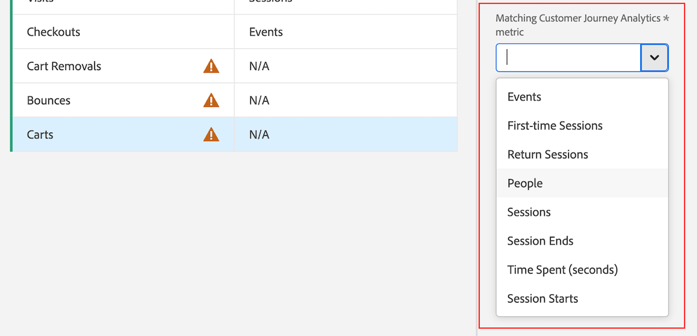

# Migrar componentes y proyectos de Adobe Analytics a Customer Journey Analytics

Los administradores de Adobe Analytics pueden migrar proyectos de Adobe Analytics y sus componentes asociados a Customer Journey Analytics.

El proceso de migración incluye lo siguiente:

* Volver a crear proyectos de Adobe Analytics en Customer Journey Analytics.

* Asignación de dimensiones y métricas de grupos de informes de Adobe Analytics a dimensiones y métricas en vistas de datos de Customer Journey Analytics.

  Algunas dimensiones y métricas se asignan automáticamente, mientras que otras se deben asignar manualmente como parte del proceso de migración. Los segmentos también se migran, pero no es necesario asignarlos como parte del proceso de migración.

  Todos los componentes migrados se muestran en el resumen de la migración cuando esta se completa.

## Preparación para una migración

Antes de que cualquier miembro de su organización empiece a migrar proyectos, complete las siguientes secciones.

### Requisitos previos

Antes de que sus proyectos y sus componentes asociados estén listos para migrar, primero debe:

* Utilice el conector de origen de Analytics para ver los datos del grupo de informes de Adobe Analytics en Customer Journey Analytics. Para ello, debe hacer lo siguiente:

   * [Configurar grupos de informes para su incorporación a Adobe Experience Platform y Customer Journey Analytics](https://experienceleague.adobe.com/docs/analytics-platform/using/compare-aa-cja/cja-aa-comparison/aa-data-in-cja.html?lang=en#set-up-report-suites-for-ingestion-into-the-adobe-experience-platform-and-customer-journey-analytics)

   * [Ingesta y uso de los datos](https://experienceleague.adobe.com/docs/analytics-platform/using/cja-data-ingestion/ingest-use-guides/analytics.html?lang=es)

* Asegúrese de que los usuarios de Customer Journey Analytics estén aprovisionados en las vistas de datos donde se asignan los datos.

  Para obtener más información, consulte [Permisos de Customer Journey Analytics en el Admin Console](https://experienceleague.adobe.com/docs/analytics-platform/using/cja-admin/cja-access-control.html?lang=en#customer-journey-analytics-permissions-in-admin-console) in [control de acceso de Customer Journey Analytics](https://experienceleague.adobe.com/docs/analytics-platform/using/cja-admin/cja-access-control.html).

  La pestaña Permisos forma parte de cada perfil de producto en Admin Console. Puede añadir usuarios a perfiles de producto específicos. A continuación, asigne derechos a vistas de datos específicas y especifique los permisos que tienen los usuarios en un perfil de producto.

* Cree un plan de migración, tal como se describe en la sección siguiente, [Creación de un plan de migración como organización](#create-a-migration-plan-as-an-organization).

### Comprender lo que se incluye en una migración

En las tablas siguientes se describen los elementos de un proyecto y de un componente que se incluyen en una migración:

#### Elementos de componente que se migran

|  | Migrado |
|---------|---------|
| **[Propietario](/help/components/c-calcmetrics/c-workflow/cm-workflow/cm-manager.md)** |  |
| **[Uso compartido](/help/analyze/analysis-workspace/components/analysis-workspace-components.md)** | No |
| **[Descripciones](/help/analyze/analysis-workspace/components/add-component-descriptions.md)** | ? |
| **[Etiquetas](/help/analyze/analysis-workspace/components/analysis-workspace-components.md)** | No |
| **[Atribución (en dimensiones)](/help/analyze/analysis-workspace/attribution/overview.md)** | ? |

{style="table-layout:auto"}

#### Elementos de proyecto migrados

|  | Migrado |
|---------|----------|
| **[Intervalos de fechas](/help/analyze/analysis-workspace/components/calendar-date-ranges/calendar.md)** |  |
| **[Segmentos](/help/components/segmentation/seg-overview.md)** |  |
| **[Segmentos rápidos](/help/analyze/analysis-workspace/components/segments/quick-segments.md)** |  |
| **[Dimensiones](/help/components/dimensions/overview.md)** |  Asignado automática o manualmente |
| **[Métricas](/help/components/metrics/overview.md)** |  Asignado automática o manualmente |
| **[Paneles](/help/analyze/analysis-workspace/c-panels/panels.md)** |  |
| **[Visualizaciones](/help/analyze/analysis-workspace/visualizations/freeform-analysis-visualizations.md)** |  |
| **[Propietario](/help/analyze/analysis-workspace/build-workspace-project/freeform-overview.md)** |  Definido por el usuario que realiza la migración |
| **[Revisión](/help/analyze/analysis-workspace/curate-share/curate.md)** | No |
| **[Uso compartido (funciones de proyecto)](/help/analyze/analysis-workspace/curate-share/share-projects.md)** | No |
| **[Uso compartido (compartir con cualquier vínculo)](/help/analyze/analysis-workspace/curate-share/share-projects.md)** | ? <!-- if no, combine with the above and just call it sharing? What about sharing links?--> |
| **[Anotaciones](/help/analyze/analysis-workspace/components/annotations/overview.md)** | No |
| **[Estructura de carpetas](/help/analyze/analysis-workspace/build-workspace-project/workspace-folders/about-folders.md)** | No |
| **[Descripciones](/help/analyze/analysis-workspace/build-workspace-project/freeform-overview.md)** |  |
| **[Etiquetas](/help/analyze/analysis-workspace/build-workspace-project/freeform-overview.md)** | No |
| **[Horarios](/help/components/scheduled-projects-manager.md)** | No |
| **[Detección de anomalías](/help/analyze/analysis-workspace/virtual-analyst/c-anomaly-detection/anomaly-detection.md)** | ? |
| **[Favoritos](/help/analyze/landing.md)** | ? |

{style="table-layout:auto"}

### Comprender los elementos no compatibles que causan errores

Las siguientes visualizaciones, paneles y funciones no son compatibles con Customer Journey Analytics. Si estos elementos se incluyen en un proyecto antes de la migración, pueden provocar el fallo de la migración o errores una vez migrado el proyecto.

Elimine estos elementos del proyecto de Adobe Analytics antes de migrar el proyecto a Customer Journey Analytics. Si una migración falla, elimine estos elementos antes de reintentar la migración.

#### Visualizaciones no admitidas

* [Mapa](/help/analyze/analysis-workspace/visualizations/map-visualization.md)

#### Paneles no admitidos

* [Analytics for Target (A4T)](/help/analyze/analysis-workspace/c-panels/a4t-panel.md)

* [Comparación de segmentos](/help/analyze/analysis-workspace/c-panels/c-segment-comparison/segment-comparison.md)

* [Audiencia media por minuto de medios](/help/analyze/analysis-workspace/c-panels/average-minute-audience-panel.md)

* [ de elemento siguiente o anterior](/help/analyze/analysis-workspace/c-panels/next-previous.md)

* [Resumen de página](/help/analyze/analysis-workspace/c-panels/page-summary.md)

#### Funciones no admitidas

* [Análisis de contribución](/help/analyze/analysis-workspace/virtual-analyst/contribution-analysis/ca-tokens.md)

* [Alertas](/help/components/c-alerts/intellligent-alerts.md)

### Decida, como organización, cómo asignará los componentes no compatibles

>[!IMPORTANT]
>
>El proceso de migración identifica los componentes del proyecto de Adobe Analytics que no se pueden asignar automáticamente a los componentes de Customer Journey Analytics y le permite asignarlos manualmente.
>
>**Cualquier asignación realizada en un proyecto se aplica a todos los proyectos futuros de toda la organización, independientemente del usuario que realice la migración. Estas asignaciones no se pueden modificar ni deshacer excepto poniéndose en contacto con el Servicio de atención al cliente.**
>
>Por ello, es importante que su organización decida cómo se asignarán las dimensiones y métricas antes de migrar cualquier proyecto. Al hacerlo, se evita que los administradores individuales tomen decisiones en un silo al considerar solo un proyecto.
>
>A continuación se muestra una lista de dimensiones y métricas que debe asignar manualmente si existen en el proyecto. Se recomienda revisar esta lista antes de la migración. Si alguno de estos componentes existe en el proyecto, decida ahora a qué componentes de Customer Journey Analytics los asignará.

#### Dimensiones no admitidas

* averagepagetime
* pagetimeseconds
* singlepagevisits
* visitnumber
* timeprior
* timespent
* Categoría
* connectiontype
* customerloyalty
* customlink
* downloadlink
* exitlink
* hitdepth
* hittype
* pathlength
* daysbeforefirstpurchase
* dayssincelastpurchase
* dayssincelastvisit
* identificationstate
* optoutreason
* persistentcookie
* returnfrequency
* searchenginenatural
* searchenginenaturalkeyword
* mobilecarrier
* monitorresolution
* surveybase
* mcaudiences
* tntbase
* targetraw

#### Métricas no admitidas

* timespentvisit
* timespentvisitor
* recargas
* bounces
* botar
* pageevents
* pageviewspervisit
* orderspervisit
* averagepagedepth
* averagetimespentonsite
* exitlinkinstances
* customlinkinstances
* downloadlinkinstances
* darkvisitors
* singlepagevisits
* singlevaluevisits
* visitorhomepage
* visitorsmcvisid
* pagesnotfound
* nuevos compromisos
* time_granularity
* concurrentes_visores_visitantes
* concurrentes_visores_ocurrencias
* dispositivos
* personas estimadas
* playback_time_spent_seconds
* playback_time_spent_minutes
* average_minute_audience_time_based
* average_minute_audience_media_time
* average_minute_audience_content_time
* video_length
* targetconversion
* targetimpression

## Migrar proyectos de Adobe Analytics a Customer Journey Analytics

>[!IMPORTANT]
>
>Antes de migrar proyectos a Customer Journey Analytics como se describe en esta sección, obtenga más información sobre la migración de proyectos en la [Planificación de la migración](#plan-the-migration) sección anterior.
>
>Las dimensiones o métricas que asigne son permanentes, tanto para este proyecto como para todos los proyectos futuros que se migren en toda la organización. Las asignaciones que realice no se podrán modificar una vez finalizada la migración.

1. En Adobe Analytics, seleccione la pestaña [!UICONTROL **Administración**] y, a continuación, seleccione [!UICONTROL **Todos los administradores**].

1. En [!UICONTROL **Configuración y recopilación de datos**], seleccione [!UICONTROL **Migración de componentes**].

1. Busque el proyecto que desea migrar. Puede filtrar, ordenar o buscar en la lista de proyectos.

   De forma predeterminada, solo se muestran los proyectos compartidos con usted. Para ver todos los proyectos de su organización, seleccione la **Filtrar** y, a continuación, expanda [!UICONTROL **Otros filtros**] y seleccione [!UICONTROL **Mostrar todo**]. (Para obtener más información sobre cómo filtrar, ordenar y buscar en la lista de proyectos, consulte [Filtrar, ordenar y buscar la lista de proyectos](#filter-sort-and-search-the-list-of-projects).)

1. Pase el ratón sobre el proyecto que quiere migrar y, a continuación, seleccione la **Migrar** icono .

   o

   Seleccione el proyecto que desea migrar y, a continuación, seleccione [!UICONTROL **Migrar a Customer Journey Analytics**].

   Solo puede seleccionar un proyecto a la vez para migrar.

   El [!UICONTROL **Migrar nombre_proyecto a Customer Journey Analytics**] Cuadro de diálogo.

   <!-- add screenshot -->

1. En el [!UICONTROL **Propietario del proyecto**] , empiece a escribir el nombre del usuario que desea establecer como propietario del proyecto en Customer Journey Analytics y, a continuación, seleccione su nombre en el menú desplegable.

   El propietario que especifique tiene plenos derechos de gestión sobre el proyecto.

1. En el [!UICONTROL **Esquema de asignación para grupos de informes**] , seleccione un grupo de informes.

1. En el [!UICONTROL **Vista de datos**] en el menú desplegable, seleccione la vista de datos del Customer Journey Analytics en la que desea migrar el proyecto y los componentes.

1. Seleccionar [!UICONTROL **Asignar esquema**].

1. En el [!UICONTROL **Asignar esquema**] , expanda la [!UICONTROL **Dimension**] y [!UICONTROL **Métricas**] secciones.

   Algunas dimensiones y métricas en Adobe Analytics se asignan automáticamente a una dimensión o métrica en Customer Journey Analytics. Otros deben asignarse manualmente.

   **Asignar automáticamente dimensiones y métricas**

   Algunas dimensiones y métricas en Adobe Analytics se asignan automáticamente a una dimensión o métrica en Customer Journey Analytics. No se puede tomar ninguna decisión de asignación para estas dimensiones y métricas.

   Por ejemplo, la variable **Visitas** en Adobe Analytics se asigna automáticamente con la variable **Sesiones** métrica en Customer Journey Analytics.

   Puede seleccionar cualquier dimensión o métrica para ver sus ID asociados.

   <!-- update screenshot after I can see the Status column -->

   

   **Asignación manual de dimensiones y métricas**

   Algunas dimensiones y métricas en Adobe Analytics no se pueden asignar automáticamente a una dimensión o métrica en Customer Journey Analytics.

   Cuando una dimensión o métrica no se puede asignar automáticamente, aparece un contador naranja junto a [!UICONTROL **Dimension**] o [!UICONTROL **Métricas**] encabezado de sección, que indica el número de dimensiones o métricas que deben asignarse manualmente. En la tabla, un icono de advertencia  se muestra junto a cada dimensión o métrica que debe asignarse manualmente.

   Además, la variable [!UICONTROL **Estado**] la columna dice [!UICONTROL **No asignado**].

   <!-- update screenshot after I can see the Status column -->

   

1. Para asignar manualmente dimensiones y métricas, seleccione una dimensión o métrica que contenga un icono de advertencia , luego en el [!UICONTROL **Métrica de Customer Journey Analytics asignada**] (o el [!UICONTROL **Dimensión de Customer Journey Analytics asignada**] campo (si va a asignar una dimensión), seleccione la dimensión o métrica del Customer Journey Analytics que desee asignar a la dimensión o métrica que haya seleccionado.

   

   Una vez asignada una dimensión o métrica, el icono de advertencia desaparece y la variable [!UICONTROL **Estado**] cambios de columna en [!UICONTROL **Asignado**] con un punto verde. (Un estado de [!UICONTROL **Asignado**] con un punto gris indica que la dimensión o métrica se asignó durante una migración anterior; las asignaciones anteriores no se pueden actualizar.)

   Repita este proceso para cada dimensión o métrica que contenga el icono de advertencia.

   Una vez que todas las dimensiones y métricas del grupo de informes de Adobe Analytics se hayan asignado a una dimensión o métrica en la vista de datos del Customer Journey Analytics, aparecerá una marca de verificación verde  aparece junto al nombre del grupo de informes en la [!UICONTROL **Esquema de asignación para grupos de informes**] sección.

1. (Condicional) Si el proyecto que está migrando contiene más de un grupo de informes, seleccione otro grupo de informes en la [!UICONTROL **Esquema de asignación para grupos de informes**] y, a continuación, repita los pasos del 6 al 10. <!-- double-check that the step numbers are still correct -->

1. Seleccionar [!UICONTROL **Migrar**].

   >[!WARNING]
   >
   >   Aparece un mensaje de advertencia en pantalla después de seleccionar [!UICONTROL **Migrar**]. Antes de elegir continuar, es necesario que entienda que cualquier dimensión o métrica que asigne es permanente, tanto para este proyecto como para todos los proyectos futuros que se migren en toda la organización. Si continúa, las asignaciones que realice no se podrán modificar.

   Una vez finalizada la migración, la variable [!UICONTROL **Estado de migración**] proporciona un resumen de lo que se ha migrado.

   Si la migración falla, consulte la [Reintento de una migración fallida](#retry-a-failed-migration) para obtener más información.

## Reintento de una migración fallida

Si falla una migración, puede volver a intentar la migración.

Antes de reintentar una migración fallida, asegúrese de eliminar cualquier [elementos no compatibles](#understand-unsupported-elements-that-cause-errors) del proyecto.

>[!NOTE]
>
>Si la migración sigue fallando después de volver a intentarlo, póngase en contacto con el Servicio de atención al cliente con el ID de proyecto. Puede encontrar el ID del proyecto en la página de estado de la migración. <!-- when does this page display? How can they get there -->

Para reintentar una migración fallida:

1. En Adobe Analytics, seleccione la pestaña [!UICONTROL **Administración**] y, a continuación, seleccione [!UICONTROL **Todos los administradores**].

1. En [!UICONTROL **Configuración y recopilación de datos**], seleccione [!UICONTROL **Migración de componentes**].

1. Seleccionar [!UICONTROL **Error**] en el [!UICONTROL **Estado de migración**] al lado del proyecto que desea volver a intentar.

   

   El [!UICONTROL **Estado de migración**] página muestra.

   Esta página también se muestra inmediatamente después de completar los pasos de migración descritos en la sección [Migrar proyectos de Adobe Analytics a Customer Journey Analytics](#migrate-adobe-analytics-projects-to-customer-journey-analytics) arriba.

1. Seleccionar [!UICONTROL **Reintentar migración**].

## Filtrar, ordenar y buscar la lista de proyectos

Puede filtrar, ordenar y buscar la lista de proyectos en la página Migración de componentes.

### Filtrado de la lista de proyectos

Puede filtrar por los siguientes criterios:

| Filtro | Descripción |
|---------|----------|
| [!UICONTROL **Estado**] | El estado de la migración: <ul><li>[!UICONTROL **Sin iniciar**]</li><li>[!UICONTROL **Iniciado**]</li><li>[!UICONTROL **Completado**]</li><li>[!UICONTROL **Fallido**]</li></ul>. |
| [!UICONTROL **Etiquetas**] | Seleccione cualquier etiqueta de la lista de etiquetas. Solo se muestran los proyectos que tienen las etiquetas seleccionadas aplicadas. |
| [!UICONTROL **Grupo de informes**] | Seleccione cualquier grupo de informes de la lista de grupos de informes. Solo se muestran los proyectos que utilizan los grupos de informes seleccionados. |
| [!UICONTROL **Propietarios**] | Seleccione cualquier propietario de la lista de propietarios. Solo se muestran los proyectos que son propiedad de los usuarios que seleccione. |
| [!UICONTROL **Otros filtros**] | Los filtros adicionales disponibles son los siguientes: <ul><li>[!UICONTROL **Mío**]: muestra solo los proyectos en los que está establecido como propietario.</li><li>[!UICONTROL **Compartido conmigo**]: muestra solo los proyectos que se han compartido con usted.</li><li>[!UICONTROL **Favoritos**]: Muestra solo los proyectos marcados como favoritos. (Puede marcar un proyecto como favorito desde el menú [página de aterrizaje del proyecto](/help/analyze/landing.md).)</li><li>[!UICONTROL **Mensual**]</li><li>[!UICONTROL **Anual**]</li></ul> |

{style="table-layout:auto"}

### Ordenar la lista de proyectos

Puede ordenar la lista de proyectos por cualquier columna.

Para ordenar la lista de proyectos:

1. Seleccione el encabezado de la columna por la que desea ordenar.

1. (Opcional) Vuelva a seleccionar el mismo encabezado de columna para invertir el orden.

### Buscar un proyecto

Puede buscar en la lista de proyectos de la página Migración de componentes para encontrar el proyecto que desea migrar.

1. En el campo de búsqueda que se encuentra en la parte superior de la página Migración de componentes, empiece a escribir el nombre del proyecto que desea migrar.

1. Seleccione el proyecto cuando aparezca en el menú desplegable.

<!-- is there going to be a way to customize the columns that are displayed? -->
