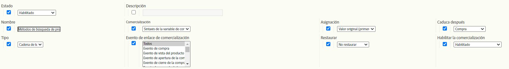
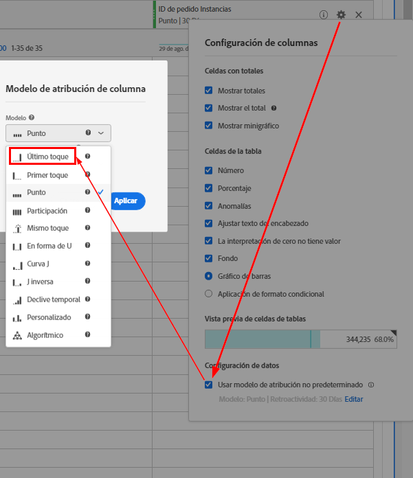

# eVars de comercialización y métodos de búsqueda de productos

Este documento muy detallado explica los conceptos subyacentes a las eVars de comercialización, que procesan y asignan los datos de forma diferente a las eVars estándar. También explica cómo se relacionan las eVars de comercialización con los métodos de búsqueda de productos.

## Información general

El uso de eVars de comercialización permite asignar cualquier actividad exitosa a los valores capturados por las eVars en un nivel *por producto* en lugar de en un nivel *por visita/por pedido*.

Aunque la mayoría de los sitios web comerciales tienen muchas formas de encontrar productos, Adobe considera que los siguientes son los métodos fundamentales de búsqueda de productos que todos los clientes minoristas deben rastrear en Adobe Analytics:

* Palabras clave de búsqueda interna
* Códigos de seguimiento de campaña internos
* Categorías de comercialización y exploración
* Vínculos de venta cruzada

A los efectos de este documento, asignemos algunas eVars a las soluciones de la siguiente manera:

* eVar2: Palabras clave de búsqueda interna
* eVar3: Códigos de seguimiento de campaña internos
* eVar4: Categorías de comercialización y exploración
* eVar5: Vínculos de venta cruzada

Podemos usar un eVar adicional para medir el rendimiento de todos los métodos de búsqueda de productos en relación mutua. Además de los métodos de búsqueda descritos anteriormente, el eVar incluye otros métodos de búsqueda en su comparación, como vínculos a páginas de detalles de productos de sitios web externos.

* eVar1: Métodos de búsqueda de productos

En lugar de configurar cualquiera de estas variables para que sean eVars estándar, configúrelas para que sean eVars de comercialización.

Para demostrar cómo configurar estas variables, aquí tiene un ejemplo donde un visitante decide utilizar las &quot;sandals&quot; de búsqueda de palabras clave internas para encontrar un producto en el sitio. En la página de resultados de búsqueda de palabras clave, debe capturar los datos de al menos dos eVars:

* `eVar2` es igual a la palabra clave que se utilizó en la búsqueda (&quot;sandals&quot;)
* `eVar1` es igual al método de búsqueda de productos utilizado (&quot;búsqueda de palabras clave interna&quot;).

Cuando configura estas dos variables en función de estos valores específicos, sabe que el visitante está usando el término de búsqueda de palabras clave internas &quot;sandals&quot; para encontrar un producto. Al mismo tiempo, sabe que el visitante no está usando los otros métodos de búsqueda de productos para encontrar productos (por ejemplo, el visitante no está navegando por categorías de productos exactamente al mismo tiempo que realiza una búsqueda de palabras clave). Para garantizar que se realice la asignación adecuada por producto, estos métodos no utilizados no deben obtener crédito para encontrar un producto que se haya encontrado mediante una búsqueda de palabras clave interna. Por lo tanto, debe insertar lógica en el código (como AppMeasurement, AEP Web SDK, etc.) que establezca automáticamente las eVars asociadas con estos otros métodos de búsqueda en un valor &quot;método de no búsqueda&quot;.

Por ejemplo, cuando un usuario busca productos utilizando la palabra clave &quot;sandals&quot;, la lógica del código de Analytics debe establecer las variables iguales a las siguientes en la página de resultados de búsqueda de palabras clave internas:

* eVar2=&quot;sandals&quot;: la palabra clave &quot;sandals&quot; se utilizó en la búsqueda de palabras clave interna
* eVar1=&quot;búsqueda de palabras clave interna&quot;: se utilizó el método de búsqueda &quot;búsqueda de palabras clave internas&quot;
* eVar3=&quot;campaña no interna&quot;: no se utilizó una campaña interna para acceder a la página de resultados de la búsqueda
* eVar4=&quot;non-browse&quot;: no se accedió a una categoría Examinar en la página de resultados de búsqueda
* eVar5=&quot;non-cross-sell&quot;: no se hizo clic en un vínculo de venta cruzada en la página de resultados de la búsqueda

## Configuración de eVars de comercialización

Estas son las diferentes configuraciones que puede usar con las eVars de comercialización. La siguiente captura de pantalla proviene del Administrador del grupo de informes. Para acceder a él, vaya a [!UICONTROL Analytics] > [!UICONTROL Administración] > [!UICONTROL Grupos de informes] > [!UICONTROL Editar configuración] > [!UICONTROL Conversión] > [!UICONTROL Variables de conversión] > [!UICONTROL Agregar nuevo] > [!UICONTROL Habilitar comercialización].



Encontrará más información sobre esta configuración en las secciones debajo de la tabla.

| Configuración | Descripción |
|--- | --- |
| Nombre | Nombre o la dimensión de informes a la que está destinada la variable. Si `eVar1` está pensado para capturar los métodos de búsqueda de productos, el campo Nombre de `eVar1` debe configurarse como &quot;Métodos de búsqueda de productos&quot;. |
| Comercialización | El tipo de sintaxis que se utilizará para capturar los valores de eVar de comercialización |
| Asignación | Ayuda determina el valor del eVar de comercialización que debe recibir crédito cuando se produce un evento exitoso. |
| Caduca después | Determina cuándo los enlaces de productos y eVares de comercialización existentes ya no deben estar en vigor. |
| Tipo | Tipo de datos que se recopilan en el eVar de comercialización |
| Evento de enlace de comercialización  | Eventos que determinan cuándo un producto debe enlazarse a un valor de eVar de comercialización |
| Restablecer | Un déclencheur que restablecerá todos los datos del back-end para el eVar en ese momento |
| Habilitar la comercialización | Un indicador que debe establecerse en &quot;Habilitado&quot; para que el eVar pase de ser un eVar estándar a un eVar de comercialización |

### Habilitar la comercialización

Cuando la opción &quot;Habilitar comercialización&quot; se establece en &quot;Habilitado&quot;, todas las opciones que se describen a continuación aparecen en el Administrador del grupo de informes. Cuando la opción &quot;Habilitar comercialización&quot; se establece en &quot;Deshabilitado&quot;, solo está disponible la configuración de eVar estándar.

### Comercialización

Esta opción no está disponible para eVars estándar. La configuración [!UICONTROL Marketing] permite elegir [!UICONTROL Sintaxis de la variable de conversión] o [!UICONTROL Sintaxis del producto] como método para capturar el valor del eVar de comercialización.

**[!UICONTROL La]** sintaxis de la variable de conversión significa que el valor de eVar se establece en su propia variable. Por ejemplo, con Sintaxis de la variable de conversión, el valor `eVar1` de &quot;búsqueda de palabra clave interna&quot; se establece de la siguiente manera dentro del código de página (o el código AppMeasurement, el código SDK web de AEP, etc.):

`s.eVar1="internal keyword search";`

Sin embargo, con **[!UICONTROL Sintaxis del producto]**, el eVar se configura únicamente dentro de la variable de productos de Adobe Analytics. La variable de productos de Analytics se divide en seis partes diferentes por producto:

`s.products="[category];[productID];[quantity];[revenue];[events];[eVars]"`

*  La categoría es una función obsoleta y ya no se recomienda como opción viable para realizar un seguimiento del rendimiento de la categoría del producto.  Su mera existencia demuestra por qué en la mayoría de las implementaciones de la variable products, un punto y coma simple precede a la parte productID del valor de la variable.
*  La cantidad y los   ingresos son útiles cuando se realiza un seguimiento de la compra de un producto.
*  Los eventos son útiles para registrar valores de eventos incrementales o monetarios personalizados que no están pensados para ser contabilizados como ingresos (como envíos, descuentos, etc.)

Las eVars de comercialización configuradas para usar Sintaxis del producto se establecen dentro de la parte final de la variable products. Por ejemplo, supongamos que un visitante utilizó una búsqueda de palabras clave interna para encontrar el ID de producto &quot;12345&quot;. La forma basada en la sintaxis del producto para configurar eVar1 en este ejemplo tendría este aspecto:

`s.products=";12345;;;;eVar1=internal keyword search";`

Observe que todavía tenemos marcadores de posición delimitados por punto y coma para las partes de cantidad, ingresos y evento de la variable products.  Sin estos marcadores de posición, se ignoraría completamente la configuración `eVar1` de la búsqueda interna de palabras clave.

### Asignación

El término &quot;Asignación&quot; para eVars de comercialización puede resultar confuso, especialmente para eVars de comercialización que utilizan Sintaxis de variables de conversión. Todas las eVars estándar pueden tener su propia configuración de asignación individual. Sin embargo, las eVars de comercialización con Sintaxis de variables de conversión solo usan la configuración de asignación &quot;Más reciente (último)&quot;, independientemente de lo que muestre la configuración de asignación en el Administrador del grupo de informes.

Comprender lo que hace esta configuración significa comprender la diferencia entre la asignación del eVar y el enlace del eVar de comercialización. Para las eVars de comercialización, &quot;Enlace del eVar de comercialización&quot; es un nombre más apropiado para esta configuración de &quot;Asignación&quot;.

**Configuración de asignación de eVar estándar**

Siempre que se recopila cualquier eVar con sintaxis estándar de una solicitud de imagen, los servidores de procesamiento de Adobe Analytics insertan datos en otra columna de base de datos, denominada columna `post_evar`. Dado que las eVars están pensadas para ser persistentes (caducan en algún momento más allá de la visita actual en la mayoría de los casos), los servidores establecen esta columna `post_evar` en cada solicitud de imagen posterior. Se establece igual al último valor pasado a su eVar correspondiente. En el caso de las eVars estándar, cuando se produce un evento de éxito, Adobe Analytics utiliza la columna `post_evar` en lugar de la columna de eVar normal para determinar el valor de eVar que debe recibir crédito por el evento.

Para las eVars estándar, la configuración de Asignación determina si el primer o el último valor de eVar que se recopiló durante un periodo determinado se insertará en la columna `post_evar`. Si la configuración de Asignación para un eVar estándar es igual a &quot;Valor original (primero)&quot;, el primer valor de eVar recopilado del visitante se inserta en la columna `post_evar` para todas las solicitudes de imagen posteriores. Esto continúa para todas las solicitudes futuras enviadas desde el explorador de este visitante hasta que el eVar caduque según la configuración &quot;Caduca después&quot;.

Si la configuración de Asignación de un eVar estándar es igual a &quot;Más reciente (último)&quot;, el valor de eVar más reciente recopilado del visitante se rellena en la columna `post_evar` para todas las solicitudes de imagen posteriores. La asignación &quot;Más reciente (último)&quot; implica que el valor `post_evar` cambia cada vez que su eVar correspondiente se establece en un nuevo valor en cualquier solicitud de imagen. La asignación &quot;Valor original (primero)&quot; implica que la columna `post_evar` no cambia entre visitas individuales aunque su eVar correspondiente pueda establecerse en un valor diferente en una solicitud de imagen futura.

**Configuración de asignación (enlace) del eVar de comercialización**

Como se mencionó anteriormente, todas las eVars de comercialización con Sintaxis de variables de conversión solo tienen una asignación &quot;Más reciente (último)&quot;.  Esto es lo que realmente significa la configuración de &quot;Asignación&quot; para las eVars de comercialización: Como se ha insinuado anteriormente, esta configuración no determina qué valores se insertan en la columna `post_evar` a medida que un visitante continúa usando el sitio. En su lugar, la configuración de Asignación para eVars de comercialización determina qué valor de eVar se vincula a un producto y cómo dichos productos asignan sus eventos de éxito de nuevo a los valores de eVar a los que están vinculados.

Analicemos qué sucede si la configuración de Asignación de eVar de comercialización (es decir, enlace) es igual a &quot;Valor original (primero)&quot;. Todos los productos que se establecen junto a la columna `post_evar` y que no se hayan enlazado previamente al eVar &quot;preprocesado&quot; correspondiente de la columna post_evar se enlazarán al valor contenido en la columna `post_evar`. Este enlace entre el valor del eVar y el producto nunca cambiará hasta que el eVar caduque según la configuración &quot;Caduca después&quot; de la configuración del grupo de informes.

Cada vez que una solicitud de imagen cumple los criterios que, de lo contrario, enlazarían un producto ya enlazado con el valor de eVar establecido más recientemente, la configuración &quot;Valor original (primero)&quot; obliga a los servidores de recopilación de datos de Adobe Analytics a ignorar cualquier intento posterior de hacerlo. Lo contrario sucede con las eVars de comercialización con la configuración Asignación (enlace) igual a &quot;Más reciente (último)&quot;. Cada vez que una solicitud de imagen cumple los criterios que unen un producto a un eVar de comercialización, el producto se enlazará (y se volverá a vincular) al valor más reciente pasado al eVar o al valor que (siempre) se encuentra en la columna `post_evar`.

Como se ha mencionado anteriormente, las eVars de comercialización permiten asignar eventos de éxito a los valores de eVar por producto, en lugar de por visita/por pedido. Por lo tanto, cada vez que un producto enlazado tiene un evento de éxito (como una compra o adición al carro de compras) asociado a él, el evento de éxito le da crédito tanto al producto como a los valores de eVar de comercialización a los que está enlazado el producto en ese momento.

### Caduca después

La configuración de caducidad de un eVar de comercialización le permite elegir

* Cuando los enlaces de producto/eVar deben caducar, y

* Cuando la columna post_evar ya no debe rellenarse automáticamente después de pasar un eVar a una solicitud de imagen.

La caducidad de un eVar puede producirse cuando se registra un evento de éxito o cuando transcurre un período de tiempo determinado. Adobe Analytics solo permite una configuración de caducidad a la vez por eVar.

Para el método de búsqueda de productos, la práctica recomendada para configurar la caducidad de un eVar de comercialización debe ser establecerlo en

* Cantidad de tiempo que un producto se encuentra en el carro de compras de un sitio antes de que el sitio lo elimine automáticamente del carro de compras
* O cuando se produce el evento de compra.

Con cualquiera de estas opciones, los productos que compra un visitante tienen el crédito de pedido/unidad/ingresos asignado a los valores de eVar de comercialización a los que estaban enlazados los productos en ese momento.

### Tipo

La configuración del tipo de eVar determina qué tipo de datos se inserta en el eVar. En la mayoría de los casos, este valor debe ser igual a &quot;Texto&quot;. El uso de &quot;Contador&quot; para un eVar de comercialización es poco frecuente. Sin embargo, se podría usar &quot;Contador&quot; para asignar el éxito a los valores de eVar de contador por producto.  Discutir soluciones con un tipo de &quot;Contador&quot; está fuera del alcance de este documento.

### Evento de enlace de comercialización 

La configuración Evento de enlace de comercialización permite especificar las condiciones para que un producto se vincule al valor de un eVar de comercialización. Estas condiciones se limitan a la activación de eventos de éxito específicos o solo eVars. Las variables de tráfico de activación (p. ej. props) no tienen ningún efecto en los enlaces de comercialización.

Tenga en cuenta que la configuración de Evento de enlace de comercialización puede enlazar un producto a un valor de eVar a través de más de un evento. Ejemplos:

* Mediante un evento de vista de producto
* Mediante un evento de adiciones al carro de compras
* Mediante un evento de compra

De forma predeterminada, la configuración vincula un producto a un valor de eVar de comercialización siempre que cualquier otro evento/eVar (comercialización o estándar) esté contenido en la misma solicitud de imagen que el producto.

### Restablecer

La configuración Restablecer le permite &quot;caducar&quot; inmediatamente todos los valores de eVar de todos los visitantes que actualmente tengan un valor `post_evar` en la base de datos back-end de Adobe Analytics. También elimina todos los enlaces actuales entre productos y eVar.

>[!IMPORTANT]
>Adobe no recomienda utilizar la configuración Restablecer a menos que tenga la intención de volver a empezar el eVar con una pizarra de datos completamente &quot;limpia&quot; desde el momento en que se realiza el restablecimiento.

## ¿Qué configuración debe utilizar?

Entre las numerosas combinaciones de ajustes disponibles, cabe preguntarse: ¿Qué configuración es una práctica recomendada?

Si desea enlazar &quot;búsqueda de palabras clave internas&quot; al ID de producto 12345, la variable de productos se configuraría de la siguiente manera:

`s.products=";12345;;;;eVar1=internal keyword search";`

Cualquier evento de éxito (adiciones al carro de compras, compras) que se capture al mismo tiempo que productID 12345 se acreditará tanto al ID de producto 12345 como al valor `eVar1` de &quot;búsqueda de palabra clave interna&quot;. La única manera en que un valor `eVar1` diferente obtuvo crédito por los eventos de éxito asociados con el ID de producto 12345 es si `eVar1` se establecieron posteriormente en un valor **diferente** dentro de la variable de productos (junto con el ID de producto 12345). Ejemplo:

`s.products=";12345;;;;eVar1=internal campaign";`

Esta configuración cambia el enlace del ID de producto 12345 del valor `eVar1` de &quot;búsqueda de palabra clave interna&quot; al valor `eVar1` de &quot;campaña interna&quot;. Este reenlace se realiza cada vez que se utiliza Sintaxis del producto y la configuración Asignación (enlace) del eVar se establece en &quot;Más reciente (último)&quot;. ¿Qué sucede si la configuración de asignación (enlace) se establece en &quot;Valor original (primero)&quot;? A continuación, el eVar de configuración 1 igual a &quot;campaña interna&quot; junto con el ID del producto 12345 no vuelve a vincular el ID del producto 12345 al valor de eVar1 de &quot;campaña interna&quot;. El enlace permanece con el valor enlazado originalmente - &quot;búsqueda de palabras clave interna&quot;.

### Desafíos del uso de Sintaxis del producto

Sin una planificación cuidadosa, pueden surgir varios problemas al usar Sintaxis del producto. Veamos el caso de usar varias eVars para rastrear los métodos de búsqueda de productos en el sitio web. En este caso, cada eVar de método de búsqueda de productos individual debe configurarse al mismo tiempo para dar un crédito de eVar de método de búsqueda en particular (y las demás eVars de método de búsqueda no tienen crédito). La sintaxis del producto se puede utilizar en estos escenarios, pero el código resultante para implementar es más complicado.

Si usamos nuestro ejemplo original de &quot;sandals&quot; y lo adaptamos para usar Sintaxis del producto (suponiendo que el visitante encontró un producto con el ID de &quot;sandal123&quot; utilizando el término clave de &quot;sandals&quot;), la variable de productos resultante debe configurarse de la siguiente manera:

`s.products=";sandal123;;;;eVar2=sandals|eVar1=internal search|eVar3=non-internal campaign|eVar4=non-browse|eVar5=non-cross-sell";`

Aunque la sintaxis de la variable products es larga en este ejemplo, enlazará cada uno de los valores de eVar vistos con el ID del producto &quot;sandal123&quot;. A partir de entonces, cualquier evento de éxito (por ejemplo, adiciones al carro de compras o compras) que se capture al mismo tiempo que el producto &quot;sandal123&quot; se acreditará a los valores de eVar que se vincularon por última vez al producto.  Este ejemplo de código muestra si se realiza una compra de 1 unidad del producto &quot;sandal123&quot; (por 79,95 dólares) después de que las eVars anteriores se hayan enlazado al producto &quot;sandal123&quot;:

```
s.products=";sandal123;1;79.95";
s.events="purchase";
```

Los siguientes valores tendrían 1 pedido, 1 unidad y 79,95 $ de ingresos atribuidos a ellos:

* eVar2 valor de &quot;sandals&quot;
* eVar1 valor de &quot;búsqueda de palabras clave interna&quot;
* eVar3 valor de &quot;campaña no interna&quot;
* Valor de eVar4 &quot;sin examinar&quot;

Esto es una atribución correcta, lo que no es un problema. En cambio, el principal dilema con este enfoque es determinar cómo y cuándo configurar las eVars del método de búsqueda de productos.

En la mayoría de los casos con Sintaxis del producto, las eVars del método de búsqueda del producto tendrían que configurarse en una página de detalles del producto en lugar de en la página en la que se utilizó realmente el método de búsqueda (por ejemplo, en la página de resultados de búsqueda de palabra clave, la página de navegación, la página de aterrizaje de la campaña interna, etc.). Es razonable suponer que un producto no se ha &quot;encontrado&quot; realmente hasta que un visitante interactúa con un producto hasta cierto punto. De este modo, estas eVars (que utilizan Sintaxis del producto) no deben configurarse en la página del método de búsqueda porque en estas páginas se muestran (normalmente) varios productos. Queremos enlazar el valor del método de búsqueda únicamente a los productos con los que ha interactuado el visitante.

Además, mientras ve una página de método de búsqueda, los visitantes pueden hacer clic en un vínculo que les lleva a una página de detalles de producto individual o agregar un producto individual al carro directamente desde la página de método de búsqueda. Con nuestro ejemplo de palabra clave de búsqueda &quot;sandals&quot;, si un visitante agrega el producto &quot;sandal123&quot; al carro directamente desde una página de resultados de búsqueda de palabra clave, el código para capturar el aditivo al carro de compras (a través del evento onClick del botón Agregar al carro de compras, etc.) tendría que generarse dinámicamente en el momento en que se produce la adición al carro de compras o &quot;codificarse&quot; directamente a través del código de página o un sistema de administración de etiquetas.  Independientemente, el código que se active en tales casos tendría este aspecto:

```
s.linkTrackVars="products,events";
s.linkTrackEvents=s.events="scAdd";
s.products=";sandal123;;;;eVar2=sandals|eVar1=internal keyword search|eVar3=non-internal campaign|eVar4=non-browse|eVar5=non-cross-sell";
s.tl(true,"o","Cart Add")
```

Este código vincula correctamente los valores de eVar que se han visto arriba con el producto &quot;sandal123&quot;. Sin embargo, para establecer correctamente estos valores cuando se produce el evento de clic, el desarrollador debe:

* Agregue lógica del lado del servidor a la página de resultados de búsqueda que determina los valores que deben insertarse en las eVars del método de búsqueda de productos, y
* Ensamble toda la variable products vista arriba sin errores de sintaxis.

Además, si un visitante decide &quot;encontrar&quot; el producto haciendo clic en un vínculo a la página de detalles del producto, el desarrollador debe:

* Pase los detalles del método de búsqueda de productos (como se ha visto arriba) desde la página de métodos de búsqueda a la página de detalles del producto y ** Asuma el mismo valor de variable de productos de los artículos que se acaban de pasar desde la página anterior.

Esta solución requiere un alto nivel de complejidad que podría no ser factible.

### Dónde resulta útil la sintaxis del producto

La sintaxis del producto sigue siendo útil cuando

* Se interactúa con varios productos con los mismos ID de producto al mismo tiempo, y
* Las eVars que se enlazan a estos productos deben tener diferentes valores por ID de producto.

Por ejemplo, muchos productos de ropa tienen &quot;SKU secundarias&quot;, que designan el tamaño, el color, el estilo y cualquier otro atributo. Estos atributos separan un solo producto secundario de otros productos que pertenecen al mismo producto principal. Supongamos que decide comprar una camiseta azul medio más una camiseta roja grande. Supongamos que ambas camisas tienen el ID de producto principal de &quot;camiseta123&quot; y que se ha configurado `eVar10` para capturar SKU secundarios. Las variables configuradas en la página de confirmación de compra se establecerían de la siguiente manera:

```
s.events='purchase';
s.products=';tshirt123;1;20;;eVar10=tshirt123-m-blue,;tshirt123;1;20;;eVar10=tshirt123-l-red"
```

En este caso, tanto los valores `eVar10` (childSKU) de &quot;tcamiseta123-m-blue&quot; como &quot;camiseta123-l-red&quot; obtienen crédito por la compra de sus respectivas instancias del ID de producto &quot;camiseta123&quot;.

### Desafíos con la asignación &quot;Más reciente&quot;

Puede encontrar problemas adicionales utilizando la configuración Asignación (enlace) de &quot;Más reciente (último)&quot;. En muchas experiencias de navegación web, los visitantes &quot;vuelven a encontrar&quot; un producto que ya han visto o agregado al carro de compras. Esto suele ocurrir mediante una visita posterior o justo antes de que decidan completar una compra. Supongamos que durante su primera visita al sitio, encontraron el producto &quot;sandal123&quot; a través de la búsqueda de palabras clave de &quot;sandals&quot;. Inmediatamente lo agregaron al carro desde la página de resultados de búsqueda de palabras clave. El código que captura la adición al carro de compras se configuraría de la siguiente manera:

```
s.linkTrackVars="products,events";
s.linkTrackEvents=s.events="scAdd";
s.products=";sandal123;;;;eVar2=sandals|eVar1=internal keyword search|eVar3=non-internal campaign|eVar4=non-browse|eVar5=non-cross
```

Como resultado, cada uno de los valores de eVar que se ven en esta solicitud de imagen están enlazados al producto &quot;sandal123&quot;.

Ahora, imaginemos que el visitante no compra el producto durante esta visita, pero regresa al sitio tres días después. Saben que ya agregaron el producto &quot;sandals123&quot; al carro de compras. Pero todavía quieren saber más sobre ello antes de realizar la compra. En lugar de usar una búsqueda de palabras clave para encontrar el producto, el visitante navega por el sitio. Terminan en la sección de navegación de comercialización &quot;mujeres > zapatos > sandalias&quot; justo antes de &quot;reencontrar&quot; el producto. Cuando terminan &quot;rebuscando&quot; la página de detalles del producto para el producto &quot;sandal123&quot;, las variables se configurarían de la siguiente manera (al cargar la página):

```
s.events="prodView";
s.products=";sandal123;;;;eVar4=womens > shoes > sandals|eVar1=browse|eVar3=non-internal campaign|eVar2=non-search|eVar5=non-cross-sell";
```

Con la configuración Asignación (enlace) de &quot;Más reciente (último)&quot;, el producto &quot;sandal123&quot; se reune a valores de eVar completamente diferentes a los a los que estaba vinculado originalmente. Además, si el visitante completa la compra de &quot;sandal123&quot;, todo el crédito de compra se otorga a estos valores de eVar recién enlazados en lugar de a los valores enlazados originalmente.

La pregunta aquí es: ¿Qué valores de eVar deben recibir crédito por la compra?&quot; Recuerde que el visitante encontró inicialmente el producto &quot;sandal123&quot; a través de una búsqueda de palabras clave interna. Luego lo agregaron al carro directamente desde la página de resultados de búsqueda. Por lo tanto, el valor eVar1 de &quot;búsqueda de palabras clave interna&quot; (y el valor eVar2 de &quot;sandals&quot;) debería obtener crédito por la compra. Sin embargo, la configuración Asignación (enlace) se estableció en &quot;Más reciente (último)&quot;. Por lo tanto, el valor eVar1 de &quot;examinar&quot; (y el valor eVar4 de &quot;mujer > zapatos > sandalias&quot;) obtiene el crédito de compra en su lugar. La razón es que fueron los últimos valores enlazados a &quot;sandal123&quot; antes de que el visitante completara la compra.

Una solución a este problema es cambiar la configuración de asignación (enlace) del eVar de comercialización de &quot;Más reciente (último)&quot; a &quot;Valor original (primero)&quot;. De este modo, los valores de eVar originales enlazados al producto &quot;sandal123&quot; obtienen crédito cuando se realiza la compra, independientemente de cuántas veces el visitante &quot;vuelva a encontrar&quot; el producto.

Si el visitante agrega un producto al carro de compras pero nunca lo compra, la caducidad del eVar permite que se vincule un nuevo valor de método de búsqueda al producto. La caducidad del eVar debe coincidir con el tiempo que un sitio web permite que un producto permanezca en el carro de compras antes de que se elimine automáticamente.

### Uso de la sintaxis de la variable de conversión

Volvamos a la &quot;Sintaxis del producto&quot; frente a Pregunta &quot;Sintaxis de la variable de conversión&quot;. Adobe ha descubierto un método más sencillo para recopilar eVars de comercialización del método de búsqueda de productos y enlazar sus valores a productos que los visitantes han encontrado: El uso de Sintaxis de variables de conversión reduce el trabajo de implementación del que son responsables los desarrolladores del cliente. Sigue ofreciendo la misma -o mejor- información que el método de Sintaxis del producto. Los desarrolladores simplemente tienen que seguir las instrucciones de implementación que se les han dado y el resto del código se puede colocar en el archivo SDK web de Adobe AppMeasurement/AEP.

Por ejemplo, veamos la solución recomendada para rastrear el rendimiento interno de la búsqueda de palabras clave. Dice que en la página de resultados de búsqueda de palabras clave, el código captura la palabra clave buscada a través de una prop (por ejemplo, prop4) y otra prop (por ejemplo, prop5). Estas props hacen un seguimiento de la cantidad de resultados que se muestran en la búsqueda. Siempre que se genera una solicitud de imagen de Adobe Analytics en la página de resultados de la búsqueda, se utilizan los objetos de capa de datos (o código de página) implementados por los desarrolladores para rellenar las variables anteriores (las props).

La lógica adicional contenida en el archivo SDK web de AppMeasurement/AEP puede rellenar el resto de las variables (las eVars/dimensiones de comercialización) que deben configurarse al mismo tiempo.\
Por ejemplo, si un nuevo visitante realizara una búsqueda de palabra clave de &quot;sandals&quot; (sandals), que arrojara 25 resultados en la página de resultados de búsqueda, el código que se activaría (a través del código de página O la captura de capa de datos) tendría este aspecto:

```
s.prop4="sandals";
s.prop5="25";
```

La lógica dentro del archivo SDK de AppMeasurement/Analytics podría transformar automáticamente este fragmento de código en lo siguiente:

```
s.prop4="sandals";
s.prop5="25";
s.eVar2="sandals";
s.eVar1="internal keyword search";
s.eVar3="non-internal campaign";
s.eVar4="non-browse";
s.eVar5="non-cross sell";
```

No es necesario preocuparse por pasar datos de página en página e intentar crear una cadena bastante grande y poco manejable para insertarla en la variable products. En su lugar, los desarrolladores pueden implementar su parte de las soluciones de seguimiento (que se inserta en las props) y dejar el resto de la implementación en el código personalizado proporcionado por la asesoría de Adobe.

Como se explicó anteriormente, todas las eVars de comercialización que utilizan Sintaxis de variables de conversión tienen la configuración Asignación &quot;Más reciente (último)&quot;. Una vez que un eVar está establecido en cualquier valor, ese valor persiste en todas las visitas individuales posteriores (a través de la columna post_evar). Se mantiene hasta que se establece en un valor diferente o hasta que caduca el eVar. Por lo tanto, cualquier producto con el que interactúe una vez configuradas las eVars, si aún no se han enlazado a ellas, se enlazará con los valores &quot;Más reciente (último)&quot; que se pasen al eVar.

Utilizando nuestro ejemplo anterior, el valor `eVar2` de &quot;sandals&quot; y el valor de eVar1 de &quot;internal keyword search&quot;, etc. persisten en todas las páginas vistas después de que se haya realizado la búsqueda de palabras clave. Persisten hasta que las eVars se sobrescriben con otros valores. Supongamos que un visitante hace clic en un vínculo a la página de detalles del producto para el ID del producto &quot;sandal123&quot; desde la página de resultados de búsqueda de palabras clave.  A continuación, el ID de producto &quot;sandal123&quot; (si aún no se ha enlazado) se enlaza a cada uno de los valores contenidos en las columnas post_evar o a los valores de eVar recopilados de la página anterior (resultados de búsqueda).

Hay algo más que reconsiderar con la sintaxis de la variable de conversión. Es que los eventos de enlace deben configurarse para enlazar un valor de eVar a un producto. La simple configuración de un eVar de comercialización (en su propia variable) junto a un producto (en la variable products) en una solicitud de imagen de Adobe Analytics no necesariamente vincula el valor de eVar al producto.  En su lugar, la configuración de Evento de enlace de comercialización, que se establece en el Administrador de grupos de informes, determina los criterios que enlazan un valor de eVar a un producto

Dado que queremos enlazar los valores del eVar del método de búsqueda de productos a los productos cada vez que se produce una interacción de productos (lo que implica que se ha &quot;encontrado&quot; un producto), es seguro suponer que las interacciones más comunes de &quot;producto encontrado&quot; que se pueden llevar a cabo son una vista de producto (cuando los visitantes acceden a una página de detalles del producto) o una adición al carro de compras (cuando los visitantes agregan un producto al carro de compras directamente desde una página de métodos de búsqueda de productos).

Por lo tanto, podemos elegir estos dos eventos (prodView, scAdd) como eventos de enlace de comercialización &quot;fundamentales&quot;.
Esto es lo que sucede cuando alguno de estos eventos de enlace está contenido en una solicitud de imagen. Cualquier ID de producto que esté contenido en la misma solicitud (dentro de la variable products) y que no se haya enlazado a un eVar de comercialización se enlazará con los valores más recientes pasados al eVar de comercialización (columnas post_evar). Cualquier intento de volver a enlazar estos productos después de que tenga lugar este enlace original se ignora cuando el valor de Asignación (enlace) es igual a &quot;Valor original (primero)&quot;.

### Configuración de prácticas recomendadas

A continuación se muestran las configuraciones de prácticas recomendadas. Implementan fácilmente el método de búsqueda de productos con los mejores resultados. Adobe recomienda que los clientes configuren cada una de las eVars de comercialización de los métodos de búsqueda de productos (en general) de la siguiente manera:

* Comercialización habilitada: Habilitado
* Comercialización [sintaxis]: Sintaxis de la variable de conversión
* Asignación [enlace]: Valor original (primero)
* Caduca después de: Cantidad de tiempo que un producto permanece en un carro de compras antes de ser eliminado automáticamente (por ejemplo, 14 días, 30 días, etc.).  Si no existe ese tiempo, caduque después del evento &quot;purchase&quot;
* Tipo: Texto
* Eventos de enlace de comercialización:  Vista de producto, adición al carro de compras y compra

## ¿Qué hacen realmente los eventos de enlace?

Cuando un evento de enlace está contenido en la misma llamada de servidor que la variable de productos, los valores de eVar de comercialización (que utilizan Sintaxis de la variable de conversión) de su columna posterior se enlazan a la variable de productos. En función del ejemplo anterior , supongamos que una llamada al servidor contiene los siguientes valores de eVar de comercialización:

```
s.eVar2="sandals";
s.eVar1="internal keyword search";
s.eVar3="non-internal campaign";
s.eVar4="non-browse";
s.eVar5="non-cross sell";
```

Como se explicó anteriormente, las eVars anteriores persisten más allá de la visita actual a través de su columna post_evar correspondiente. Por lo tanto, los servidores de Adobe transforman las eVars anteriores en lo siguiente:

```
post_eVar2="sandals";
post_eVar1="internal keyword search";
post_eVar3="non-internal campaign";
post_eVar4="non-browse";
post_eVar5="non-cross sell";
```

Estas columnas posteriores se almacenan en la base de datos de Adobe y persisten más allá de la visita actual en la que se establecieron inicialmente. Esto supone que no se produce ninguna caducidad o restablecimiento de variables.  Los servidores de Adobe tienen estos valores post_evar &quot;disponibles&quot; en el momento en que procesan cualquier llamada futura al servidor que contenga tanto el evento de enlace como la variable products.

El enlace que se produce es únicamente entre estos valores post_evar y el contenido de la variable products. El evento de enlace no necesariamente se &quot;enlaza&quot; a las eVars o a la variable products. Es el &quot;catalizador&quot; el que indica a los servidores de Adobe que enlacen los valores de post_evar a los productos.

Supongamos que en una visita futura se establecen las siguientes variables:

```
s.products=";sandals123"
s.events="prodView";
```

En las columnas post_evar, los servidores de procesamiento de Adobe ven esta visita de la siguiente manera:

```
s.products=";sandals123"
s.events="prodView";
post_eVar2="sandals";
post_eVar1="internal keyword search";
post_eVar3="non-internal campaign";
post_eVar4="non-browse";
post_eVar5="non-cross sell";
```

Supongamos que eVar1, eVar2, eVar3, eVar4 y eVar5 se han configurado para utilizar `prodView` como evento de enlace. Si alguna de estas eVars no está configurada para usar prodView como evento de enlace, entonces el enlace entre ese eVar (mal configurado) y la variable products no tendrá lugar.

El enlace produce algunos resultados muy interesantes, que se pueden ver en el valor de la columna post_products . El enlace transforma el código anterior y establece algunas columnas posteriores de la siguiente manera:

```
post_events="prodView"
post_products=";sandals123;;;;eVar2=sandals|eVar1=internal keyword search|eVar3=non-internal campaign|eVar4=non-browse|eVar5=non-cross-sell"
```

Puede que le resulte familiar el valor contenido en la columna post_products . Desplácese hacia arriba en este documento y compare este valor de post_products y el valor de s.products como se muestra en .  Observe que la columna post_products se configura usando Sintaxis de la variable products .

Esto significa que el enlace &quot;copia&quot; los valores del eVar de sintaxis de la variable de conversión en la variable de productos a través de Sintaxis del producto. Esta acción de copia solo tiene lugar cuando la variable products y un evento de enlace (configurado mediante la configuración de eVar) están contenidos en la misma solicitud. En ese punto, los valores contenidos en las columnas post_eVar están enlazados al producto. Este enlace se representa mediante Sintaxis del producto tal como se almacena en la columna post_products .

## eVars de comercialización, la métrica Instancias y la Attribution IQ

Cuando se envía un eVar estándar en una llamada al servidor de Analytics, el valor de su columna post_evar siempre obtiene una instancia atribuida a él. Las instancias representan el número de veces que se ha establecido un eVar igual a un valor en particular en una solicitud de imagen.

Por ejemplo, supongamos que `eVar10` es un eVar estándar con atribución [!UICONTROL Último toque]. Si establece `s.eVar10="hello world"` en cualquier página, el valor de &quot;hello world&quot; se pasa a la columna post_evar10 cuando el Adobe procesa la visita. La métrica de instancias es igual a &quot;1&quot; para cada `eVar10` configuración individual de `hello world`. Tenga en cuenta que una instancia no siempre se registra cuando la columna post_evar tiene un valor. En su lugar, la columna post_evar determina qué valor obtiene la instancia cuando se registra una instancia.

Las instancias de un eVar de comercialización atribuyen la atribución a los valores que recopila el eVar. Pero esto ocurre solamente cuando un producto que estaba enlazado al valor de eVar de comercialización estaba &quot;interactuado&quot; con al mismo tiempo.

Por ejemplo, configurar `s.eVar1="Internal Keyword Search"` por sí solo no da crédito a ninguna métrica Instancia en el valor eVar1 de &quot;Búsqueda de palabras clave internas&quot;. Se registra una instancia en ese momento. Sin embargo, a menos que un producto esté enlazado a ese valor &quot;Búsqueda de palabras clave internas&quot; al mismo tiempo que `eVar1` está establecido, la instancia se atribuye al bloque No especificado. En otras palabras, el valor `eVar1` de &quot;Búsqueda de palabras clave internas&quot; puede obtener una instancia. Pero esto solo sucede cuando un producto enlazado al valor de &quot;Búsqueda de palabras clave internas&quot; aparece en la variable products de la misma solicitud de imagen.

En resumen, sin configuración adicional, la métrica Instancias predeterminada de un eVar de comercialización es menos que útil. Por suerte, el Adobe lanzado [Attribution IQ](https://experienceleague.adobe.com/docs/analytics/analyze/analysis-workspace/attribution/overview.html?lang=en). Permite aplicar varios modelos de atribución para cualquier métrica personalizada que recopile Adobe Analytics. Las métricas que aplican estos modelos de atribución no utilizan los valores contenidos en las columnas post_evar ni los valores enlazados a un producto en particular. En su lugar, estas métricas utilizan solo los valores que se pasan a través de las propias solicitudes de imagen (o los valores que se capturan mediante reglas de procesamiento de Adobe Analytics). Puede utilizar las funciones de Attribution IQ para obtener una métrica de instancias atribuidas con precisión para todas las eVars de comercialización que utilicen Sintaxis de variables de conversión.



Al agregar una métrica de instancias para un eVar de comercialización a un informe, el modelo de Attribution IQ adecuado sería el modelo &quot;Último toque&quot;. La configuración de la ventana de búsqueda del modelo no importa en este caso. El motivo es que un modelo de atribución de último toque &quot;forzado&quot; siempre da crédito de instancia a cada valor individual que se transfiere mediante una solicitud. Esto sucede independientemente de si la configuración real de atribución/enlace del eVar está establecida en &quot;Más reciente (último)&quot; en &quot;Valor original (primero)&quot;.
