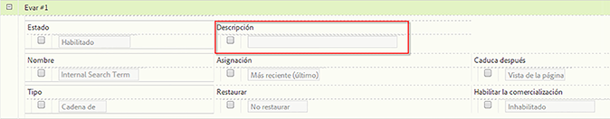

# Descripciones personalizadas de informe

Puede proporcionar descripciones personalizadas de informe para eVars, propiedades, clasificaciones y eventos. Todos los usuarios finales pueden ver las descripciones.

**[!UICONTROL Analytics]** &gt; **[!UICONTROL Administración]** &gt; **[!UICONTROL Grupos de informes]** &gt; **[!UICONTROL Editar configuración]** &gt; **[!UICONTROL *variable*]**

>[!NOTE]
>
>La adición de descripciones está disponible para las clasificaciones más tradicionales, pero no para las clasificaciones móviles.

1. Proporcione una descripción para el informe. El número máximo de caracteres es 255.
1. Haga clic en **[!UICONTROL Guardar]**.

La descripción es visible en dos ubicaciones:

* En la barra de título para el informe:

   

* Como información de objeto cuando pasa el cursor por encima del informe en la navegación izquierda:

   

