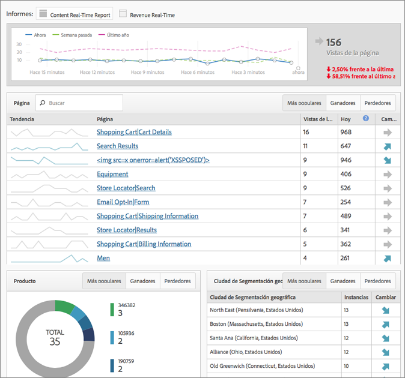

# Informes en tiempo real

Muestra el tráfico de la página web y clasifica las vistas de la página en tiempo real. Proporciona datos procesables en los que fundamentar sus decisiones comerciales.

>[!NOTE] El informe en tiempo real no requiere implementación ni etiquetado adicionales. Utiliza la implementación existente de Adobe Analytics. Para configurar informes en tiempo real, consulte  [Configuración de informes en tiempo real](/help/admin/admin/realtime/t-realtime-admin.md).

**[!UICONTROL Site Metrics]** > **[!UICONTROL Real-Time]**

Real-Time responde a las siguientes preguntas: ¿Qué es la tendencia en mi sitio y por qué? Le permite, como especialista en mercadotecnia, responder rápidamente y administrar de forma activa el rendimiento del contenido y las campañas de mercadotecnia. Los datos en tiempo real notificados tienen menos de dos minutos de latencia y se actualizan automáticamente minuto a minuto.

El panel incluye métricas de alta frecuencia y análisis de sitio de Adobe Analytics para informar visualmente sobre las tendencias de tráfico y vista de páginas de noticias dinámicas y sitios web de minoristas. Tiempo real comprende las tendencias de los datos minuto a minuto, segundos después de recopilarlos. Recopila y transmite datos en una interfaz de usuario de actualización automática, mediante la correlación y el seguimiento en tiempo real del contenido y cierta conversión.

Dos de los escenarios de uso más frecuentes incluyen editores que deseen promocionar o degradar artículos a medida que cambia la actividad del usuario y especialistas en marketing que deseen rastrear el lanzamiento de una nueva línea de productos.

Como administrador, puede

* Cree hasta 3 informes en tiempo real por grupo de informes, utilizando dimensiones o clasificaciones existentes y métricas. Utilice las dimensiones secundarias para correlacionar (o desglosar) la principal.
* Añada 3 dimensiones (o clasificaciones) por informe (una primaria y dos secundarias), además de 1 métrica para todo el sitio.
* Utilice cualquier evento personalizado, evento del carro de compras o instancia.
* Vista de hasta 2 horas de datos históricos en tiempo real y modificación de esta configuración:

   * Últimos 15 minutos: Granularidad de 1 minuto
   * Últimos 30 minutos: Granularidad de 1 minuto
   * Última hora: Granularidad de 2 minutos
   * Últimas 2 horas: Granularidad de 4 minutos

* Compare, por ejemplo, los valores de la semana pasada con los valores del año pasado (así como con el total de hoy).

Tenga en cuenta que las eVars (métricas de conversión) no son compatibles, ya que no existe ningún concepto de persistencia. Aunque puede seleccionar métricas de conversión, solo funcionan si están configuradas en la misma página que las dimensiones. Para obtener más información, consulte el mensaje de advertencia registrado en [Configuración de informesen tiempo real](/help/admin/admin/realtime/t-realtime-admin.md).

La configuración y visualización de informes en tiempo real está restringida a administradores o a cualquier usuario de los grupos de permisos &quot;Acceso a todos los informes&quot; y &quot;Sistema de informes avanzado&quot;. Sin embargo, Tiempo real respeta los permisos. Si, por ejemplo, no tiene derechos para ver los ingresos, no podrá realizar la vista de un informe en tiempo real que incluya datos de ingresos.

## Latencia de datos como resultado de la configuración de A4T  {#section_806CE36354FC4C539A0DED9266A5C704}

Una vez habilitada la integración de A4T en Adobe Destinatario, experimentará una latencia adicional de 5 a 10 minutos en Adobe Analytics. Este aumento de latencia permite almacenar los datos de Analytics y Destinatario en la misma visita, lo que le permite desglosar las pruebas por página y sección del sitio.

Este aumento se refleja en todos los servicios y herramientas de Adobe Analytics, incluidos el flujo en directo y el sistema de informes en tiempo real, y se aplica en los siguientes escenarios:

* Para flujo en directo, informes en tiempo real y solicitudes de API, y datos actuales para variables de tráfico, solo se retrasan las visitas con un ID de datos suplementario.
* Para los datos actuales sobre las métricas de conversión, los datos finalizados y las fuentes de datos, todas las visitas se retrasan entre 5 y 7 minutos adicionales.

Tenga en cuenta que el aumento de la latencia se da después de implementar el Servicio de identidad, incluso aunque no haya implementado correctamente esta integración.
