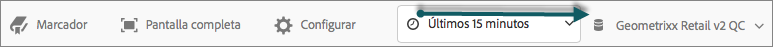
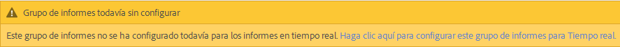
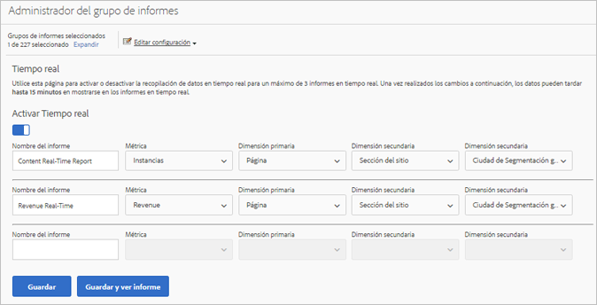
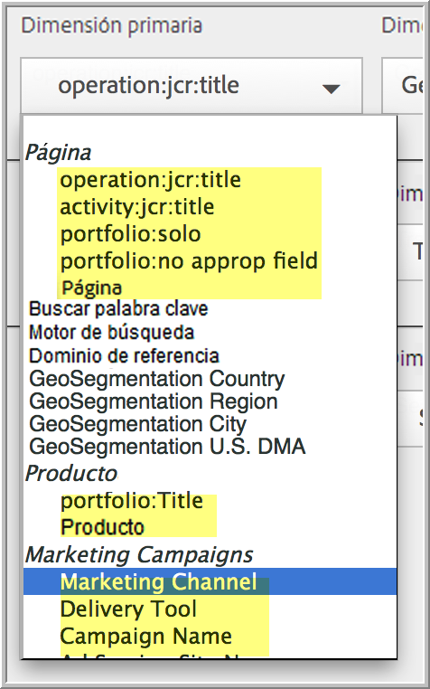
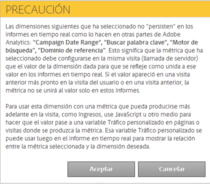

# Configuración de informes en tiempo real

Pasos administrativos para configurar informes en tiempo real.

Configurar informes en tiempo real en Reports &amp; Analytics consiste en seleccionar el grupo de informes y configurar hasta 3 informes para este.

1. Seleccione el grupo de informes para el que quiere habilitar los informes en tiempo real.

   Navigate to **[!UICONTROL Analytics]** &gt; **[!UICONTROL Reports]** &gt; **[!UICONTROL View All Reports &gt; Site Metrics]** &gt; **[!UICONTROL Real-Time]** and select the report suite from the drop-down at the top:

   

   Si trata de ver informes en tiempo real de un grupo de informes que no se haya configurado para este tipo de informes, aparecerá un mensaje que le permitirá configurarlo.

   

1. Click **[!UICONTROL Configure]** (gear icon) to run the [!UICONTROL Report Suite Manager].

   (Also available under **[!UICONTROL Analytics]** &gt; **[!UICONTROL Admin &gt; Report Suites]** &gt; **[!UICONTROL Edit Settings]** &gt; **[!UICONTROL Real-Time]**.)

1. Turn on the **[!UICONTROL Enable Real-Time]** setting.
1. Configure la recopilación de datos en tiempo real para hasta tres informes, con una métrica y tres dimensiones o clasificaciones por informe.

   

   Para obtener información sobre las métricas y dimensiones compatibles en tiempo real, consulte Métricas y dimensiones admitidas.

   Si ha creado clasificaciones, estas aparecerán con sangría debajo de las dimensiones para las que se hayan definido:

   

   >[!NOTE]
   >
   >Para un solo informe en tiempo real, actualmente no se admiten dimensiones duplicadas, aunque se seleccione una clasificación diferente para cada dimensión.

   Para obtener más información sobre las clasificaciones, consulte [Acerca de las clasificaciones](/help/components/c-classifications2/c-classifications.md).

   >[!NOTE]
   >
   >Algunas dimensiones, como "Palabras clave de búsqueda" o "Producto", no persisten en tiempo real como lo hacen en otras partes de Adobe Analytics. Al seleccionar una métrica no persistente se mostrará la siguiente advertencia:

   

1. Click **[!UICONTROL Save]** or **[!UICONTROL Save and View Report]**.

   Después de esta configuración inicial del informe los datos pueden tardar hasta 20 minutos en ser transferidos. A partir de ese momento los datos estarán disponibles inmediatamente. Para obtener más información sobre la visualización de informes en tiempo real, consulte [Ejecución de un informe en tiempo real](https://marketing.adobe.com/resources/help/en_US/sc/user/reports_realtime.html).

1. De manera predeterminada todos los usuarios tienen acceso a los informes en tiempo real.
