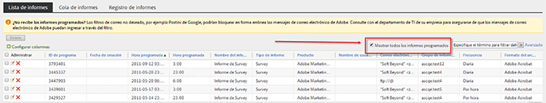
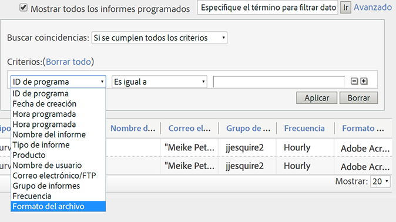
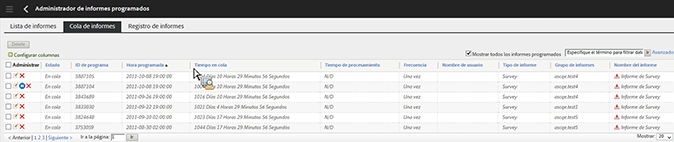
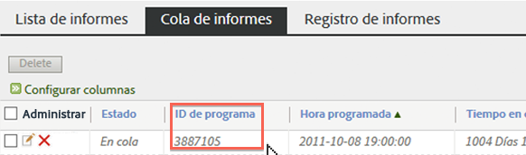

# Cola de informes programados

Permite que los usuarios de nivel de administración vean y gestionen informes programados en toda la organización.

**[!UICONTROL Analytics]** > **[!UICONTROL Componentes]** > **[!UICONTROL Informes programados]**

Algunas funciones de nivel de administración en el Administrador de informes programados son:

* La opción [Mostrar todos los informes programados](/help/admin/admin/scheduled-reports-admin.md#section_3F167CAAEEC24140B476CF95B7402690) de su organización.
* [Funciones de filtro avanzado](/help/admin/admin/scheduled-reports-admin.md#section_206A52A85DE84947AAB3AD082FBF6275) de su organización.
* La nueva ficha [Cola de informes](/help/admin/admin/scheduled-reports-admin.md#section_03C866115D354BB182E90BF4D52F1E0B) que enumera todos los informes que están en cola para la ejecución en los servidores de informes.
* Visualización del [ID de programa](/help/admin/admin/scheduled-reports-admin.md#section_568B70F4228C4229977CB85D2DCD53A1) en la interfaz de cola de informe.

## Mostrar todos los informes programados {#section_3F167CAAEEC24140B476CF95B7402690}

En la ficha **[!UICONTROL Lista de informes]**, puede **[!UICONTROL mostrar todos los informes programados]** en su organización, además de los que programó personalmente.

>[!NOTE]
>
>La columna **[!UICONTROL Nombre del informe]** muestra el nombre del informe que se está programando. La columna **[!UICONTROL Nombre del archivo]** muestra todo el nombre de archivo personalizado que haya establecido en las Opciones de envío avanzadas. En consecuencia, si programa varios informes del mismo tipo de informe y especifica nombres personalizados para cada uno, el Administrador de informes programados mostraría varias entradas con el mismo Nombre de informe pero con diferentes nombres de archivos. Esto se debe que el informe de servidor que se programa es el mismo, por lo que la columna Nombre del informe tendría los mismos nombres de informes para todos excepto los nombres de archivos personalizados (tal como se estableció).

## Funciones de filtro avanzado  {#section_206A52A85DE84947AAB3AD082FBF6275}

Por ejemplo, si desea filtrar todos los informes que están programados cada hora, especifique **[!UICONTROL Frecuencia igual a cada hora]** en el filtro **[!UICONTROL Avanzado]** y haga clic en **[!UICONTROL Aplicar]**:

## Cola de informes {#section_03C866115D354BB182E90BF4D52F1E0B}

Esta cola le permite gestionar y eliminar potencialmente cualquier informe programado que esté &quot;obstaculizando&quot; la cola. (Generalmente, los informes agotan el tiempo de espera a las 4 horas).

La cola de informes también le proporciona la habilidad de &quot;Omitir el informe programado una vez&quot;. Haga clic en el icono azul en la columna **[!UICONTROL Administrar]**.

## ID de programa {#section_568B70F4228C4229977CB85D2DCD53A1}

Si el **[!UICONTROL ID de programa]** está expuesto en la interfaz de la cola de informe es útil cuando necesita ponerse el contacto con Adobe Client Care para resolver un problema de los informes programados.

