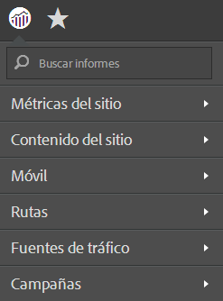

# Menú de informes simplificado

Pasos para implementar el menú de informes simplificado en Reports and Analytics.

El menú Reports &amp; Analytics de Adobe simplificado permite aplicar un menú alternativo y simplificado con carpetas reestructuradas inferiores. El menú simplificado muestra estas opciones de manera predeterminada:

>[!NOTE]
>
>Tenga en cuenta que al aplicar el menú simplificado se eliminarán todas las personalizaciones que haya realizado en la estructura de menú predeterminada. Además, implementa la estructura de menús simplificados para todos los usuarios de Marketing Reports &amp; Analytics de su organización. Piense detenidamente en las repercusiones (como la formación que haya proporcionado sobre la estructura de menús existente) antes de implementar este nuevo menú, ya que no podrá revertir a ninguna personalización en su estructura de menús existente.

1. Vaya a **[!UICONTROL Analytics]** > **[!UICONTROL Administración]** > **[!UICONTROL Grupos de informes]** para abrir el Administrador del grupo de informes.
1. Seleccione el grupo de informes para el que quiera implementar la estructura de menús simplificados.
1. Vaya a **[!UICONTROL Editar configuración]** > **[!UICONTROL General]** > **[!UICONTROL Personalizar menús]**.
1. Haga clic en **[!UICONTROL Restaurar simplificado]** para implementar la estructura de menús simplificados.

   

1. Para volver al menú predeterminado (no personalizado), haga clic en **[!UICONTROL Restaurar predeterminados]**.
