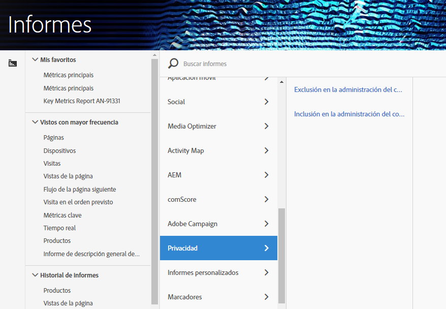

# Variables de administración de consentimiento

Para proporcionar asistencia adicional en la administración de datos de privacidad, hay disponible un conjunto de variables reservadas que se pueden utilizar junto con variables de datos de contexto específicas.
Estas variables de administración de consentimiento proporcionan un marco fácil de usar para capturar el estado de consentimiento en cada visita de análisis.

## Variables

* Exclusión en la administración de consentimiento
   * Variable reservada: Prop de lista
   * Tipo: Cadena delimitada por comas
   * Contiene:
      * `contextData.['cm.ssf']=1` mostrado como SSF
      * `contextData.['opt.dmp']=N` mostrado como DMP
      * `contextData.['opt.sell']=N` mostrado como SELLO

* Inclusión en la administración de consentimiento
   * Variable reservada: Prop de lista
   * Tipo: Cadena delimitada por comas
   * Contiene:
      * `contextData.['opt.dmp']=Y` mostrado como DMP
      * `contextData.['opt.sell']=Y` mostrado como SELLO

## Creación de informes

Puede habilitar las variables de administración de consentimiento mediante una nueva configuración de privacidad disponible en la Consola de administración de Analytics.

Cada grupo de informes se puede configurar de la siguiente manera:
1. In Reports &amp; Analytics click **[!UICONTROL Admin &gt; Report Suites.]**
1. Select the report suite(s) where you are collecting media data and click **[!UICONTROL Edit Settings &gt; Privacy Management.]**

   

1. Haga clic en el botón **[!UICONTROL Activar informes]** de privacidad de datos. **** Nota: Una vez habilitadas, estas variables no se pueden desactivar.

   

1. Una vez activado, verá un mensaje de confirmación.

   

1. Las variables reservadas ahora están disponibles para los informes.  Consulte Opción de exclusión de administración de consentimiento y inclusión de administración de consentimiento.

   

## Implementación

Se han predefinido tres variables de datos de contexto para que funcionen con las variables reservadas de gestión de consentimiento.  Depende de cada ingeniero de implementación determinar cómo administrar y mantener la configuración de estas variables.

Consulte Variables [de datos de](https://docs.adobe.com/help/en/analytics/implementation/javascript-implementation/variables-analytics-reporting/context-data-variables.html) contexto para obtener instrucciones generales sobre cómo implementar variables de datos de contexto.

### SSF

* Datos de contexto: contextData.['cm.ssf']
* Valores aceptados:
   * 1 - Al enviar el valor "1", indica que el reenvío del lado del servidor está en estado de exclusión. El valor "1" asociado con esta variable bloqueará el uso compartido de esta visita con Adobe Audience Manager. Consulte Cumplimiento de [la privacidad electrónica de AAM.](https://docs.adobe.com/help/en/analytics/integration/audience-analytics/audience-analytics-workflow/ssf-gdpr.html)
   * No se aceptan otros valores para este parámetro.

### DMP

* Datos de contexto: contextData.['opt.dmp']
* Valores aceptados:
   * N: Al enviar el valor "N", esto indica que el consumidor está optando por dejar de compartirlo en las plataformas de administración de datos. **** Nota: La configuración de esta variable en "N" no bloquea actualmente el uso compartido a AAM, pero el bloqueo de llamadas a la funcionalidad AAM se agregará a principios de 2020. Por ahora, Adobe recomienda configurar `c.cm.ssf=1` y `c.opt.dmp=N` bloquear el envío de visitas a AAM.
   * Y: Al enviar el valor "Y", esto indica que el consumidor está optando por compartir en plataformas de administración de datos.

### VENDER

* Datos de contexto: contextData.['opt.sell']
* Valores aceptados:
   * N - Al enviar el valor "N", esto indica que el consumidor está optando por no compartir o vender los datos a terceros.
   * Y - Al enviar el valor "Y", esto indica que el consumidor está optando por compartir o vender los datos a terceros.
