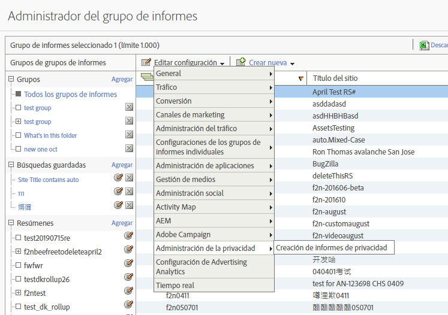
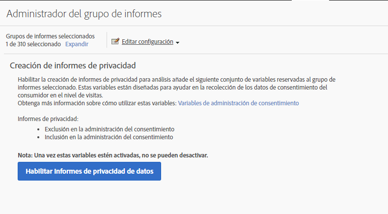
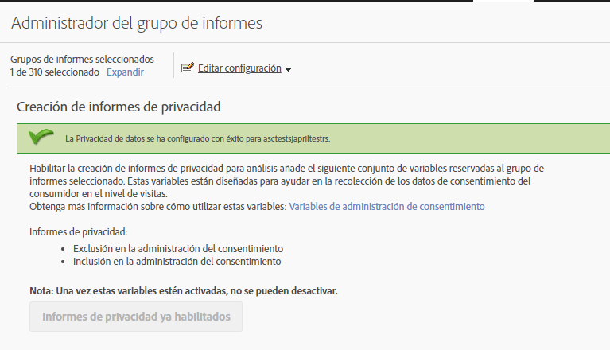
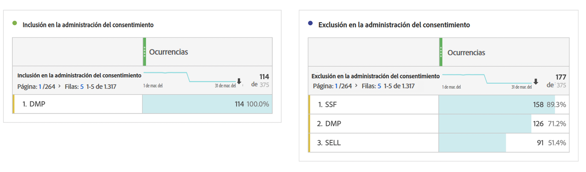

# Variables de informes de privacidad

Para proporcionar asistencia adicional en la administración de datos de privacidad, existe un conjunto de variables reservadas que se pueden utilizar junto con variables de datos de contexto específicas.
Estas variables de informes de privacidad proporcionan un marco fácil de usar para registrar el estado de privacidad en cada visita de análisis.

## Variables

* Exclusión en la administración de consentimiento
   * Variable reservada: Prop de lista
   * Tipo: Cadena delimitada por comas
   * Contiene:
      * `contextData.['cm.ssf']=1` mostrado como SSF
      * `contextData.['opt.dmp']=N` mostrado como DMP
      * `contextData.['opt.sell']=N` mostrado como SELL

* Inclusión en la administración de consentimiento
   * Variable reservada: Prop de lista
   * Tipo: Cadena delimitada por comas
   * Contiene:
      * `contextData.['opt.dmp']=Y` mostrado como DMP
      * `contextData.['opt.sell']=Y` mostrado como SELL

## Creación de informes

Puede habilitar las variables de informes de privacidad mediante una nueva configuración de privacidad disponible en Admin Console de Analytics.

Cada grupo de informes se puede configurar de esta forma:
1. En Informes y análisis, haga clic en **[!UICONTROL Admin > Report Suites]**.
1. Select the report suite(s) where you are collecting media data and click **[!UICONTROL Edit Settings > Privacy Management]**.

   

1. Click the **[!UICONTROL Enable Data Privacy Reports]** button.

   > [!NOTE] Una vez estas variables estén activadas, no se pueden desactivar.

   

1. Una vez activadas, verá un mensaje de confirmación.

   

1. Las variables reservadas ahora están disponibles para análisis en Informes y análisis y Workspace. Consulte la Exclusión de administración de consentimiento e Inclusión de administración de consentimiento.

   

## Implementación

Se han predefinido tres variables de datos de contexto para que funcionen con las variables reservadas de administración de informes de privacidad.  Depende de cada ingeniero de implementación determinar cómo administrar y mantener la configuración de estas variables.

Consulte [Variables de datos de contexto](https://docs.adobe.com/help/en/analytics/implementation/javascript-implementation/variables-analytics-reporting/context-data-variables.html) para obtener instrucciones generales sobre cómo implementar variables de datos de contexto.

### SSF

* Datos de contexto: `contextData.['cm.ssf']`
* Valores aceptados:
   * 1 - Al enviar el valor “1”, esto indica que el Reenvío del lado del servidor está en estado de exclusión. El valor “1” asociado con esta variable bloqueará el uso compartido de esta visita con Adobe Audience Manager. Consulte [Cumplimiento de la privacidad electrónica de AAM](https://docs.adobe.com/help/en/analytics/integration/audience-analytics/audience-analytics-workflow/ssf-gdpr.html).
   * 0: Opcional. Use el valor &quot;0&quot; para los clientes que aceptaron el marketing dirigido. Si no se configura la variable, se observarán los mismos resultados.

### DMP

* Datos de contexto: `contextData.['opt.dmp']`
* Valores aceptados:
   * N - Al enviar el valor “N” esto indica que el consumidor se excluye del uso compartido para las plataformas de administración de datos.  **Nota**: A partir del 15 de enero de 2020, si esta variable se establece en &quot;N&quot;, se bloquea el uso compartido de esta visita por parte del servidor en AAM.
   * Y - Al enviar el valor “Y” esto indica que el consumidor se incluye en el uso compartido para las plataformas de administración de datos.

### SELL

* Datos de contexto: `contextData.['opt.sell']`
* Valores aceptados:
   * N - Al enviar el valor “N” indica que el consumidor se excluye del uso compartido o de la venta de los datos a terceros.
   * Y - Al enviar el valor “Y” esto indica que el consumidor se incluye en el uso compartido o de la venta de los datos a terceros.
