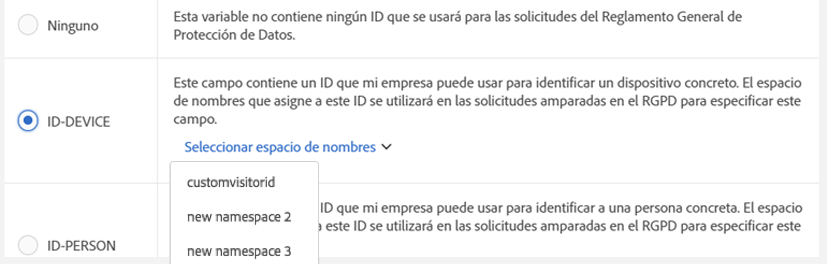
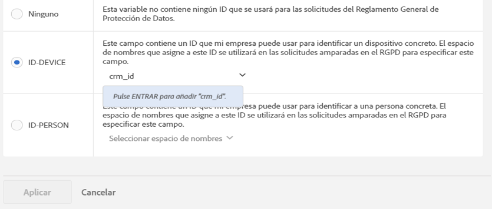

# Etiquetas de privacidad de datos para variables de Analytics

## ¿Por qué debería etiquetar sus datos? {#section_A075CDF3AD0744BD8CEB41CE3FB7BFB3}

Muchos clientes de Adobe tienen equipos legales que han revisado las leyes de privacidad de datos (RGPD, CCPA, etc.) y que han sacado sus propias conclusiones sobre cómo deben manejarse los datos para cumplir con las leyes de privacidad de datos. Las interpretaciones legales pueden ser distintas de una empresa a otra y la configuración de administración de datos también puede diferir según el cliente. Dado que los clientes tienen distintas preferencias para el tratamiento de privacidad de datos y diferentes conjuntos de datos, Adobe permite a sus clientes, como responsables del tratamiento de datos, personalizar la configuración que deseen para el tratamiento de privacidad de datos en lo relativo a sus propios datos. De este modo, cada cliente individual puede tratar las solicitudes de privacidad de datos de la manera que mejor se adapte a su marca y a su conjunto de datos único.

Adobe Analytics proporciona herramientas para etiquetar datos según su sensibilidad y restricciones contractuales. Las etiquetas son importantes y útiles para ayudar a: (1) identificar a los sujetos de datos, (2) determinar qué datos devolver como parte de una solicitud de acceso y (3) identificar los campos de datos que deben eliminarse como parte de una solicitud de eliminación.

Antes de poder determinar las etiquetas que se deben aplicar a cada variable o campo, debe [comprender qué tipo de ID](/help/admin/c-data-governance/gdpr-analytics-ids.md) captura en sus datos de Analytics y decidir cuáles usará para las solicitudes de privacidad de datos.

La implementación de privacidad de datos de Adobe Analytics admite las siguientes etiquetas para datos de identidad, datos confidenciales y administración de datos.

## Etiquetas DULE  {#section_B2E78130957647338495EF37DE21D6BC}

>[!NOTE] El marco de etiquetado y aplicación del uso de los datos (Data Usage Labeling &amp; Enforcement, DULE) se ha diseñado para proporcionar una manera uniforme de recopilar, comunicar y usar metadatos de los datos de todas las soluciones, servicios y plataformas de Adobe en Adobe Experience Cloud. Los metadatos ayudan a los responsables del tratamiento de datos a indicar qué datos son información personal, cuáles son datos confidenciales y qué restricciones contractuales están asociadas a los datos. En esta versión inicial, Analytics expone únicamente las etiquetas DULE que son relevantes para la privacidad de datos. A medida que otros productos de Adobe implementan la compatibilidad con las etiquetas DULE, las futuras versiones introducirán etiquetas de datos confidenciales adicionales, así como etiquetas contractuales, las cuales ayudarán a garantizar que los datos compartidos entre productos se utilizan únicamente de las formas permisibles según la ley.

## Etiquetas de datos de identidad (DULE)  {#identity-data-labels}

Las etiquetas de datos de identidad “I” se utilizan para categorizar datos que permiten identificar a una persona específica o ponerse en contacto con ella.

<table id="table_6B5368D714424E52835D5DFE189BD080"> 
 <thead> 
  <tr> 
   <th colname="col1" class="entry"> Etiqueta </th> 
   <th colname="col2" class="entry"> Definición </th> 
   <th colname="col3" class="entry"> Otros requisitos </th> 
  </tr>
 </thead>
 <tbody> 
  <tr> 
   <td colname="col1"> <p>I1 </p> </td> 
   <td colname="col2"> <p><b>Identificable</b>directamente: Datos que pueden identificar o habilitar específicamente el contacto directo con un individuo, como un nombre o una dirección de correo electrónico. </p> </td> 
   <td colname="col3"> 
    <ul id="ul_4E2AD59D119E40D28B869D0BB63B9FD9"> 
     <li id="li_AC3E99B57E3A4AE2A12BE219680AFC58">No se puede establecer en eventos </li> 
     <li id="li_BB66992863C8402F8D58656293F31E71">No se puede establecer en las eVars de comercialización </li> 
    </ul> </td> 
  </tr> 
  <tr> 
   <td colname="col1"> <p>I2 </p> </td> 
   <td colname="col2"> <p><b>Identificable</b>indirectamente: Datos que pueden utilizarse en combinación con cualquier otro dato para identificar o habilitar el contacto directo con un individuo o dispositivo. </p> <p>No permiten que se determine de qué persona se trata por sí solos, pero podrían combinarse con otra información (que usted podría tener o no en su poder) para identificar a alguien. Algunos ejemplos son un número de lealtad del cliente o un ID utilizado por el sistema CRM de una compañía que es único para cada uno de sus clientes. </p> </td> 
   <td colname="col3"> 
    <ul id="ul_A0EF0F3DC5804D4FBE228946D697ABEB"> 
     <li id="li_A592EA6DA82C4D8C80E03F02ADF4E20E">No se puede establecer en eventos </li> 
     <li id="li_46CE7B1E84884CDAB356A6DF89397849">No se puede establecer en las eVars de comercialización </li> 
    </ul> </td> 
  </tr> 
 </tbody> 
</table>

## Etiquetas de datos confidenciales (DULE)  {#sensitive-data-labels}

Las etiquetas de datos confidenciales “S” se utilizan para categorizar datos confidenciales, como datos geográficos. En el futuro se introducirán etiquetas de datos confidenciales adicionales para identificar otros tipos de información confidencial.

<table id="table_A778A508620545CCB37830E5CF1C75B7"> 
 <thead> 
  <tr> 
   <th colname="col1" class="entry"> Etiqueta </th> 
   <th colname="col2" class="entry"> Definición </th> 
  </tr>
 </thead>
 <tbody> 
  <tr> 
   <td colname="col1"> <p>S1 </p> </td> 
   <td colname="col2"> <p> Datos precisos de geolocalización relacionados con la latitud y la longitud que pueden utilizarse para determinar la ubicación exacta de un dispositivo (a menos de 100 metros). </p> </td> 
  </tr> 
  <tr> 
   <td colname="col1"> <p>S2 </p> </td> 
   <td colname="col2"> <p> Datos de ubicación geográfica que pueden utilizarse para determinar un área definida de forma amplia. </p> </td> 
  </tr> 
 </tbody> 
</table>

## Etiquetas de administración de datos (privacidad de datos) {#data-governance-labels}

Las etiquetas de control de datos confieren a los usuarios la capacidad de clasificar datos que reflejen consideraciones relacionadas con la privacidad y condiciones contractuales a fin de cumplir las normativas y las políticas corporativas.

**Etiquetas de acceso a la privacidad de datos**

<table id="table_663EFF43A454498386F7F3E60875E0F8"> 
 <thead> 
  <tr> 
   <th colname="col1" class="entry"> Etiqueta </th> 
   <th colname="col2" class="entry"> Definición </th> 
   <th colname="col3" class="entry"> Otros requisitos </th> 
  </tr>
 </thead>
 <tbody> 
  <tr> 
   <td colname="col1"> <p>Ninguna </p> </td> 
   <td colname="col2"> <p>Seleccione esta opción si esta variable no contiene datos que deban incluirse en los datos devueltos al interesado como parte de una solicitud de acceso a la privacidad de datos. </p> </td> 
   <td colname="col3"> </td> 
  </tr> 
  <tr> 
   <td colname="col1"> <p>ACC-ALL </p> </td> 
   <td colname="col2"> <p>Los valores de este campo se deben incluir en <u>todas</u> las solicitudes de acceso de la privacidad de datos. </p> <p>Si esta visita provenía de un dispositivo compartido por varias personas, al aplicar esta etiqueta, usted, como controlador de datos, indica que es aceptable compartir los datos de este campo con cualquier persona que tenga acceso al dispositivo compartido. </p> </td> 
   <td colname="col3"> <p>Los campos con esta etiqueta se devolverán para todas las solicitudes de la privacidad de datos. </p> </td> 
  </tr> 
  <tr> 
   <td colname="col1"> <p>ACC-PERSON </p> </td> 
   <td colname="col2"> <p> Los valores de este campo se deben incluir únicamente para solicitudes de acceso de la privacidad de datos cuando tengamos la certeza, dentro de lo razonable, de que la visita correspondía al interesado, tal y como se determine mediante la coincidencia de un ID de solicitud de la privacidad de datos con el valor de un campo ID-PERSON. </p> </td> 
   <td colname="col3"> <p>También debe tener una etiqueta ID-PERSON establecida en alguna variable dentro de este grupo de informes y enviar solicitudes usando esa ID, o esta etiqueta nunca se aplicará. </p> </td> 
  </tr> 
 </tbody> 
</table>

Mientras que algunas variables recibirán alguna de las otras etiquetas, se espera que el acceso a las etiquetas se aplique a muchas de sus variables. Sin embargo, usted, en consulta con su equipo legal, es quien decide qué datos ha recopilado y qué datos debe compartir con los sujetos de datos.

**Etiquetas de eliminación de privacidad de datos**

<table id="table_59DFCE4D90214CB5972BDDE5B7391B4D"> 
 <thead> 
  <tr> 
   <th colname="col1" class="entry"> Etiqueta </th> 
   <th colname="col2" class="entry"> Definición </th> 
   <th colname="col3" class="entry"> Otros requisitos </th> 
  </tr>
 </thead>
 <tbody> 
  <tr> 
   <td colname="col1"> </td> 
   <td colname="col2"> <p>A diferencia de otras etiquetas, estas etiquetas de eliminación no son mutuamente exclusivas. Puede seleccionar una, ambas o ninguna. No es necesario incluir una etiqueta Ninguno por separado, ya que se indica Ninguno simplemente sin marcar ninguna de las opciones de eliminación. </p> </td> 
   <td colname="col3"> <p>Solo se requiere una etiqueta de eliminación para los campos que contienen un valor que permita asociar una visita con el asunto de datos (es decir, que permita la identificación del sujeto de datos). </p> <p> Otra información personal (favoritos, historial de navegación/compras, estado de salud, etc.) no necesita eliminarse, ya que la asociación con el sujeto de datos se interrumpirá. </p> </td> 
  </tr> 
  <tr> 
   <td colname="col1"> <p>ELI-DISPOSITIVO </p> </td> 
   <td colname="col2"> <p>En el caso de solicitudes de eliminación de la privacidad de datos, los valores de este campo deben convertirse en anónimos solo para aquellas solicitudes en las que haya una etiqueta ID-DEVICE presente en la visita. </p> <p>Si se produce el mismo valor en otras visitas individuales que no se eliminen, las demás instancias no se cambiarán. Esto hará que los recuentos cambien para los informes que calculan recuentos únicos en este campo. En dispositivos compartidos, esto puede eliminar identificadores para otras personas, más allá del sujeto de datos. </p> <p>Los recuentos no cambian si este campo también tiene una etiqueta ID-DEVICE y el valor del campo se ha utilizado como ID para la solicitud de privacidad de datos. </p> </td> 
   <td colname="col3"> 
    <ul id="ul_45C3A09E1F05492B97C3F3DEA7C78FBC"> 
     <li id="li_BAB277F92F284ADE9D7B6839BDD716E2">También requiere la etiqueta I1 o I2 o S1 </li> 
     <li id="li_6DDFC0571457489CBA9D76F547247F20">No se puede establecer en eventos </li> 
     <li id="li_E79C6DFC6C58478EAA1504E3820D512C">No se puede establecer en las eVars de comercialización </li> 
     <li id="li_B78E273212E447D49D0707E174B66DEC">No se puede establecer en Clasificaciones </li> 
     <li id="li_F0F52D0DE7454557A6A97063C1FBC372">Debe enviar solicitudes utilizando un ID-DEVICE o establecer expandedIDs en true, o bien esta etiqueta nunca se aplicará. </li> 
    </ul> </td> 
  </tr> 
  <tr> 
   <td colname="col1"> <p>DEL-PERSON </p> </td> 
   <td colname="col2"> <p>En el caso de solicitudes de eliminación de la privacidad de datos, los valores de este campo deben convertirse en anónimos solo para aquellas solicitudes en las que haya una etiqueta ID-PERSON presente en la visita. </p> <p>Si se produce el mismo valor en otras visitas individuales que no se eliminen, no se cambiarán los demás valores. Esto hará que los recuentos cambien para los informes que calculan recuentos únicos en este campo. Los recuentos no cambiarán si este campo también tiene una etiqueta ID-PERSON y el valor del campo se ha utilizado como ID para la solicitud de privacidad de datos. </p> </td> 
   <td colname="col3"> 
    <ul id="ul_6722E42E036E47B4B5E17DC213636D51"> 
     <li id="li_6C1A64FF68AF428A827D8C6C33E22970">También requiere la etiqueta I1 o I2 o S1 </li> 
     <li id="li_8053533FFE874EE795C8B6043A4F73B3">No se puede establecer en eventos </li> 
     <li id="li_D6700CF4D03E44DDA83C4DDBB5B70CC3">No se puede establecer en las eVars de comercialización </li> 
     <li id="li_B6C2B15484B344889DBF29B62E2EA8FD">No se puede establecer en Clasificaciones </li> 
     <li id="li_3BBD0C27D9644C2B9618457A0BFC15EF">También debe tener una etiqueta ID-PERSON establecida en alguna variable dentro de este grupo de informes y enviar solicitudes usando esa ID, o esta etiqueta nunca se aplicará. </li> 
    </ul> </td> 
  </tr> 
 </tbody> 
</table>

**Etiquetas de identidad de privacidad de datos**

<table id="table_F6BBC868457443A19A7B693BD6C55B4B"> 
 <thead> 
  <tr> 
   <th colname="col1" class="entry"> Etiqueta </th> 
   <th colname="col2" class="entry"> Definición </th> 
   <th colname="col3" class="entry"> Otros requisitos </th> 
  </tr>
 </thead>
 <tbody> 
  <tr> 
   <td colname="col1"> <p>Ninguna </p> </td> 
   <td colname="col2"> <p>Esta variable no contiene ningún ID que se usará para las solicitudes de privacidad de datos. </p> </td> 
   <td colname="col3"> <p>Únicamente debe establecer una de estas otras etiquetas si este campo contiene un ID que utilizará al enviar las solicitudes de acceso o eliminación mediante la interfaz de usuario o la API de privacidad de datos. </p> </td> 
  </tr> 
  <tr> 
   <td colname="col1"> <p>ID-DEVICE </p> </td> 
   <td colname="col2"> <p>Este campo contiene un ID que puede utilizarse para identificar un dispositivo para una solicitud de privacidad de datos, pero no puede distinguir entre distintos usuarios de un dispositivo compartido. </p> <p>No necesita especificar esta etiqueta para todas las variables que contienen ID (ese el propósito de las etiquetas I1/I2). Utilice esta etiqueta si envía solicitudes de privacidad de datos mediante las ID almacenadas en esta variable y desea buscar esta variable para los ID especificados. </p> </td> 
   <td colname="col3"> 
    <ul id="ul_618019CB8FCA4A5C94C47636240197B2"> 
     <li id="li_0E5ADED36FF24A348FDD434E2CC8C8EE">También requiere la etiqueta I1 o I2 </li> 
     <li id="li_20BCFF07B2BF468C8E0D477C10B2EF9F">No se puede establecer en eventos </li> 
     <li id="li_0BD73EEF4184475D8E97878CF8DBEB90">No se puede establecer en las eVars de comercialización </li> 
     <li id="li_129851035C4A4BF0922296B4C3BEE39B">No se puede establecer en Clasificaciones </li> 
    </ul> </td> 
  </tr> 
  <tr> 
   <td colname="col1"> <p>ID-PERSONA </p> </td> 
   <td colname="col2"> <p>Este campo contiene un ID que se puede usar para identificar a un usuario autenticado (una persona específica) cuando se realice una solicitud de privacidad de datos. </p> <p>No necesita especificar esta etiqueta para todas las variables que contienen ID (ese el propósito de las etiquetas I1/I2). Utilice esta etiqueta si enviará solicitudes de privacidad de datos mediante las ID almacenadas en esta variable y desea buscar esta variable para los ID especificados. </p> </td> 
   <td colname="col3"> 
    <ul id="ul_0C7EEC8FCB5C4BCDA5D48F3C98770A67"> 
     <li id="li_2E781AE8D7A046A7996C7300CA854B86">También requiere la etiqueta I1 o I2 </li> 
     <li id="li_EB4C6430C218405DAAE81DEE010DCAA2">No se puede establecer en eventos </li> 
     <li id="li_05AA67B45974474F9DA520E8B877BA11">No se puede establecer en las eVars de comercialización </li> 
     <li id="li_8A6BF4B40ED249289EAD46FE1C755FB0">No se puede establecer en Clasificaciones </li> 
    </ul> </td> 
  </tr> 
 </tbody> 
</table>

## Proporcionar un área de nombres al etiquetar una variable como ID-DEVICE o ID-PERSON  {#section_F0A47AF8DA384A26BD56032D0ABFD2D7}

Cuando etiquete una variable como ID-DEVICE o ID-PERSON, se le solicitará que proporcione un área de nombres. Puede utilizar un área de nombres definida anteriormente o definir una nuevo.

**Utilizar un área de nombres definida anteriormente**

Si ha asignado una etiqueta de ID anteriormente a otras variables de cualquier grupo de informes de su empresa de inicio de sesión, puede seleccionar una de estas áreas de nombres existentes. Debe volver a utilizar el área de nombres si esta variable contiene el mismo tipo de ID que otras variables que ya están etiquetadas con este área de nombres y desea realizar búsquedas en todos ellos al enviar una solicitud.

1. Click **[!UICONTROL Select Namespace]** and select one of the existing namespaces.
1. Haga clic en **[!UICONTROL Apply]**.



**Definir una nuevo área de nombres**

También puede definir una nueva área de nombres. Le recomendamos que las cadenas de área de nombres se limiten a caracteres alfanuméricos, además de los caracteres de guion bajo, guión y espacio. Se convertirán a todas las minúsculas.

1. Click **[!UICONTROL Select Namespace]** and type in the namespace title.

   

1. Press **[!UICONTROL Enter]** to add this namespace. El botón Aplicar únicamente se activará en este momento.
1. Haga clic en **[!UICONTROL Apply]**.

La cadena que especifique como el área de nombres es la misma cadena que debería utilizar al enviar solicitudes mediante la API de privacidad de datos como el valor del parámetro “namespace”. La solicitud entonces hará que Adobe Analytics busque todas las variables en todos sus grupos de informes que compartan este área de nombres en busca del ID que haya especificado en la solicitud.

No necesita especificar las etiquetas de ID-DEVICE o ID-PERSON para todas las variables que contienen ID (ese el propósito de las etiquetas I1/I2). Utilice esta etiqueta si enviará solicitudes de privacidad de datos mediante las ID almacenadas en esta variable y desea buscar esta variable para los ID especificados. A modo de ejemplo, si eVar1 puede contener una dirección de correo electrónico y eVar2 puede contener un nombre de usuario de inicio de sesión, pero solo va a enviar solicitudes utilizando el nombre de usuario, puede etiquetar eVar1 como I1, ACC-PERSON, DEL-PERSON, pero eVar2 como I2, ACC-PERSON, DEL-PERSON, ID-PERSON con el área de nombres “nombre de usuario”. A continuación, puede enviar una solicitud con un bloque JSON de sección de usuario como:

```
{
     "namespace": "user name",
     "type": "analytics",
     "value": "rocketman123"
}
```

El uso de la misma área de nombres para distintas variables es aceptable dentro del mismo grupo de informes. Por ejemplo, algunas implementaciones personalizadas almacenan un CRM-ID tanto en un prop como en un eVar. Si el CRM-ID siempre se produce en uno de ellos (como el eVar) y solo se produce ocasionalmente en el otro (el prop), y nunca en el prop cuando tampoco en el eVar, entonces solo el eVar requiere una etiqueta ID y un área de nombres, ya que Adobe puede buscar el ID únicamente en ese eVar. Sin embargo, si el CRM-ID en ocasiones se produce en una variable y en ocasiones en otra, entonces ambas deberían tener la misma área de nombres y Adobe buscará coincidencias con el ID especificado en ambas variables como parte de la solicitud de privacidad de datos con este área de nombres. Debe seguir teniendo etiquetas DEL en todas estas variables, de modo que el valor sea anonimizado independientemente de dónde se produzca.

Otro ejemplo: puede tener un CRM ID que en ocasiones se envía a través de eVar1 y en ocasiones se envía a través de prop7. También cuenta con una regla de procesamiento que copia el valor del eVar1, si existe, en el eVar3. De lo contrario, copia el valor de prop7 en el eVar3. En este escenario, eVar3 siempre contendrá el ID de CRM si se conoce, por lo que solo eVar3 requiere una etiqueta ID-PERSON.

>[!CAUTION] Las áreas de nombres &quot;visitorId&quot; y &quot;customVisitorId&quot; están reservadas para identificar la cookie de seguimiento heredada de Analytics y el ID de visitante de cliente de Analytics. No utilice estas áreas de nombres para variables de conversión o tráfico personalizado.

## Tipos de variables y las etiquetas de privacidad de datos/DULE que admiten {#section_CE7C3EDE1344466A98BC45E394B40762}

El etiquetado de privacidad de datos/DULE afecta a cuatro clases amplias de variables de Analytics. No todas las variables admiten todas las etiquetas. Esta tabla muestra qué variables admiten o no las etiquetas.

<table id="table_95D4416B3A8A40C28B2610D0003456E6"> 
 <thead> 
  <tr> 
   <th colname="col1" class="entry"> Tipo de variable </th> 
   <th colname="col2" class="entry"> Etiquetas admitidas </th> 
   <th colname="col3" class="entry"> Etiquetas no compatibles </th> 
  </tr>
 </thead>
 <tbody> 
  <tr> 
   <td colname="col1"> 
    <ul id="ul_0615B545A5AD43F2A6F25698A47AAD3E"> 
     <li id="li_A4B3E8E241B149C99F2A71B21227AD72">Eventos exitosos personalizados </li> 
     <li id="li_8AEF688AE9B8426C82D199E4B195330D">eVars de comercialización </li> 
     <li id="li_DFFCA65DCC6146AEB6D47476B4D4CC3B">Variables multivalor (mvVars) </li> 
     <li id="li_3192D08B12C249D1AAA8AAEEDE2FD7D7">Variables de jerarquía </li> 
    </ul> </td> 
   <td colname="col2"> <p>S1/S2 </p> <p>ACC-ALL, ACC-PERSON </p> </td> 
   <td colname="col3"> <p>I1/I2 </p> <p>ID-DISPOSITIVO, ID-PERSONA </p> <p>DEL-DEVICE, DEL-PERSON </p> </td> 
  </tr> 
  <tr> 
   <td colname="col1"> <p>Clasificaciones </p> </td> 
   <td colname="col2"> <p>I1/I2, S1/S2 </p> <p>ACC-ALL, ACC-PERSON, </p> </td> 
   <td colname="col3"> <p>ID-DISPOSITIVO, ID-PERSONA </p> <p>DEL-DEVICE, DEL-PERSON </p> </td> 
  </tr> 
  <tr> 
   <td colname="col1"> 
    <ul id="ul_1C2FD4D606664965A88F10818E1C11A9"> 
     <li id="li_590975F5C7304317B22C80B20718E914">Variables de tráfico (props) </li> 
     <li id="li_6E614B7036994434BFDA71A4424529A0">Variables de comercio (eVars sin comercialización) </li> 
    </ul> </td> 
   <td colname="col2"> <p>Todas las etiquetas </p> </td> 
   <td colname="col3"> - </td> 
  </tr> 
  <tr> 
   <td colname="col1"> <p>La mayoría de las demás variables </p> <p><i>(Consulte la tabla siguiente para ver las excepciones)</i> </p> </td> 
   <td colname="col2"> <p>ACC-ALL, ACC-PERSON </p> </td> 
   <td colname="col3"> <p>I1/I2, S1/S2 </p> <p>ID-DISPOSITIVO, ID-PERSONA </p> <p>DEL-DEVICE, DEL-PERSON </p> </td> 
  </tr> 
 </tbody> 
</table>

## Variables a las que se pueden asignar/modificar etiquetas que no sean ACC-ALL/ACC-PERSON {#section_4FA003003D1B4E2EBCFCDB1A7CD4A824}

<table id="table_0972910DB2D7473588F23EA47988381D"> 
 <thead> 
  <tr> 
   <th colname="col1" class="entry"> Grupo </th> 
   <th colname="col2" class="entry"> Variables </th> 
   <th colname="col3" class="entry"> Etiquetas modificables </th> 
   <th colname="col4" class="entry"> Comentario </th> 
  </tr>
 </thead>
 <tbody> 
  <tr> 
   <td colname="col1" morerows="1"> 
    <ul id="ul_62FA1BAA3B9245909509566D8C03F900"> 
     <li id="li_38F7C4E18ECB42C292370713F502B8EB">Dimensiones de conversión </li> 
     <li id="li_41CB61F927CB4402AAB4A62E219CD153">Dimensiones de tráfico personalizadas </li> 
    </ul> </td> 
   <td colname="col2"> <p>Todos, excepto las clasificaciones </p> </td> 
   <td colname="col3"> <p>Todos </p> </td> 
   <td colname="col4"> </td> 
  </tr> 
  <tr> 
   <td colname="col2"> <p>Clasificaciones </p> </td> 
   <td colname="col3"> <p>Ninguno / I1 / I2 </p> <p>Ninguno / S1 / S2 </p> </td> 
   <td colname="col4"> </td> 
  </tr> 
  <tr> 
   <td colname="col1"> <p>Eventos de conversión </p> </td> 
   <td colname="col2"> <p>Todos </p> </td> 
   <td colname="col3"> <p>Ninguno / S1 / S2 </p> </td> 
   <td colname="col4"> </td> 
  </tr> 
  <tr> 
   <td colname="col1"> <p>Dimensiones y eventos de solución </p> </td> 
   <td colname="col2"> <p>Vínculo de Activity Map, </p> <p>Página de  Activity Map </p> </td> 
   <td colname="col3"> <p>Ninguno / I1 / I2 </p> <p>Ninguno / DEL-DISPOSITIVO / DEL-PERSON </p> </td> 
   <td colname="col4"> <p>Las variables pueden contener parámetros de URL, que pueden incluir datos identificables directa o indirectamente. Si su implementación no recopila datos directa o indirectamente identificables en estas variables, estos no necesitan etiquetas de identidad o eliminación. </p> <p>Tenga en cuenta que la eliminación borra los parámetros de URL, pero conserva la URL de base. </p> </td> 
  </tr> 
  <tr> 
   <td colname="col1"> <p>Dimensiones de procesamiento de datos </p> </td> 
   <td colname="col2"> <p>ID de visitante personalizado </p> </td> 
   <td colname="col3"> <p>ID-DISPOSITIVO/ID-PERSONA </p> <p>DEL-DEVICE/DEL-PERSON </p> </td> 
   <td colname="col4"> <p>No es posible eliminar las etiquetas ID o DEL (establecidas como Ninguno), pero puede cambiarlas por las variantes DEVICE o PERSON, en función de la implementación de su ID personalizado. </p> <p>Si no utiliza el ID de visitante personalizado, entonces esta configuración es irrelevante. </p> </td> 
  </tr> 
  <tr> 
   <td colname="col1" morerows="1"> 
    <ul id="ul_5EB0193732D44A20AEA08CE9DFE01DBD"> 
     <li id="li_F70D969F83314A94BD8567449968EE2F">Dimensiones estándar </li> 
     <li id="li_6046764B19FF4679B51E55671C2C0ADB">Dimensiones de procesamiento de datos </li> 
    </ul> </td> 
   <td colname="col2"> <p>Dirección IP </p> <p>Dirección IP 2 </p> </td> 
   <td colname="col3"> <p>DEL-DEVICE/DEL-PERSON </p> </td> 
   <td colname="col4"> <p>No puede quitar la etiqueta DEL, pero puede cambiarla para que sea DEL-DEVICE o DEL-PERSON, o ambas. </p> </td> 
  </tr> 
  <tr> 
   <td colname="col2"> <p>Acción de ClickMap (preexistente), </p> <p>Contexto de ClickMap (preexistente), </p> <p>Activity Map, </p> <p>URL de la página, </p> <p>URL de la página de entrada original, </p> <p>Referente, </p> <p>URL de la página de inicio de la visita </p> </td> 
   <td colname="col3"> <p>Ninguno / I1 / I2 </p> <p>Ninguno / DEL-DISPOSITIVO / DEL-PERSON </p> </td> 
   <td colname="col4"> <p>Las variables pueden contener parámetros de URL, que pueden incluir datos identificables directa o indirectamente. Si su implementación no recopila datos directa o indirectamente identificables en estas variables, estos no necesitan etiquetas de identidad o eliminación. </p> <p>Tenga en cuenta que la eliminación borra los parámetros de URL, pero conserva la URL de base. </p> </td> 
  </tr> 
 </tbody> 
</table>

## Gestión de eliminaciones  {#section_F3DEE591671A4B16A8E043F91C137ECB}

La compatibilidad de Adobe Analytics con las solicitudes de eliminación de privacidad de datos se ha diseñado para que los informes se vean menos afectados. En la mayoría de los casos, las métricas mostradas en los informes no deben cambiar. Un informe sobre el historial ejecutado antes de eliminar la privacidad de datos coincidirá con el mismo informe ejecutado una vez realizada la eliminación. Esto se consigue al desvincular por completo los datos eliminados del interesado y, a la vez, dejando los datos no identificables en su lugar para mantener la coherencia de los valores notificados.

En la tabla siguiente se describe cómo se &quot;eliminan&quot; las distintas variables. Esta no es una lista completa.

<table id="table_A329C2E2645F4685BC208826D070A5F6"> 
 <thead> 
  <tr> 
   <th colname="col1" class="entry"> Variables </th> 
   <th colname="col2" class="entry"> Método de eliminación </th> 
  </tr>
 </thead>
 <tbody> 
  <tr> 
   <td colname="col1"> <p>・ Variables de tráfico (props) </p> <p>・ Variables de comercio (eVars) </p> </td> 
   <td colname="col2"> <p>El valor existente se reemplaza con uno nuevo con el formulario “Privacidad de datos-356396D55C4F9C7AB3FBB2F2FA223482”, donde el valor hexadecimal de 32 dígitos después del prefijo “Privacidad de datos” es un número pseudoaleatorio con cifrado de 128 bits. Como, en esencia, se está reemplazando con una cadena aleatoria, no hay forma de determinar el valor original a partir de este nuevo valor, ni hay forma de derivar el nuevo valor si se conoce el valor original. </p> <p>En una variable determinada, si el valor idéntico al que se va a reemplazar se produce dentro de otras visitas que también se van a eliminar como parte de la misma solicitud de privacidad de datos, todas las instancias de dicho valor se sustituirán por el mismo valor nuevo. </p> <p>Si algunas instancias de un valor se reemplazan por una solicitud de eliminación y una solicitud posterior elimina otras (nuevas) instancias del valor original, el nuevo valor de reemplazo será diferente al valor de reemplazo original. </p> </td> 
  </tr> 
  <tr> 
   <td colname="col1"> <p>ID de compra </p> </td> 
   <td colname="col2"> <p>El valor existente se reemplaza con uno nuevo con la forma “G-7588FCD8642718EC50”, donde los 18 dígitos hexadecimales después del prefijo “G-” son los primeros 18 dígitos de un número pseudoaleatorio con cifrado de 128 bits. Todos los comentarios que se aplican a la eliminación de variables de tráfico y comercio también se aplican aquí. </p> <p>El ID de compra es un ID de transacción cuyo objetivo principal es asegurarse de que una compra no se abone dos veces, como cuando alguien actualiza su página de confirmación de compra. El propio ID puede asociar la compra a una fila de su propia base de datos en que se haya registrado la compra. En la mayoría de los casos no es necesario eliminar este ID, por lo que no se elimina de forma predeterminada. Si sigue pudiendo vincular la compra a un usuario después de la solicitud de eliminación amparada en la privacidad de datos de sus propios datos, es posible que tenga que eliminar este campo, de modo que los datos de Analytics para este visitante no se puedan vincular al comprador. </p> </td> 
  </tr> 
  <tr> 
   <td colname="col1"> <p>Visitor ID </p> </td> 
   <td colname="col2"> <p>El valor es un entero de 128 bits y se reemplaza por un valor pseudorandom criptográficamente fuerte de 128 bits. </p> </td> 
  </tr> 
  <tr> 
   <td colname="col1"> <p>• MCID </p> <p>• ID de visitante personalizado </p> <p>• Dirección IP </p> <p>• Dirección IP 2 </p> </td> 
   <td colname="col2"> <p>El valor se borra (establecido como cadena vacía o 0, según el tipo de variable). </p> </td> 
  </tr> 
  <tr> 
   <td colname="col1"> <p>• Acción de ClickMap (preexistente) </p> <p>• Contexto de ClickMap (preexistente) </p> <p>• Activity Map </p> <p>• URL de la página </p> <p>• URL de la página de entrada original </p> <p>• Referente </p> <p>• URL de la página de inicio de la visita </p> </td> 
   <td colname="col2"> <p>Los parámetros de URL se borran o eliminan. Si el valor no parece una dirección URL, se borra el valor (se establece en la cadena vacía). </p> </td> 
  </tr> 
  <tr> 
   <td colname="col1"> <p>• Latitud </p> <p>• Longitud </p> </td> 
   <td colname="col2"> <p>La precisión se reduce a no más de 1 km. </p> </td> 
  </tr> 
 </tbody> 
</table>

## Variables que no admiten las etiquetas de eliminación esperadas {#section_956B766EFFEC427E87E6CFF3A4217E86}

En esta sección se pretende aclarar la información sobre las variables de Analytics que no admiten eliminación. A veces, estas variables las eliminan usuarios que no son de Analytics (como el equipo jurídico), que no comprenden el tipo de datos que contiene la variable y que realizan suposiciones incorrectas basadas en el nombre de la variable. A continuación se muestra una lista de algunas de estas variables y por qué no hace falta eliminarlas o por qué no requieren una etiqueta de eliminación específica.

<table id="table_6FECF3D654514862912D371E6BE4143B"> 
 <thead> 
  <tr> 
   <th colname="col1" class="entry"> Variable </th> 
   <th colname="col2" class="entry"> Comentarios </th> 
  </tr>
 </thead>
 <tbody> 
  <tr> 
   <td colname="col1"> <p>ID de visitante nuevo </p> </td> 
   <td colname="col2"> <p>El ID del visitante nuevo es un valor booleano que se establece en true la primera vez que vemos un ID de visitante determinado. No es necesario eliminarlo una vez que el ID del visitante se anonimiza. Después de la anonimización, se corresponderá con la primera vez que hayamos visto esta identificación anónima. </p> </td> 
  </tr> 
  <tr> 
   <td colname="col1"> <p>Código postal </p> <p>Código postal geográfico </p> </td> 
   <td colname="col2"> <p>Los códigos postales solo se establecen para visitas originadas en los EE. UU. No se establecen para visitas provenientes de la UE. Incluso cuando se configuran, sólo proporcionan un área geográfica amplia que dificulta la reidentificación del sujeto de datos. </p> </td> 
  </tr> 
  <tr> 
   <td colname="col1"> <p>Latitud geográfica </p> <p>Longitud geográfica </p> </td> 
   <td colname="col2"> <p>Proporcionan una ubicación aproximada derivada de la dirección IP. La precisión es generalmente similar a la de un código postal, a unos pocos kilómetros de la ubicación real. </p> </td> 
  </tr> 
  <tr> 
   <td colname="col1"> <p>Agente de usuario </p> </td> 
   <td colname="col2"> <p>El agente de usuario identifica la versión del explorador que se utilizó. </p> </td> 
  </tr> 
  <tr> 
   <td colname="col1"> <p>ID de usuario </p> </td> 
   <td colname="col2"> <p> Especifica el grupo de informes de Analytics (como número) que contiene los datos. </p> </td> 
  </tr> 
  <tr> 
   <td colname="col1"> <p>ID del grupo de informes </p> </td> 
   <td colname="col2"> <p> Especifica el nombre del grupo de informes de Analytics que contiene los datos. </p> </td> 
  </tr> 
  <tr> 
   <td colname="col1"> <p>Visitor ID </p> <p>MCID / ECID </p> </td> 
   <td colname="col2"> <p> Estas etiquetas tienen una etiqueta DEL-DEVICE, pero no se puede añadir la etiqueta DEL-PERSON. Si especifica  <a href="/help/admin/c-data-governance/gdpr-id-expansion.md"> Expansión de ID</a> con cada solicitud, estos ID se eliminarán automáticamente para todas las solicitudes de eliminación, incluso las que utilizan un ID-PERSON. </p> <p>Si no utiliza la expansión de ID, pero desea que estos ID de cookie se anonimicen en las visitas que contengan un ID coincidente en una prop o eVar, puede solucionar esta limitación de etiquetado mediante el etiquetado de la prop o eVar con una etiqueta ID-DEVICE, incluso si realmente identifica a una persona (todas las etiquetas DEL-PERSON también necesitarán cambiarse a etiquetas DEL-DEVICE). En este caso, dado que solo algunas instancias del ID de visitante o del ECID están siendo anónimas, los recuentos de visitantes únicos cambiarán en el sistema de informes histórico. </p> </td> 
  </tr> 
  <tr> 
   <td colname="col1"> <p>ID de AMO </p> </td> 
   <td colname="col2"> <p> El ID de Adobe Advertising Cloud es una variable de solución que tiene una etiqueta DEL-DEVICE no modificable. Se rellena a partir de una cookie, del mismo modo que el ID del visitante y el MCID. Debe eliminarse de las visitas siempre que se eliminen esos otros ID. Consulte la descripción de esas variables para obtener más detalles. </p> </td> 
  </tr> 
 </tbody> 
</table>

## Campos de fecha para solicitudes de acceso  {#section_6678FB4FF42B481C9B78E64F61782397}

Existen cinco variables estándar que contienen marcas de hora:

<table id="table_49A9255366254F799E1682C30CBD98EB"> 
 <thead> 
  <tr> 
   <th colname="col1" class="entry"> Marca de hora </th> 
   <th colname="col2" class="entry"> Definición </th> 
  </tr>
 </thead>
 <tbody> 
  <tr> 
   <td colname="col1"> <p>Hora UTC de visita </p> </td> 
   <td colname="col2"> <p>Hora a la que Adobe Analytics recibió la visita. </p> </td> 
  </tr> 
  <tr> 
   <td colname="col1"> <p>Personalizar hora UTC de visita </p> </td> 
   <td colname="col2"> <p>El tiempo en que se produjo la visita, que para algunas aplicaciones móviles y otras implementaciones puede ser anterior al tiempo en que se recibió. Por ejemplo, si una conexión de red no estaba disponible cuando se produjo, la aplicación puede retener la visita y enviarla cuando haya una conexión disponible. </p> </td> 
  </tr> 
  <tr> 
   <td colname="col1"> <p>Fecha y hora </p> </td> 
   <td colname="col2"> <p>El mismo valor que Custom Hit Time UTC, pero en la zona horaria del grupo de informes, no en la zona GMT.</p> </td> 
  </tr> 
  <tr> 
   <td colname="col1"> <p>Hora GMT de la primera visita </p> </td> 
   <td colname="col2"> <p>El valor UTC de tiempo de visita individual personalizado para la primera visita individual recibida para el valor de ID de visitante de esta visita. </p> </td> 
  </tr> 
  <tr> 
   <td colname="col1"> <p>Hora UTC de inicio de la visita </p> </td> 
   <td colname="col2"> <p>El valor Custom Hit Time UTC para la primera visita recibida para la visita actual por este ID de visitante.</p> </td> 
  </tr> 
 </tbody> 
</table>

El código para generar los archivos devueltos por las solicitudes de acceso amparadas en la privacidad de datos requiere que al menos una de las tres primeras variables de marcador de tiempo se incluya en la solicitud de acceso (que tenga un etiqueta ACC que se aplique al tipo de solicitud). Si no se incluye ninguna de estas marcas, Custom Hit Time UTC se trata como si tuviera una etiqueta ACC-ALL.

El archivo CSV del nivel de visita que devuelven las solicitudes de acceso amparadas en la privacidad de datos convierte los valores de estos campos de marcador de tiempo Unix en campos de fecha y hora con el formato AAAA-MM-DD HH:MM:SS (por ejemplo, 2018-05-01 13:49:22). En el archivo HTML de resumen, estos valores de marcador de tiempo se truncan para incluir únicamente la fecha, AAAA-MM-DD, con el fin de reducir el número de valores exclusivos en estos campos.
