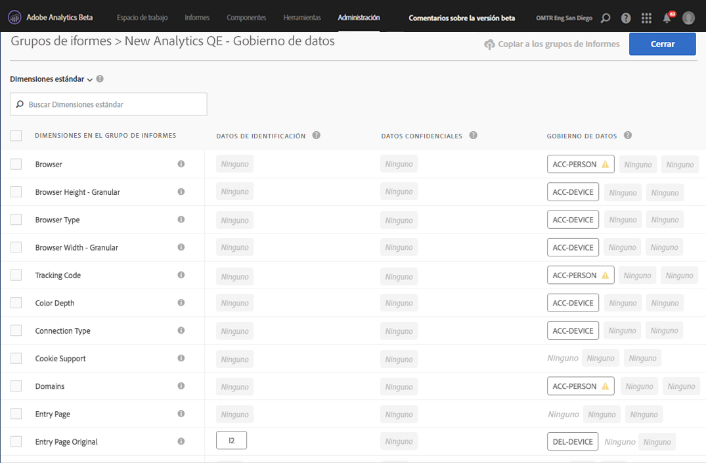
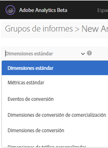
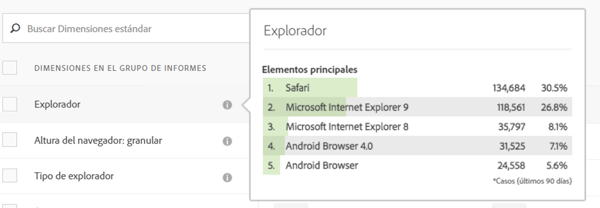
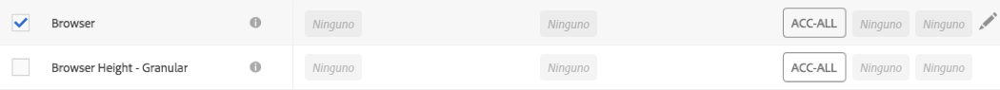
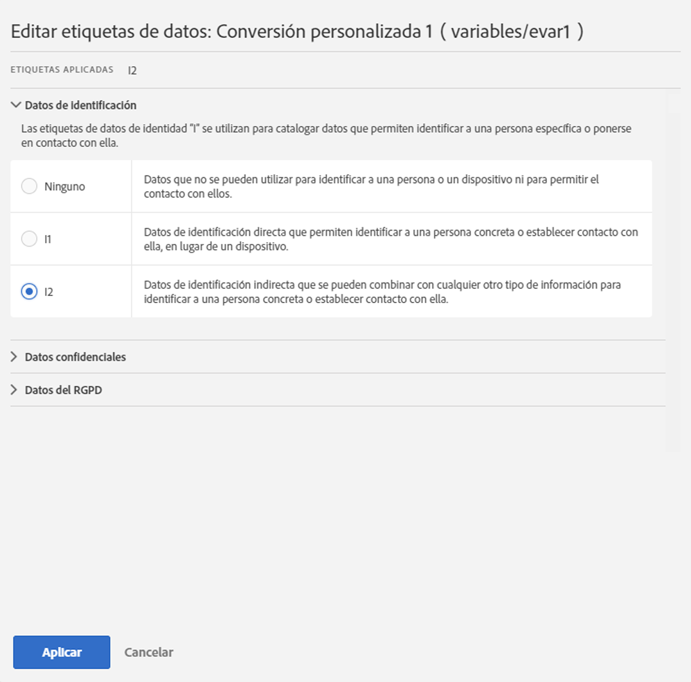
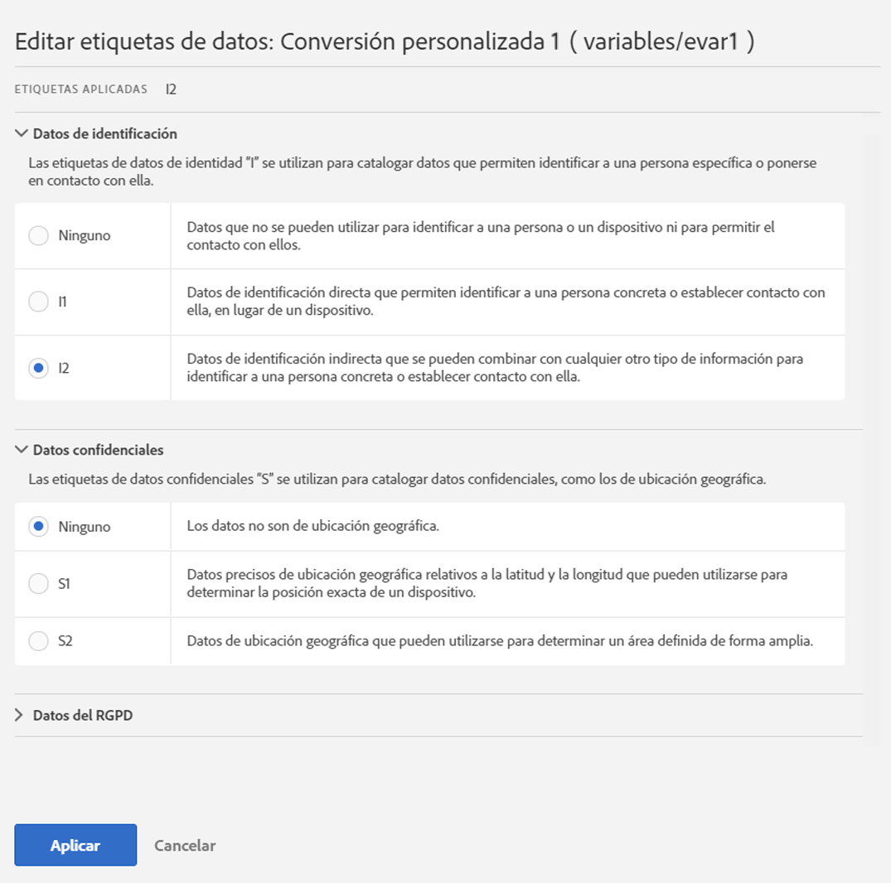
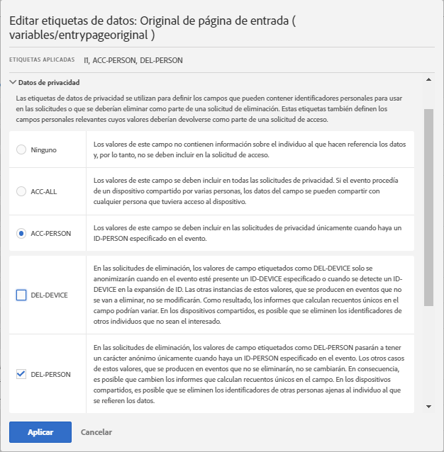
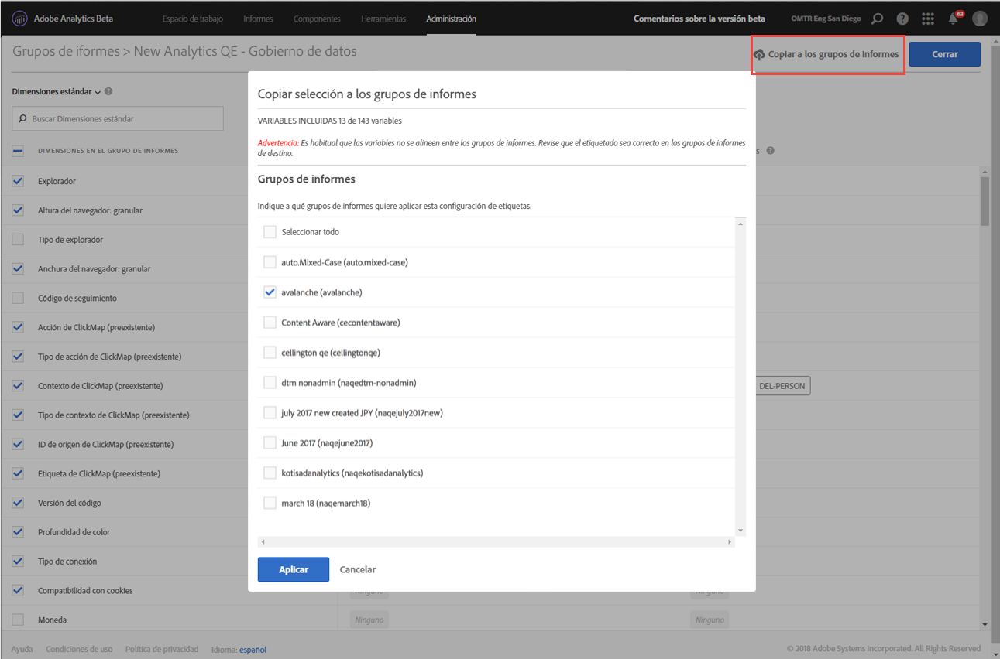

# Etiquetado de datos de grupos de informes

Al etiquetar los datos de los grupos de informes, se asignan etiquetas de identidad, confidencialidad y control de datos a cada variable de un grupo de informes determinado. Asegúrese de familiarizarse primero con las etiquetas y sus definiciones.

>[!NOTE]
>
>Recuerde que el etiquetado debe revisarse cada vez que se crea un nuevo grupo de informes o cuando se activa una nueva variable dentro de un grupo de informes existente. También es posible que necesite revisar el etiquetado cuando se activen nuevas integraciones de la solución, ya que pueden exponer nuevas variables que pueden requerir etiquetado. Una reimplementación de sus aplicaciones móviles o sitios web puede cambiar la forma en la que se utilizan las variables existentes, las cuales también pueden necesitar la actualización de las etiquetas.

## Asignación o edición de etiquetas de grupos de informes {#section_39F829F35A274EACA532E2F6FF392996}

**Ejemplo**: Usted, como responsable del tratamiento de datos, pretende recopilar direcciones de correo electrónico e ID de cookie de los interesados para tratar sus solicitudes de privacidad de datos. Estos ID de cookie se almacenan en un grupo de informes en Adobe Analytics. Si desea crear una etiqueta para direcciones de correo electrónico e ID de cookie, debe usar el marco de etiquetado y aplicación del uso de los datos (DULE) de Adobe Cloud Platform en Analytics.

1. En Analytics, vaya a **[!UICONTROL Administración]** > **[!UICONTROL Control de datos]** > **[!UICONTROL (seleccione el grupo de informes)]** 

1. Seleccione el grupo de variables que desea etiquetar.

   

   * **Dimensiones estándar** (dimensiones predefinidas de Adobe Analytics)
   * **Métricas estándar** (métricas predefinidas de Adobe Analytics)
   * **Eventos de conversión** (eventos de éxito personalizados)
   * **Dimensiones de conversión de comercialización** (eVars de comercialización)
   * **Dimensiones de conversión** (eVars no relacionadas con la comercialización)
   * **Dimensiones de tráfico personalizadas** (props)
   * **Dimensiones y eventos de la solución** (las dimensiones y eventos relacionadas con soluciones como Móvil, Vídeo, Activity Map, etc. e integraciones con soluciones como Adobe Campaign, Adobe Experience Manager, Advertising Cloud, etc.)
   * **Dimensiones de procesamiento de datos** (las variables que no están expuestas directamente en la generación de informes mediante la interfaz de Adobe Analytics, pero están disponibles mediante las fuentes de datos o las solicitudes del Data Warehouse)

1. (Opcional) Haga clic en el icono de información (i) junto a cada variable para comprender mejor sus valores más comunes a lo largo de los últimos 90 días. (Esta funcionalidad no está disponible para las dimensiones de procesamiento de datos porque no está disponible en la interfaz de Analytics).

   

1. Para seleccionar una o más variables, haga clic en sus casillas de verificación y, después, seleccione el icono **[!UICONTROL Editar]** (a la derecha) para editar una o más variables.

   

1. El cuadro de diálogo de etiquetas de **datos de identidad** se abre automáticamente. Estas etiquetas clasifican los datos que se pueden usar por sí mismos o en combinación con otros datos para identificar a una persona o permitir ponerse en contacto de forma directa con ella. Para obtener más información sobre estas etiquetas, consulte [Etiquetas de datos de identidad (DULE).](/help/admin/c-data-governance/gdpr-labels.md#identity-data-labels)

   >[!NOTE]
   >
   >El marco de etiquetado y aplicación del uso de los datos (Data Usage Labeling &amp; Enforcement, DULE) se ha diseñado para proporcionar una manera uniforme de recopilar, comunicar y usar metadatos de los datos de soluciones, servicios y plataformas en Adobe Experience Cloud. Los metadatos ayudan a los responsables del tratamiento de datos a indicar qué datos son información personal, cuáles son datos confidenciales y qué restricciones contractuales están asociadas a los datos.

   

1. Abra la sección **Datos confidenciales** para establecer las etiquetas de datos confidenciales, la cual organiza por categorías los datos de geolocalización. Para obtener más información sobre estas etiquetas, consulte [Etiquetas de datos confidenciales (DULE).](/help/admin/c-data-governance/gdpr-labels.md#sensitive-data-labels)

   

1. Abra la sección de datos de privacidad de datos para establecer las etiquetas de **Administración de datos**. Utilice esta sección para instruir cómo gestiona Adobe cada variable de solicitudes de eliminación y acceso de privacidad de datos, así como para la definición de qué variables deben analizarse para encontrar ID de interesados para estas solicitudes. Para obtener más información sobre estas etiquetas, consulte [Etiquetas de administración de datos (Privacidad de datos).](/help/admin/c-data-governance/gdpr-labels.md#data-governance-labels)

   

1. Haga clic en **[!UICONTROL Aplicar]** una vez haya completado todo el etiquetado.

## Copia de etiquetas en grupos de informes {#section_7C6FDAFF049F4126B84F6261F72668EE}

Si desea aplicar la misma configuración de DULE/Privacidad de datos más de un grupo de informes, puede seguir estos pasos:

1. Seleccione el grupo de variables (dimensiones estándar, dimensiones de conversión, etc.) que contenga la variable que desea copiar. Tenga en cuenta que solo puede copiar las etiquetas para un grupo de variables a la vez.
1. Seleccione algunas o todas las variables de este grupo.
1. Haga clic en **[!UICONTROL Copiar etiquetas en los grupos de informes]** en la parte superior derecha del cuadro de diálogo Control de datos.

   

1. Haga clic en **[!UICONTROL Seleccionar todo]** para copiar las etiquetas para las variables seleccionadas en todos los grupos de informes o seleccione el grupo de informes individual en que desea copiar las etiquetas.

   >[!IMPORTANT]
   >
   >Tenga en cuenta que todos los grupos de informes que seleccione deben estar asignados a su organización de Experience Cloud.

   Cuando copia las etiquetas de una variable o establece variables en distintos grupos de informes, la copia se dirige a la variable de la posición correspondiente en el grupo de informes de destino. Para las dimensiones estándar, las métricas estándar, las dimensiones y los eventos de la solución y las dimensiones de procesamiento de datos, las etiquetas se copiarán en la variable con el **mismo nombre** que el grupo de informes de destino.

   Sin embargo, para las variables de conversión (eVar), las dimensiones de conversión comerciales y las dimensiones de tráfico personalizadas (props), la copia se realizará a la variable con el **mismo número** que el grupo de informes de destino. Por ejemplo, eVar12 se copiará en eVar12 de todos los grupos de informes de destino. Los nombres de estas variables se ignorarán en la determinación del destino de la copia. Si la variable correspondiente no está activada en el grupo de informes de destino, la copia de dicha variable fallará.

   Cuando copia las etiquetas de las clasificaciones definidas para una variable, las etiquetas se copiarán a una clasificación en la variable correspondiente en el grupo de informes de destino (como eVar7 a eVar7) cuyo nombre es idéntico al de la clasificación que se está copiando. De lo contrario, no se realizará la copia de las etiquetas de dicha clasificación.

   Se muestra un mensaje de estado tras aplicar un conjunto de etiquetas. El mensaje de estado incluirá los nombres de cualquier variable o clasificación de destino y sus grupos de informes para los cuales no se ha podido realizar la copia.

   >[!IMPORTANT]
   >
   >Siempre debe comprobar los grupos de informes de destino para garantizar que las etiquetas se copian correctamente. Esto resulta especialmente importante en el caso de variables que tienen etiquetas de ID o DEL.

1. Haga clic en **[!UICONTROL Aplicar]**.
