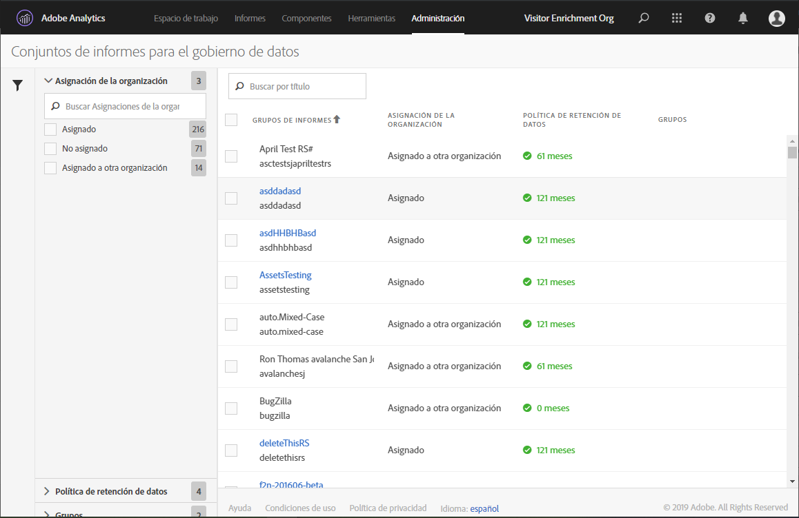

# Consulta o administración de la configuración de control de datos del grupo de informes

El cuadro de diálogo Administración de datos en Herramientas de administración proporciona una descripción general de los grupos de informes que se han configurado para el control de datos, si se han asignado a una organización de Experience Cloud y si se ha dispuesto una política de retención de datos para este grupo de informes.

1. Inicie sesión en Adobe Experience Cloud.
1. Vaya a **[!UICONTROL Analytics]** > **[!UICONTROL Administración]** > **[!UICONTROL Control de datos]**.

>[!NOTE]
>
>Si no ve este elemento de menú, debe agregarlo a un [perfil de producto en Admin Console](https://experienceleague.adobe.com/docs/analytics/admin/admin-console/permissions/product-profile.html?lang=es) con permisos para esta funcionalidad.

1. Vea todos los grupos de informes que forman parte de su empresa de inicio de sesión:

   

| Configuración | Descripción |
| --- | --- |
| **[!UICONTROL Grupos de informes]** | En la primera línea se enumera el nombre descriptivo del grupo de informes. La segunda línea contiene el nombre interno del grupo de informes. Si se le permite establecer etiquetas para un grupo de informes, la primera línea será un vínculo al que puede hacer clic que le conducirá a la página de etiquetado. |
| **[!UICONTROL Asignación a organizaciones]** | <ul><li>Asignado: este grupo de informes ya ha sido asignado a la organización Experience Cloud como la empresa de inicio de sesión de Analytics en la que inicia sesión. Solo pueden etiquetarse los grupos de informes que tengan esta configuración.</li><li>Asignado a otra organización: otra organización de Experience Cloud ya ha asignado este grupo de informes a su organización.</li></ul> |
| **[!UICONTROL Política de retención de datos]** | La implementación de la privacidad datos de Analytics requiere que establezca una política de retención de datos. Esta configuración indica:<ul><li>Se ha implementado una política de retención de datos para este grupo de informes; y</li><li>cuánto tiempo retiene Adobe los datos antes de eliminarlos. El periodo de retención de datos predeterminado es de 25 meses.</li></ul>**Nota**: Adobe Analytics no puede ayudarle con el tratamiento de solicitudes en la API de privacidad de datos (es decir, el tratamiento de las solicitudes de acceso o eliminación que reciba de sus usuarios finales) si no se ha establecido el periodo de retención de datos. Póngase en contacto con su gestor de éxito de los clientes para establecer el periodo de retención de datos. |
| **[!UICONTROL Grupos]** | La funcionalidad de agrupado actualmente no está implementada. |
| Barra lateral izquierda | Haga clic en el icono de embudo para abrir o cerrar la barra lateral. La variable [!UICONTROL Asignación a organizaciones] muestra el número de grupos de informes que se encuentran en cada una de las categorías descritas. La variable [!UICONTROL Política de retención de datos] muestra cada una de las políticas de retención de datos únicas que existen actualmente para su organización y la cantidad de grupos de informes a los que se les ha asignado esa política de retención. |
| **[!UICONTROL Exportar a CSV]** | Si marca la casilla de verificación que está junto a uno o más grupos de informes, se muestra la opción Exportar a CSV. Esta opción le permite descargar un archivo CSV que contiene todas las definiciones de etiqueta actuales para todas las variables de todos los grupos de informes seleccionados. Le recomendamos que su equipo legal revise sus opciones de etiquetado, algo que esta opción facilita. En lugar de tener que realizar la revisión con una sesión iniciada en la interfaz de Administración de datos, puede compartir el archivo .CSV con ellos. |
