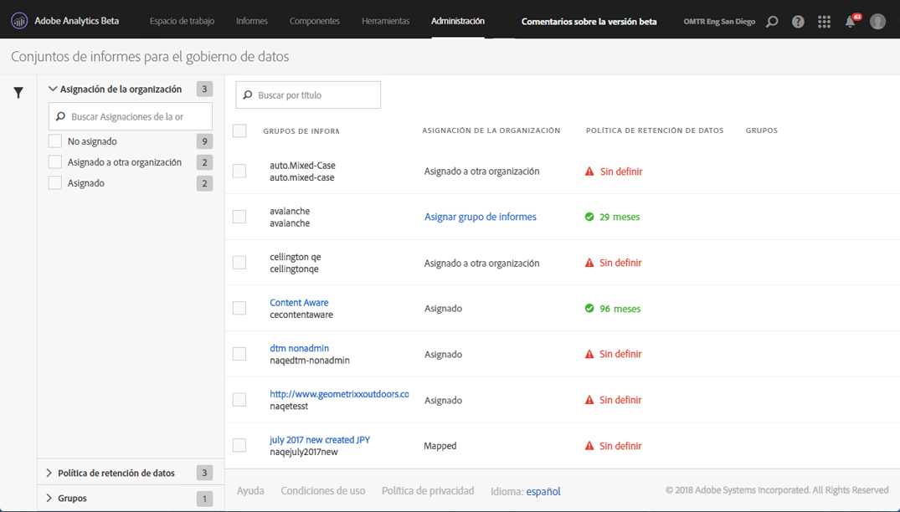
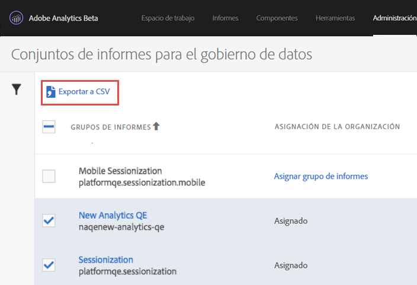

# Consulta o administración de la configuración de control de datos del grupo de informes

El cuadro de diálogo Control de datos de Herramientas de administración proporciona una descripción general de los grupos de informes que se han configurado para el control de datos, si se han asignado a una organización de Experience Cloud y si se ha dispuesto una política de retención de datos para este grupo de informes.

1. Inicie sesión en Adobe Experience Cloud.
1. Navigate to  **[!UICONTROL Analytics]** &gt; **[!UICONTROL Admin]** &gt; **[!UICONTROL Data Governance]** .

   Verá todos los grupos de informes que forman parte de su empresa de inicio de sesión:

   

<table id="table_448292730FF0475E9DCB731882F9A29B"> 
 <thead> 
  <tr> 
   <th colname="col1" class="entry"> Configuración </th> 
   <th colname="col2" class="entry"> Descripción </th> 
  </tr> 
 </thead>
 <tbody> 
  <tr> 
   <td colname="col1"> 
Grupos de informes 
 </td> 
   <td colname="col2"> 
En la primera línea se enumera el nombre descriptivo del grupo de informes. La segunda línea contiene el nombre interno del grupo de informes. Si se le permite establecer etiquetas para un grupo de informes, la primera línea será un vínculo al que puede hacer clic que le conducirá a la página de etiquetado. 
 </td> 
  </tr> 
  <tr> 
   <td colname="col1"> 
Asignación a organizaciones 
 </td> 
   <td colname="col2"> 
    <ul id="ul_EF8F613B0C5E42D19DB60BD0C89C114B"> 
     <li id="li_B35EE88555F547EFBF55ADE9D0C9EC3B"><b>Asignado</b>: este grupo de informes ya ha sido asignado a la organización Experience Cloud como la empresa de inicio de sesión de Analytics en la que inicia sesión. Solo pueden etiquetarse los grupos de informes que tengan esta configuración. </li> 
     <li id="li_4E800BF80CFF477BAA091EF272D9071C"><b>Asignar grupo de informes:</b> al hacer clic en este vínculo, podrá <a href="https://marketing.adobe.com/resources/help/en_US/mcloud/report-suite-mapping.html" format="html" scope="external">asignar un grupo de informes</a> a una organización Experience Cloud. 
Esto significa que se le redirigirá a la organización de Experience Cloud - Administración de grupos de informes, donde tendrá que encontrar el grupo de informes y asignarlo a la organización adecuada. Una vez que haya completado ese paso, vuelva a esta interfaz de usuario de control de datos. 
 </li> 
     <li id="li_FF825A65D089487BBF5FCB0D74D41CD7"><b>Asignado a otra organización:</b> otra organización de Experience Cloud ya ha asignado este grupo de informes a su organización. </li> 
    </ul> </td> 
  </tr> 
  <tr> 
   <td colname="col1"> 
Política de retención de datos 
 </td> 
   <td colname="col2"> 
La implementación del RGPD de Analytics requiere que establezca una política de retención de datos. 
 
Esta configuración indica: 
 
    <ul id="ul_AC1F0827293B47E39BFEC4B1766A0CAC"> 
     <li id="li_3AAD93EA92B94C6180E5AEBC5E4D10FB">si se ha implementado una política de retención de datos para este grupo de informes; </li> 
     <li id="li_2E8D71905C734F8BB3245FEEDA953B3E">cuánto tiempo retiene Adobe los datos antes de eliminarlos. El periodo de retención de datos predeterminado es de 25 meses. </li> 
    </ul> 
Nota: Adobe Analytics no puede ayudarle con el tratamiento de solicitudes en la API de RGPD (es decir, el procesamiento de las solicitudes de acceso o eliminación que reciba de sus usuarios finales) si no se ha establecido el periodo de retención de datos. Póngase en contacto con su gestor de éxito de los clientes para establecer el periodo de retención de datos. 
 </td> 
  </tr> 
  <tr> 
   <td colname="col1"> 
Grupos 
 </td> 
   <td colname="col2"> 
La funcionalidad de agrupado actualmente no está implementada. 
 </td> 
  </tr> 
  <tr> 
   <td colname="col1"> 
Barra lateral izquierda 
 </td> 
   <td colname="col2"> 
Haga clic en el icono de embudo para abrir o cerrar la barra lateral. 
 
La sección de Asignación a organizaciones muestra el número de grupos de informes que se encuentran en cada una de las categorías descritas. 
 
La sección de Política de retención de datos muestra cada una de las políticas de retención de datos únicas en vigor para su organización y el número de grupos de informes que han sido asignados a dicha política de retención. 
 </td> 
  </tr> 
  <tr> 
   <td colname="col1"> 
Exportar a CSV 
 </td> 
   <td colname="col2"> 
Si marca la casilla de verificación que está junto a uno o más grupos de informes, se muestra la opción Exportar a CSV. Esta opción le permite descargar un archivo CSV que contiene todas las definiciones de etiqueta actuales para todas las variables de todos los grupos de informes seleccionados. 
 
Le recomendamos que su equipo legal revise sus opciones de etiquetado, algo que esta opción facilita. En lugar de tener que realizar la revisión con una sesión iniciada en la interfaz de Administración de datos, puede compartir el archivo .csv con ellos. 
 
 
 </td> 
  </tr> 
 </tbody> 
</table>

