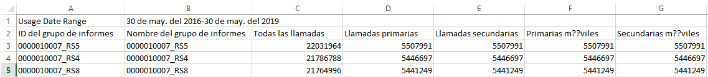

# Ver uso del grupo de informes

La ficha Uso del grupo de informes proporciona datos sobre el uso del servidor para cada grupo de informes en todas las empresas de inicio de sesión asociadas a su empresa de facturación durante el periodo de uso actual.

**[!UICONTROL Analytics]** &gt; **[!UICONTROL Admin]** &gt; **[!UICONTROL Uso de llamadas al servidor]** &gt; **[!UICONTROL Uso del grupo de informes]**

>[!IMPORTANT]
>
>Si un grupo de informes no está [vinculado a una organización de Experience Cloud](https://marketing.adobe.com/resources/help/es_ES/mcloud/report-suite-mapping.html), sus datos de uso no se reflejarán en este panel. También se puede asociar un ID de facturación a varias organizaciones de Experience Cloud; no siempre hay una relación 1:1 entre una organización y un ID de facturación.

El tablero de Uso del grupo de informes:

* Muestra el uso de llamadas al servidor del periodo de uso actual (todas las llamadas, primarias, secundarias, primarias móviles, secundarias móviles) para cada grupo de informes de su organización de Experience Cloud.
* Muestra el porcentaje del uso global por categoría de llamadas al servidor.
* Se actualiza a diario.
* Se puede descargar.
* Permite acceder a la interfaz de usuario de **[!UICONTROL Administrar alertas]**.

| Columna | Definición |
|--- |--- |
| Nombre del grupo de informes | Nombre descriptivo del grupo de informes. |
| Todas las llamadas (% del total) | Todas las llamadas al servidor en las que se ha incurrido en el periodo de uso actual. |
| Llamadas primarias (%) | Todas las llamadas al servidor primarias (y su porcentaje del total) en las que se ha incurrido en el periodo de uso actual. |
| Llamadas secundarias (%) | Todas las llamadas al servidor secundarias (y su porcentaje del total) en las que se ha incurrido en el periodo de uso actual. |
| Primarias móviles (%) | Todas las llamadas al servidor primarias móviles (y su porcentaje del total) en las que se ha incurrido en el periodo de uso actual. |
| Secundarias móviles (%) | Todas las llamadas al servidor secundarias móviles (y su porcentaje del total) en las que se ha incurrido en el periodo de uso actual. |

## Descargar informe de uso {#section_D7345660B5E043CD8850954216509A3D}

Esta opción permite descargar los datos de uso actual y datos de periodos anteriores al periodo de uso actual (hasta enero de 2015). El informe se descarga como archivo .csv.

1. Seleccione al menos un grupo de informes.
1. Haga clic en **[!UICONTROL Descargar informe]**.

   

| Elemento de informe | Descripción |
|--- |--- |
| Nombre del archivo | Nombre codificado: Informe de uso `day and time of report creation.csv` |
| Grupos de informes incluidos | Cualquier grupo de informes que seleccione en la página Uso del servidor de informes se incluye en esta lista. |
| Tipos de llamada incluidos | Especifique cualquier combinación de estas: Todas las llamadas (predeterminado), Primarias, Secundarias, Primarias móviles, Secundarias móviles. |
| Intervalo de tiempo | Puede elegir el periodo de uso actual o especificar un intervalo personalizado.  Para un intervalo personalizado, especifique el comienzo del intervalo y el final del intervalo.  **Nota:** Recuerde que no puede descargar datos de uso anteriores a enero de 2015  . |

1. Haga clic en **[!UICONTROL Descargar]**.

A continuación se muestra una captura de pantalla del aspecto del archivo .csv descargado. Incluye una columna para la ID del grupo de informes. La ID del grupo de informes especifica una ID única que solo puede contener caracteres alfanuméricos. Esta ID no se puede cambiar después de crear un grupo de informes.

