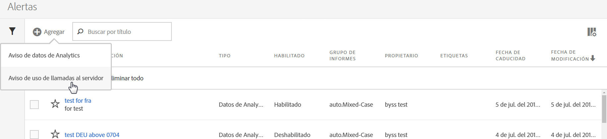
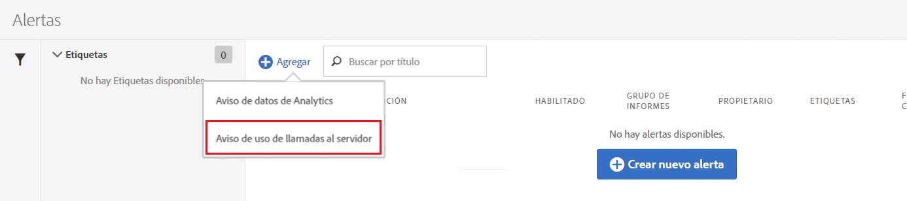
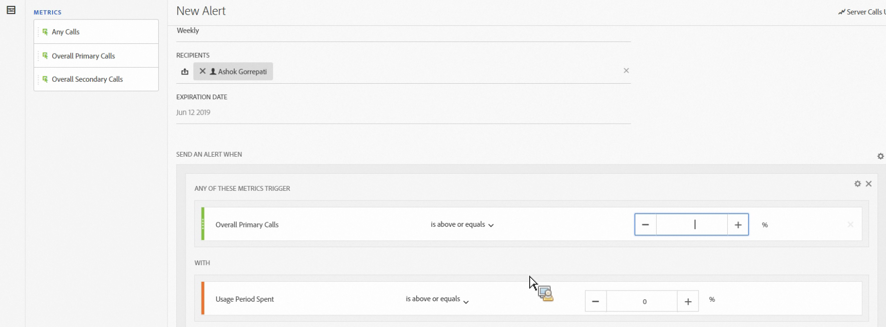
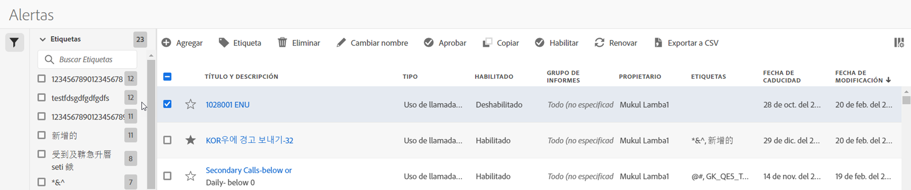

# Alertas de uso de llamadas al servidor

Al configurar una alerta, se aplica a todos los grupos de informes en todas las empresas de inicio de sesión de una empresa de facturación.

## Información general

A new alert category called **[!UICONTROL Server Calls Usage Alert]** is part of the the existing [Alert Management](https://marketing.adobe.com/resources/help/en_US/analytics/analysis-workspace/intellligent_alerts.html) user interface.

It is pre-populated with **1 default alert** that appears within any login company that has access to the Server Call Usage feature. Estas alertas activan una notificación dirigida a todos los administradores de la empresa de inicio de sesión si se cumple uno de los siguientes criterios:

* “Cualquier” uso de llamadas al servidor que sea “mayor o igual que” el 100 % para cualquier tipo de llamada al servidor para la que esté autorizado, O
* “Cualquier” uso de llamadas al servidor que sea “mayor o igual que” el 90 % para cualquier tipo de llamada al servidor para la que esté autorizado, O
* “Cualquier” uso de llamadas al servidor que sea “mayor o igual que” el 75 % para cualquier tipo de llamada al servidor para la que esté autorizado Y “Periodo de uso empleado” que sea “menor o igual que” el 75 % del periodo de uso.

Puede acceder a las alertas de uso de llamadas al servidor de dos formas:

* Haga clic en **[!UICONTROL Administrar alertas]en la esquina superior derecha de la ficha Uso actual en la pestaña de uso de Grupo de informes o**
* Navigate to **[!UICONTROL Components]** &gt; **[!UICONTROL Alerts]** in Adobe Analytics.

## Crear alertas de uso de llamadas al servidor {#section_2A2882C6D48D47C1944D52FB7C766BEC}

Para crear alertas adicionales,

1. Haga clic en **[!UICONTROL + Añadir]** y seleccione **[!UICONTROL Alerta de uso de llamadas al servidor]**.

   

1. Defina la alerta.

   

   * **Título**: Especifique un nombre descriptivo. No es posible guardar la alerta sin nombre.
   * **Granularidad de tiempo**: Se refiere a la frecuencia con la que se revisará la alerta. *En este momento solo admitimos granularidad Semanal.* Esto significa que la alerta se comprobará de forma semanal y consultará los datos del periodo de uso actual.
   * **Destinatarios**: Especifique cualquier persona de la organización que deba recibir un correo electrónico cuando la alerta active el umbral especificado.
   * **Fecha** de caducidad: De forma predeterminada, la fecha de caducidad es de un año desde la fecha de creación de la alerta.
   * **Enviar una alerta cuando**:

      * Cualquiera de estos Activaciónactive
el tipo de llamadas al servidor como métrica y especifique el umbral de alerta seleccionando el modificador y el umbral:
         * mayor o igual que
         * menor o igual que
      * con
Especifique el umbral y la condición (mayor o igual que, menor o igual que) para el Periodo de uso empleado.

1. Haga clic en **[!UICONTROL Guardar]**.

## Administrar alertas de uso de llamadas al servidor {#section_8FF98170763C4B5CBEC6DD43F893177A}

Para administrar alertas:

1. Seleccione la casilla junto a una o más alertas. Las acciones de la administración de alertas se muestran en la parte superior.
1. Complete una o más de estas acciones:

   | Acción | Definición |
   |--- |--- |
   | + Añadir | Acceda al [Generador de alertas](../../admin/c-server-call-usage/scu-alerts.md) haciendo clic en [!UICONTROL + Añadir]. |
   | Etiqueta | Etiquete alertas para organizarlas y que sea más fácil utilizarlas. |
   | Eliminar | Puede eliminar todas las alertas excepto las predeterminadas. |
   | Cambiar nombre | Puede cambiar el nombre de todas las alertas excepto el de las predeterminadas. |
   | Aprobar | Apruebe alertas para hacerlas “oficiales”. |
   | Habilitar/Deshabilitar | Puede habilitar o deshabilitar todas las alertas, incluso las predeterminadas. |
   | Renovar | Cuando se seleccionan una o varias alertas, estas se pueden renovar. Esto retrasa las fechas de caducidad y las amplía a 1 año a partir del momento en que se hace clic en [!UICONTROL Renovar] sin tener en cuenta la fecha de caducidad original. |
   | Exportar a CSV | Consulte [Descargar informe de uso](../../admin/c-server-call-usage/report-suite-usage.md) |

