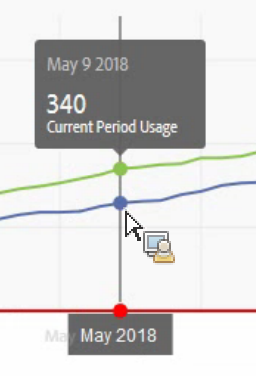

# Ver el uso actual de llamadas al servidor

**[!UICONTROL Analytics]** &gt; **[!UICONTROL Administración]** &gt; **[!UICONTROL Uso de llamadas al servidor]** &gt; **[!UICONTROL Uso actual]**

>[!IMPORTANT]
>
>Los números de uso y de compromiso que ve son acumulativos en todas las empresas de inicio de sesión y grupos de informes.

El tablero de Uso actual:

* Muestra un desglose de su consumo y asignación de llamadas al servidor en todos sus tipos de llamadas al servidor. Esta vista podría ser diferente para diferentes clientes y es coherente con lo que incluye el contrato. Por ejemplo, puede que se haya suscrito para 4 tipos separados de llamadas al servidor, primarias y secundarias para web y primarias y secundarias para móvil. En ese caso, esta vista comprenderá 4 fichas, una para cada tipo. En cada ficha, podrá ver el consumo para el periodo de uso actual.
* Compara el uso actual (línea verde) con su límite de uso contractual (línea roja).

   

* Compara el uso de su periodo actual con el del año pasado (línea azul). Obviamente, la línea azul solo aparecerá si su empresa tiene datos de uso de llamadas al servidor del año anterior.

   >[!NOTE]
   >
   >If you want to view usage for a previous time period, you have to go to the [Report Suite Usage](../../admin/c-server-call-usage/report-suite-usage.md#concept_E50FA5BD93404EB8B2FE954F658FDAFD) tab and download the usage data for a previous period.

* Muestra el porcentaje de llamadas utilizado (en porcentajes y datos sin procesar) y el porcentaje del periodo de uso empleado (en porcentajes y datos sin procesar).
* De forma predeterminada, se actualiza a diario, con una latencia de procesamiento de 5 días.
* Permite contraer y ampliar todos los informes breves.

| Término de interfaz de usuario | Definición |
|---|---|
| Uso del periodo actual (verde) | El periodo actual se basa en el [periodo de uso](../../admin/c-server-call-usage/overage-overview.md#section_CBA348A039F34563B097CD8890AB358D). |
| Uso del periodo anterior (azul) | El periodo anterior se define como el periodo de uso actual menos 1 año. |
| Límite de uso (rojo) | Su límite de uso contractual para este periodo de uso. |

