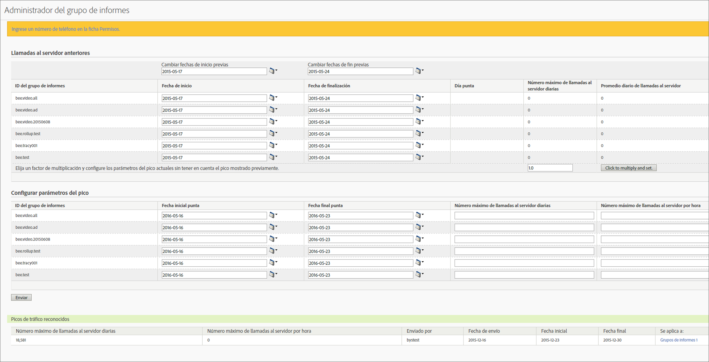

# Estimar las llamadas al servidor anteriores y programar un pico de tráfico

Le permite obtener el promedio diario de llamadas al servidor correspondiente a un lapso de tiempo específico del año pasado, además de un aumento esperado del volumen de llamadas de este año. Así, podrá programar un pico de tráfico basado en este factor de multiplicación.

1. Inicie sesión en Analytics como administrador y vaya a **[!UICONTROL Administración]** > **[!UICONTROL Todos los administradores]** > **[!UICONTROL Administración del tráfico]**.

1. Haga clic en **[!UICONTROL Ampliar]** para ampliar la lista de grupos de informes y haga clic en **[!UICONTROL Seleccionar grupos de informes]** para seleccionar varios grupos de informes.

1. Haga clic en **[!UICONTROL Programar picos]**.
1. En **[!UICONTROL Llamadas al servidor anteriores]** seleccione una fecha de inicio y de fin para los grupos de informes seleccionados.

   Se generan las cantidades para Día punta, Llamadas al servidor el día punta y Promedio diario de llamadas al servidor.

1. Introduzca un valor para el factor de multiplicación y haga clic en las opciones para **[!UICONTROL multiplicar y establecer]**.

   El valor de todas las columnas se multiplica para cada grupo de informes.

1. En **[!UICONTROL Configurar parámetros del pico]**, envíe los parámetros del pico para los grupos de informes seleccionados.

   En este momento, el pico ya está programado para el grupo de informes seleccionado.

