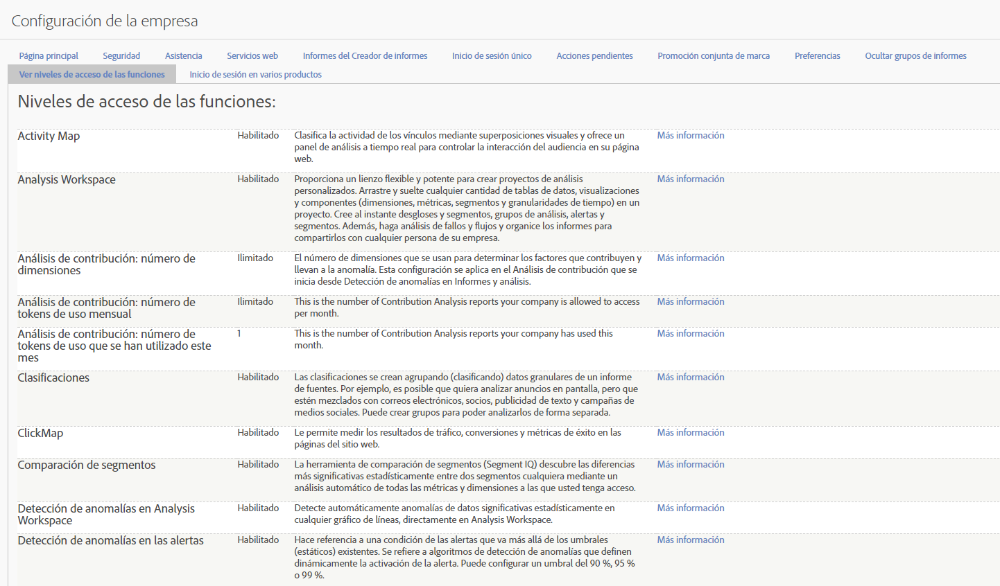

# Niveles de acceso de las funcionalidades

**[!UICONTROL Administración]**  >  **[!UICONTROL Todos los administradores]**  > Configuración  **[!UICONTROL de la empresa]**  >  **[!UICONTROL Ver niveles de acceso de las funciones]**

Este grupo de configuraciones le permite ver el nivel de acceso a los paquetes y funciones de Adobe Analytics al que está autorizada su empresa. Algunas funciones solo están disponibles con paquetes de productos (SKU) más avanzados como [Adobe Analytics Ultimate](https://www.adobe.com/es/data-analytics-cloud/analytics/ultimate.html).

