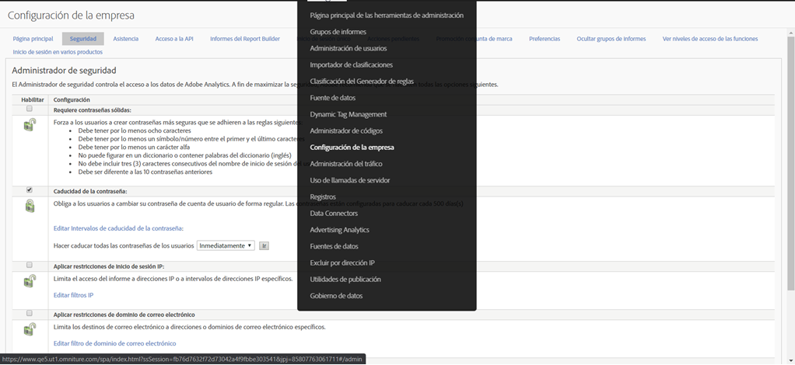

# Fin de vida útil para [!UICONTROL Aplicar restricciones de inicio de sesión con IP]

La función **[Aplicar restricciones de inicio de sesión con IP](/help/admin/company/security-manager.md)** de Adobe Analytics permite agregar direcciones IP específicas (que se consideran seguras) a una lista de permitidos, de modo que se puedan iniciar sesión con éxito y acceder a su entorno de Adobe Analytics. En muchos casos, esta función se utiliza para configurar una dirección IP corporativa como la única dirección IP segura desde la que los usuarios pueden iniciar sesión. Por lo tanto, para utilizar Adobe Analytics, se necesita que los usuarios estén en una oficina corporativa o que inicien sesión en la red a través de una VPN.

Estamos planeando finalizar la vida útil de esta función en enero de 2021.

## ¿Por qué queremos dejar de usar esta función?

Esta función da problemas, en algunos casos, con la migración de inicio de sesión de Experience Cloud o el mismo inicio de sesión de Experience Cloud. Al parecer, se produce un error con los usuarios que utilizan **[!UICONTROL Atributos del cliente]** o la **[!UICONTROL Biblioteca de audiencias]**.

Además, si tiene varias soluciones de Experience Cloud, puede eludir este requisito al iniciar sesión en Experience Cloud con una de las otras soluciones, ya que esta función no existe o no se admite fuera de Analytics. Los usuarios también pueden evitar el error con la suplantación de IP.

Por último, Adobe cuenta con una solución alternativa funcional y muy superior mediante el inicio de sesión único y Federated ID. Esta función le proporciona un mayor control y seguridad sobre el momento en que los usuarios inician sesión. Para obtener más información, vaya más abajo.

## ¿Cómo le afecta la eliminación de esta función?

Para cualquier cliente que tenga **[!UICONTROL Aplicar restricciones de inicio de sesión con IP]** configurado, esta función se eliminará en enero de 2021. En ese momento, ya no se aplicará ninguna restricción de inicio de sesión con IP que aún exista. Si todavía necesita restringir el inicio de sesión por dirección IP, debe revisar e implementar la solución recomendada de inicio de sesión único y Federated ID (más información y recursos a continuación).

Además, la configuración **[!UICONTROL Aplicar restricciones de inicio de sesión IP]** se eliminará de **[!UICONTROL Administración] > [!UICONTROL Todos los administradores] > [!UICONTROL Configuración de la empresa] > [!UICONTROL Administrador de seguridad]** en la interfaz de usuario de Analytics (como se muestra a continuación).

## ¿Cuáles son sus otras opciones?

Como se ha indicado anteriormente, esta función de Analytics acabará desapareciendo. Para darle tiempo para implementar SSO y Federated ID, hemos retrasado la fecha de fin de servicio hasta enero de 2021.

Tanto SSO como Federated ID son soluciones muy superiores a la función de restricción de inicio de sesión IP que tenemos en la actualidad y le proporcionarán más control y seguridad, y otras características. Para obtener información sobre cómo configurar SSO/Federated ID, tenemos disponible la siguiente documentación que podría ayudarle. Le recomendamos que lea a fondo la información y trabaje con su departamento de TI para implementar las nuevas soluciones:

* [Inicio de sesión único y Experience Cloud](https://spark.adobe.com/page/JeSB8EPEQIvjD/)
* [Admin Console: documentación de configuración de identidad](https://helpx.adobe.com/es/enterprise/using/set-up-identity.html)
* [Admin Console: tutorial de configuración de identidad (vídeo)](https://helpx.adobe.com/es/enterprise/how-to/identity-directories-domains.html?playlist=/ccx/v1/collection/product/enterprise/topics/enterprise-identity/collection.ccx.js&amp;ref=helpx.adobe.com)
* [Tutorial sobre la configuración de Federated ID (vídeo)](https://helpx.adobe.com/es/enterprise/how-to/identity-configure-ids.html?playlist=/ccx/v1/collection/product/enterprise/topics/enterprise-identity/collection.ccx.js&amp;ref=helpx.adobe.com)
* [Inicio de sesión único: preguntas frecuentes](https://helpx.adobe.com/es/enterprise/using/sso-faq.html)
* [Tipos de identidad compatibles con Adobe](https://helpx.adobe.com/es/enterprise/using/identity.html)

Si desea dejar claro que sigue apoyando el uso de las restricciones de inicio de sesión IP y quiere solicitar que Experience Cloud proporcione dicha función, puede votar por ella en nuestro [foro](https://forums.adobe.com/ideas/11648).
