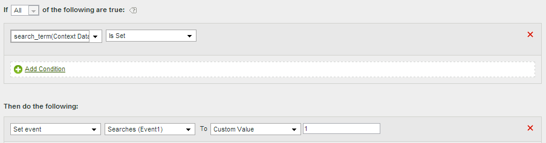

# Casos de uso de reglas de procesamiento

Las aplicaciones de cómo puede utilizar las reglas de procesamiento en su organización son amplias. En las secciones siguientes se describen algunas formas comunes de utilizarlas para su propio beneficio.

+++Copiar una variable de datos de contexto en una eVar

Las reglas de procesamiento se usan para mover valores de [Variables de datos de contexto](/help/implement/vars/page-vars/contextdata.md) a [Props](/help/components/dimensions/prop.md) y [eVars](/help/components/dimensions/evar.md). Sin reglas de procesamiento, las variables de datos de contexto no tienen sentido y no rellenan ningún informe en Analytics.

La lista [!UICONTROL Variables de contexto] contiene todas las variables que se enviaron al grupo de informes en los últimos 30 días. Si conoce el nombre de la variable de datos de contexto pero no la ha enviado al grupo de informes actual, puede agregarla manualmente:

El ejemplo siguiente toma la variable de datos de contexto `search_term` e introduce su valor en eVar3:

| Conjunto de reglas | Valor |
| --- | --- |
| Condición | `search_term` (datos de contexto) está establecido |
| Acción | [!UICONTROL Sobrescribir el valor de] eVar3 con `search_term` (datos de contexto) |

El ejemplo anterior funciona bien cuando solo hay unas pocas eVars que rellenar. Si su organización tiene cientos de variables de datos de contexto y cada una necesita su propia eVar, puede utilizar afirmaciones condicionales. Puede introducir docenas de afirmaciones condicionales dentro de una sola regla de procesamiento, lo que permite a la organización completar todas las eVars en un grupo de informes sin alcanzar el límite de 150 reglas de procesamiento.

El siguiente ejemplo rellena varias variables con variables de datos de contexto variables. Una acción también contiene una afirmación condicional:

| Conjunto de reglas | Valor |
| --- | --- |
| Acción | [!UICONTROL Sobrescribir el valor de] eVar55 con `spa.billing_customer_name` (datos de contexto) |
| Acción | [!UICONTROL Sobrescribir el valor de] Prop7 con `testhierarchy` (datos de contexto), si se ha establecido `testhierarchy` (datos de contexto) |
| Acción | [!UICONTROL Sobrescribir el valor de] eVar8 con `spa.ims_org` (datos de contexto) |

+++

+++Definir un evento con una variable de datos de contexto

Las reglas de procesamiento pueden almacenar en déclencheur eventos basados en [variables de datos de contexto](/help/implement/vars/page-vars/contextdata.md).

La lista [!UICONTROL Variables de contexto] contiene todas las variables que se enviaron al grupo de informes en los últimos 30 días. Si conoce el nombre de la variable de datos de contexto pero no la ha enviado al grupo de informes actual, puede agregarla manualmente:

La siguiente definición de regla establece un evento en cada visita que contiene una variable de datos de contexto específica:

| Conjunto de reglas | Valor |
| --- | --- |
| Condición | `search_term` (datos de contexto) está establecido |
| Acción | [!UICONTROL Establecer evento] Event1 en [!UICONTROL Valor personalizado] `1` |

+++

+++Rellenar una variable mediante un parámetro de cadena de consulta

Puede rellenar una variable utilizando un parámetro de cadena de consulta. En la mayoría de los casos, normalmente ajustaría la implementación para obtener los valores de cadena de consulta deseados. Sin embargo, si no puede ajustar fácilmente la implementación para recopilar estos datos, las reglas de procesamiento son una alternativa adecuada. Si algún error tipográfico o un problema similar impide que se rellene el valor, puede rellenar la variable utilizando reglas de procesamiento.

Compruebe siempre si un valor está vacío o si contiene el valor esperado antes de sobrescribirlo.

| Conjunto de reglas | Valor |
| --- | --- |
| Condición | Campaña no está establecida |
| Acción | [!UICONTROL Sobrescribir el valor de] campaña con [!UICONTROL Parámetro de cadena de consulta] `cpid` |

| Conjunto de reglas | Valor |
| --- | --- |
| Condición | [!UICONTROL Se Ha Establecido El Parámetro De Cadena De Consulta] `q` [!UICONTROL 4}] |
| Acción | [!UICONTROL Sobrescribir el valor de] términos de búsqueda interna con [!UICONTROL Parámetro de cadena de consulta] `q` |

+++

+++Establecer condicionalmente cualquier evento

Los eventos se pueden configurar en función de cualquier condición disponible en las reglas de procesamiento. Por ejemplo, puede almacenar en déclencheur un evento cuando el nombre de página sea igual a &quot;Información general del producto&quot;.

| Conjunto de reglas | Valor |
| --- | --- |
| Condición | Si [!UICONTROL Nombre de página] es igual a &quot;Descripción general del producto&quot; |
| Acción | [!UICONTROL Establecer evento] [!UICONTROL Vistas del producto] en [!UICONTROL Valor personalizado] `1` |

+++

+++Agregar una subcategoría concatenando la categoría y el nombre de página

Puede utilizar la opción de concatenación para rellenar valores combinando otros valores.

| Conjunto de reglas | Valor |
| --- | --- |
| Condición | Ninguno (ejecutar siempre) |
| Acción | [!UICONTROL Sobrescribir el valor de] eVar1 con [!UICONTROL Valor concatenado] Categoría + Nombre de página |

+++

+++Limpiar los valores de un informe

Puede hacer coincidir los valores con los errores ortográficos recopilados y actualizarlos para que se muestren correctamente en los informes.

Adobe recomienda utilizar la opción de coincidencia más restrictiva posible para evitar sobrescrituras no deseadas. Puede ejecutar un informe en la variable y buscar las posibles condiciones de regla que desee utilizar. Las comparaciones de cadenas no distinguen entre mayúsculas y minúsculas.

| Conjunto de reglas | Valor |
| --- | --- |
| Condición | Si prop1 [!UICONTROL Comienza con] &quot;[!DNL Shoping]&quot; |
| Acción | [!UICONTROL Sobrescribir el valor de] Prop1 con [!UICONTROL Valor personalizado] &quot;[!DNL Shopping]&quot; |

+++

+++Eliminar un evento de una visita

Puede eliminar o descartar un evento específico de una visita mediante reglas de procesamiento sin alterar la implementación. Si establece el evento en el valor personalizado `0`, el evento no se contará.

| Conjunto de reglas | Valor |
| Condición | Ninguno (ejecutar siempre) |
| Acción | [!UICONTROL Establecer evento] Event1 en [!UICONTROL Valor personalizado] `0` |

+++
