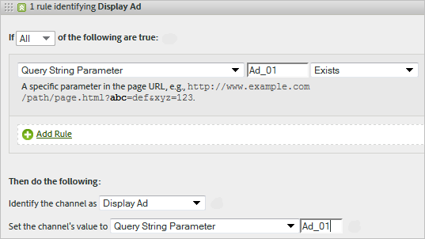
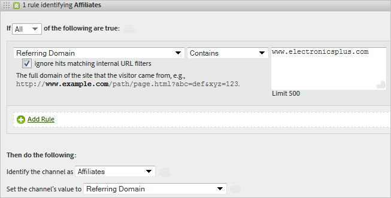

# Reglas de procesamiento de canales de marketing

Las reglas de procesamiento de canales de marketing averiguan si el visitante que entra cumple los criterios asignados a un canal al procesar cada entrada del visitante en su sitio. Las reglas se procesan en el orden en el que las especifique y, cuando se cumple una regla, se detiene el procesamiento de las demás.

**[!UICONTROL Analytics]** > **[!UICONTROL Administración]** > **[!UICONTROL Grupos de informes]** > **[!UICONTROL Editar configuración]** > **[!UICONTROL Canales de marketing]** > **[!UICONTROL Reglas de procesamiento de canal de marketing]**.

Notas adicionales sobre el procesamiento:

* Los datos recopilados con estas reglas son permanentes. Las reglas modificadas tras la recopilación de datos no son retroactivas. Adobe recomienda revisar y tener en cuenta todas las circunstancias antes de guardar las [!UICONTROL reglas de procesamiento del canal de marketing] a fin de evitar que los datos se recopilen en los canales equivocados.
* Puede configurar hasta 25 canales de marketing independientes.
* Las reglas pueden acceder a las variables que ha establecido VISTA, pero no pueden acceder a los datos que VISTA ha eliminado.
* Dos canales de marketing nunca reciben crédito por el mismo evento (por ejemplo, compras o clics). En este sentido, los canales de marketing difieren de las eVars (ya que dos eVars pueden recibir crédito por el mismo evento).
* Si hay una ausencia de cobertura de las reglas, es posible que vea [No se identificó ningún canal](/help/components/c-marketing-channels/c-faq.md).

## Requisitos previos

* Consulte la información conceptual de [Introducción a los Canales de marketing](/help/components/c-marketing-channels/c-getting-started-mchannel.md).
* Cree uno o más canales para poder asignarles reglas. Consulte [Añadir canales de marketing](/help/admin/tools/manage-rs/edit-settings/marketing-channels/c-channels.md).
* Revise las prácticas recomendadas para utilizar [!UICONTROL Canales de marketing] con [!UICONTROL Attribution].

## Creación de reglas de procesamiento para los canales de marketing

Cree reglas de procesamiento de canales de marketing que averigüen si la visita de un visitante cumple los criterios asignados a un canal.

1. Haga clic en **[!UICONTROL Analytics]** > **[!UICONTROL Administración]** > **[!UICONTROL Grupos de informes]**.
2. Selección de un grupo de informes.

   Si no se han definido canales en el grupo de informes, se abre la página [!UICONTROL Canales de marketing: configuración automática].

   Consulte [Ejecución de la configuración automática](/help/components/c-marketing-channels/c-getting-started-mchannel.md).

3. Haga clic en **[!UICONTROL Editar configuración]** > **[!UICONTROL Canales de marketing]** > **[!UICONTROL Reglas de procesamiento de canal de marketing]**. Si ejecutó la configuración automática, se definió automáticamente un conjunto de canales y reglas.

   

4. Si desea añadir una regla, seleccione en el menú **[!UICONTROL Añadir nuevo conjunto de reglas]**. Si selecciona un canal, recibirá una plantilla de regla y, si selecciona Personalizado, comenzará desde una pizarra en blanco. Ambas opciones permiten modificar el conjunto de reglas según sea necesario.

   

5. Para continuar creando reglas, haga clic en **[!UICONTROL Añadir regla SetRule]**.
6. Para priorizar las reglas, arrástrelas a la posición que corresponda.
7. Haga clic en **[!UICONTROL Guardar]**.

### Establecer el valor del canal de marketing

**[!UICONTROL Establecer el valor del canal]** define la dimensión de detalle del canal de marketing que está disponible para ese canal. 

### Criterios de regla

Esta tabla de referencia define los campos, opciones y atributos de visita que puede utilizar para establecer Reglas de procesamiento de canal de marketing.

>[!NOTE]
>
>Cualquier campo de texto que defina, como parámetro de cadena de consulta o lista de valores con los que coincida, se evalúan como valores **sin distinción de mayúsculas y minúsculas**. Por ejemplo, si tiene una regla en la que el parámetro de cadena de consulta `cmp = abc123`, todas las variaciones en mayúsculas y minúsculas de ambos `cmp` y `abc123` coinciden.

| Término | Definición |
|--- |--- |
| Todos | Activa este canal solamente cuando todos los criterios de la regla son verdaderos. |
| Cualquiera | Activa este canal cuando alguno o algunos de los criterios de la regla son verdaderos. Esta opción solo está disponible si existe más de un criterio en la regla. |
| ID de AMO | El código de seguimiento principal utilizado por las integraciones de Adobe Advertising y Advertising Analytics. Cuando se habilita una de estas integraciones, se puede usar el prefijo del código de seguimiento para identificar canales específicos de Advertising. Utilice un &quot;AMO ID&quot; que comience por &quot;AL&quot; para la búsqueda y Social o &quot;AC&quot; para la visualización. Cuando se utiliza el ID de AMO en los canales de marketing, las métricas de clics, costes e impresiones se pueden atribuir al canal correcto. Cuando el ID de AMO no está configurado, estas métricas se dirigen a Directo o a Ninguno. |
| AMO EF ID | El código de seguimiento secundario utilizado por Adobe Advertising. El propósito principal de este código de seguimiento es servir como clave para enviar datos de vuelta a Advertising. Sin embargo, también se puede utilizar para identificar Mostrar clics y Mostrar vistas como dos canales de marketing independientes. Para ello, establezca que la lógica del canal de marketing para &quot;AMO EF ID&quot; termine con `:d` para los clics en pantalla o que &quot;AMO EF ID&quot; termine con `:i` para Mostrar vistas. Si no desea dividir Mostrar en dos canales, utilice la dimensión de ID de AMO en su lugar. |
| Variables de conversión | Contiene eVars que se han habilitado para este grupo de informes y se aplica solamente cuando las variables se definen mediante el código de Adobe en la página. |
| Existe | Se ofrecen varias opciones, entre ellas:<ul><li>**No existe**: indica que el atributo de visita no existe en la solicitud. Por ejemplo, en un dominio referente, si el usuario escribe una dirección URL o hace clic en un marcador, el atributo de dominio referente no existe.</li><li>**Está vacío**: indica que existe un atributo de visita que, generalmente, es un parámetro de eVar o de cadena de consulta, pero que no hay ningún valor asociado al atributo de visita.</li><li>**No contiene**: permite especificar, por ejemplo, que un dominio de referencia no contiene un valor específico (a diferencia de usar la selección “Contiene”).</li></ul> |
| Identificar el canal como | Asocia la regla con un canal de marketing que haya añadido a la página  Administrador de canales de marketing. |
| Concuerda con las reglas de detección de búsqueda paga | Búsqueda paga detectada por Adobe. Las búsquedas pagas se dan cuando las empresas pagan una tarifa al motor de búsqueda para que las incluyan en las listas de su sitio. Por lo general, la búsqueda paga aparece en la parte superior o en el lado derecho de los resultados de búsqueda. |
| Concuerda con las reglas de detección de búsqueda natural | Búsqueda no paga detectada por los informes de Adobe. |
| El referente concuerda con los filtros de dirección URL internos | Visita cuya dirección URL de página coincide con un filtro de dirección de URL interno, tal como se define en el grupo de informes de las Herramientas de administración. |
| El referente no concuerda con los filtros de dirección URL internos | La dirección URL de referencia no coincide con un filtro de dirección de URL interno, tal como se define en el grupo de informes de las Herramientas de administración. Puede usar esta configuración con URL de página y  Existe para definir una regla de captador global y evitar que las visitas se dirijan a la sección del informe No se ha identificado el canal. |
| Hacer caso omiso de visitas que coincidan con los filtros de direcciones de URL internas | (Para los referentes) Realiza un seguimiento, solamente, de las visitas que provienen de sitios de referencia externos. Por lo general, se deja sin habilitar, salvo que desee incluir el tráfico interno. |
| Es la primera visita | Primera visita detectada por los informes de Adobe. |
| Página | La dimensión [Página](/help/components/dimensions/page.md). |
| Dominio de página | El dominio de la página a la que llega el visitante, por ejemplo, `products.example.com`. |
| Dominio y ruta de página | Dominio y ruta, como `products.example.com/mens/pants/overview.html`. |
| Dominio raíz de página (TLD+1) | El dominio raíz de la página donde aterriza el visitante como, por ejemplo, ejemplo.es . |
| URL de la página | La dirección URL de una página web de su sitio. |
| Dominio de referencia | La dimensión [Dominio de referencia](/help/components/dimensions/referring-domain.md) |
| Parámetro de cadena de consulta | Utilice un parámetro de cadena de consulta individual. Puede especificar solamente un parámetro de cadena de consulta por cada criterio. Para añadir más parámetros de cadena de consulta, utilice `ANY` como operador y luego añada parámetros de cadena de consulta a la regla. |
| Referente | Ubicación de la página web (dirección URL completa) en la que se encontraban los visitantes antes de entrar en el sitio. El referente existe fuera del dominio que haya definido. |
| Dominio y ruta de referencia | Una concatenación del dominio de referencia y la ruta URL. Algunos ejemplos son: `www.example.com/products/id/12345` o `ad.example.com/foo` |
| Parámetro de referencia | Un parámetro de cadena de consulta de la dirección URL de referencia. Por ejemplo, si los visitantes provienen de `example.com/?page=12345&cat=1`, pag y cat son los parámetros de referencia. |
| Dominio raíz de referencia | El dominio raíz del referente. El referente existe fuera del dominio que haya definido. |
| Motor de búsqueda | Un motor de búsqueda, como Google o Yahoo!, que trajo visitantes al sitio. |
| Palabras clave de búsqueda | Una palabra que se utiliza para llevar a cabo una búsqueda mediante un motor de búsqueda. |
| Motor de búsqueda + Palabras clave | Una concatenación de la palabra clave de búsqueda y el motor de búsqueda que identifica de forma exclusiva el motor de búsqueda. Por ejemplo, si busca la palabra ordenador, el motor de búsqueda y la palabra clave se identifican de este modo: `Search Tracking Code = "<search_type>:<search engine>:<search keyword>" where    search_type = "n" or "p", search_engine = "Google", and search_keyword = "computer"`**Nota:** n = natural; p = pagado |
| Definir el valor del canal en | Establece la dimensión [Detalles del canal de marketing](/help/components/dimensions/marketing-detail.md). Usted determina qué valor sería el mejor en el contexto de la regla. Algunos ejemplos son el ID del anuncio del banner, la palabra clave de búsqueda o la campaña de correo electrónico. |

## Orden y definiciones de reglas de canal de marketing {#channel-rules}

Las reglas del canal se procesan en el orden especificado. Adobe recomienda colocar primero los canales de pago o administrados (como la búsqueda de pago, la búsqueda natural, la visualización o el correo electrónico) para que reciban crédito a través de canales orgánicos (como dominios directos, internos y de referencia).

A continuación se muestra el orden recomendado para las reglas de canal, así como las definiciones de ejemplo:

### Búsqueda de pago {#paid-search}

La búsqueda de pago es una palabra o frase por la que se paga a un motor de búsqueda para que la coloque en los resultados de la búsqueda. Este canal se define generalmente en función del parámetro de cadena de consulta (consulte el ejemplo de canal de visualización) o de las reglas de detección de búsqueda de pago.

#### Detección de búsqueda de pago

Para buscar coincidencias con las reglas de detección de búsqueda paga, el canal de marketing usa la configuración de la página [!UICONTROL Detección de búsqueda paga]. (**[!UICONTROL Administración]** > **[!UICONTROL Grupos de informes]** > **[!UICONTROL Editar configuración]** > **[!UICONTROL General]** > **[!UICONTROL Detección de búsqueda paga]**). La dirección URL de destino coincide con la regla de detección de búsqueda paga existente para dicho motor de búsqueda.

En la regla de canal de marketing, la configuración de [!UICONTROL Búsqueda paga] es la siguiente:

Consulte [Detección de búsqueda de pago](../general/paid-search-detection/paid-search-detection.md) para obtener más información.

### Búsqueda natural {#natural-search}

Las búsquedas naturales tienen lugar cuando los visitantes encuentran su sitio web a través de un motor de búsqueda, y el motor de búsqueda clasifica su sitio sin que usted haya pagado específicamente para ello.

Adobe determina el tráfico de búsqueda en función de una búsqueda interna de motores de búsqueda. Si un referente coincide con los criterios de un motor de búsqueda, determina si es de pago o natural mediante las reglas de [Detección de búsqueda de pago](../general/paid-search-detection/paid-search-detection.md) que ha configurado. Una visita se considera búsqueda natural cuando no coincide con ninguna regla de detección de búsqueda de pago.

En la regla de canal de marketing, la configuración de búsqueda natural es la siguiente:

### Mostrar {#display}

Esta regla identifica a los visitantes que proceden de anuncios de banners. Se identifica con un parámetro de cadena de consulta en la dirección URL de destino, en este caso *`Ad_01`*. El parámetro de cadena de consulta y los valores que busca se evalúan como valores que no distinguen entre mayúsculas y minúsculas.

### Correo electrónico {#email}

Esta regla identifica a los visitantes que proceden de campañas de correo electrónico. Se identifica con un parámetro de cadena de consulta en la dirección URL de destino, en este caso *`eml`*:

### Afiliados {#afilliates}

Esta regla identifica a los visitantes que proceden de un conjunto específico de dominios de referencia. En la regla, se enumeran los dominios de los afiliados de los que desee hacer un seguimiento, de este modo:

### Otras campañas {#other-campaigns}

Una práctica recomendada es incluir un canal “Otras campañas” siguiendo todas las reglas de canal de pago. Este canal actúa como captador global para el tráfico de pago sin categoría.

### Redes sociales {#social-networks}

Esta regla identifica a los visitantes que se originan en una red social como, por ejemplo, Facebook. El canal suele denominarse “Social orgánico”. La configuración puede ser así:

### Canal interno (actualización de sesión) {#internal}

Esta regla identifica visitantes donde la dirección URL de referencia coincide con la configuración de filtros de URL internos en Admin Console, lo que significa que el visitante vino desde el sitio para comenzar la visita. Este canal se denomina con frecuencia Actualización de sesión.

Consulte [Razones para la actualización interna (Actualización de sesión)](/help/components/c-marketing-channels/c-faq.md#internal) si quiere obtener más información sobre el motivo por el que se produce este canal.

### Directas {#direct}

Esta regla identifica a visitantes que no tienen dominio de referencia, lo que incluye a los visitantes que llegan a su sitio directamente como, por ejemplo, con un vínculo de Favoritos, o que han pegado el vínculo en el navegador. Este canal se denomina con frecuencia “Directamente escrito/Añadido como marcador”.

### Canal Dominios de referencia {#referring-domains}

El canal Dominios de referencia identifica visitantes que tienen un dominio de referencia. Juntos, los canales de dominios de referencia, directo e internos actúan como captador global para todas las visitas que quedan y que aún no se han clasificado en un canal.

