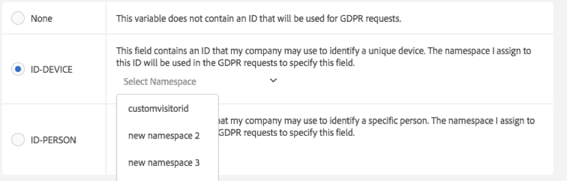

# Etiquetas de privacidad de datos para variables de Analytics

Los clientes de Adobe, como responsables del tratamiento de datos, son responsables de cumplir las leyes aplicables sobre privacidad de datos, como el reglamento general de protección de datos (RGPD) y la ley californiana sobre la protección de la vida privada de los consumidores (CCPA). Los clientes deben consultar con sus propios equipos jurídicos para determinar cómo se deben administrar sus datos para cumplir con las leyes de privacidad de datos. Adobe comprende que cada uno de sus clientes tiene necesidades específicas relacionadas con la privacidad, por lo que Adobe permite a sus clientes personalizar la configuración que deseen para el procesamiento de datos de privacidad de datos. De este modo, cada cliente único puede tratar las solicitudes de privacidad de datos de la manera que mejor se adapte a su marca y a su conjunto de datos único.

Adobe Analytics proporciona herramientas para etiquetar datos según su confidencialidad y las restricciones contractuales. Las etiquetas resultan importantes a la hora de: (1) identificar los datos de los sujetos, (2) determinar qué datos se han de devolver en una solicitud de acceso y (3) identificar campos de datos que se deban eliminar en una solicitud de eliminación.

Antes de poder determinar las etiquetas que se deben aplicar a cada variable o campo, debe [comprender qué tipo de ID](/help/admin/tools/privacy-labeling/best-practices.md) captura en sus datos de Analytics y decidir cuáles usará para las solicitudes de privacidad de datos.

La implementación de privacidad de datos de Adobe Analytics admite las siguientes etiquetas para datos de identidad, datos confidenciales y la gobernanza de datos.

>[!NOTE]
>
>Las etiquetas I1, I2, S1 y S2 tienen el mismo significado que las etiquetas DULE con el nombre correspondiente en Adobe Experience Platform. Sin embargo, se utilizan para finalidades muy diferentes. En Adobe Analytics, estas etiquetas se utilizan para ayudar a identificar campos que deben convertirse en anónimos como resultado de una solicitud de Privacy Service. En Adobe Experience Platform se utilizan para el control de acceso, la gestión del consentimiento y la aplicación de restricciones de marketing en los campos etiquetados. Adobe Experience Platform admite muchas etiquetas adicionales que Adobe Analytics no utiliza. Además, las etiquetas de Adobe Experience Platform se aplican a los esquemas. Si utiliza el conector de datos de Analytics para importar los datos de Adobe Analytics a Adobe Experience Platform, deberá asegurarse de que estén configuradas las etiquetas DULE adecuadas en Adobe Experience Platform para los esquemas de cada uno de los grupos de informes. Las etiquetas asignadas en Adobe Analytics no se aplican automáticamente a estos esquemas en Adobe Experience Platform, ya que solo representarían un subconjunto de las etiquetas DULE que puede que necesite aplicar. Además, los distintos grupos de informes pueden compartir un esquema, pero tienen diferentes etiquetas asignadas a props y evars con el mismo número y el esquema puede ser compartido por conjuntos de datos de otras fuentes de datos, lo que podría causar confusión sobre por qué determinados campos recibieron estas etiquetas.

## Etiquetas de datos de identidad {#identity-data-labels}

Las etiquetas “I” de datos de identidad se utilizan para categorizar los datos que podrían usarse para identificar a una persona específica o ponerse en contacto con ella.

| Etiqueta | Definición | Otros requisitos |
| --- | --- | --- |
| I1 | Directamente identificable: datos que pueden identificar específicamente a una persona o permitir que alguien se ponga en contacto de forma directa con ella, como un nombre o una dirección de correo electrónico. | <ul><li>No se pueden establecer en eventos.</li><li>No se pueden establecer en eVars de comercialización.</li></ul> |
| I2 | Indirectamente identificable: datos que se pueden utilizar en combinación con otros para identificar a una persona o dispositivo, o permitir que alguien se ponga en contacto con ellos de forma directa.  No permiten que se determine de qué persona se trata por sí solos, pero podrían combinarse con otra información (que usted podría tener o no en su poder) para identificar a alguien. Entre los ejemplos se incluyen un número de lealtad de cliente o un ID empleado por el sistema de CRM de una empresa que es único para cada uno de sus clientes. | <ul><li>No se pueden establecer en eventos.</li><li>No se pueden establecer en eVars de comercialización.</li></ul> |

{style="table-layout:auto"}

## Etiquetas de datos confidenciales {#sensitive-data-labels}

Las etiquetas de datos confidenciales “S” se utilizan para categorizar datos confidenciales, como datos geográficos. En el futuro, se presentarán etiquetas de datos confidenciales adicionales para identificar otros tipos de información confidencial.

| Etiqueta | Definición |
| --- | --- |
| S1 | Los datos de ubicación geográfica precisos relacionados con la latitud y la longitud que se pueden usar para determinar la ubicación exacta de un dispositivo (en un radio de 100 metros o menos). |
| S2 | Los datos de ubicación geográfica que se pueden usar para determinar un área de geoperímetro definida a grandes rasgos. |

{style="table-layout:auto"}

## Etiquetas de gobernanza de datos (privacidad de datos) {#data-governance-labels}

Las etiquetas de gobernanza de datos confieren a los usuarios la capacidad de clasificar datos que reflejen consideraciones relacionadas con la privacidad y condiciones contractuales a fin de ayudar a los clientes de Adobe a cumplir las normativas y las políticas corporativas.

### Etiquetas de acceso a la privacidad de datos {#access}

| Etiqueta | Definición | Otros requisitos |
| --- | --- | --- |
| Ninguna | Seleccione esta opción si esta variable no contiene datos que deban incluirse en los datos devueltos al interesado como parte de una solicitud de acceso a la privacidad de datos. | |
| ACC-ALL | Los valores de este campo se deben incluir en todas las solicitudes de acceso de la privacidad de datos. Si esta visita provenía de un dispositivo compartido por varias personas, al aplicar esta etiqueta, usted, como controlador de datos, indica que es aceptable compartir los datos de este campo con cualquier persona que tenga acceso al dispositivo compartido. | Los campos con esta etiqueta se devolverán para todas las solicitudes de la privacidad de datos. |
| ACC-PERSON | Los valores de este campo se deben incluir únicamente para solicitudes de acceso de la privacidad de datos cuando tengamos la certeza, dentro de lo razonable, de que la visita correspondía al interesado, tal y como se determine mediante la coincidencia de un ID de solicitud de la privacidad de datos con el valor de un campo ID-PERSON. | También debe tener una etiqueta ID-PERSON configurada en alguna variable dentro de este grupo de informes y enviar solicitudes mediante ese ID; de lo contrario, esta etiqueta nunca se aplicará. |

{style="table-layout:auto"}

Mientras que algunas variables recibirán alguna de las otras etiquetas, se espera que el acceso a las etiquetas se aplique a muchas de sus variables. Sin embargo, está en su mano, con el asesoramiento de su equipo legal, decidir cuáles de los datos que ha recopilado deben compartirse con los interesados.

### Etiquetas de eliminación de la privacidad de datos {#delete}

A diferencia de otras etiquetas, estas etiquetas de eliminación no son mutuamente exclusivas. Puede seleccionar una, ambas o ninguna. No es necesaria una etiqueta separada [!UICONTROL Ninguno], porque [!UICONTROL Ninguno] se indica simplemente no marcando ninguna opción Eliminar.

Se requiere una etiqueta de eliminación únicamente para los campos que contienen un valor que pueda permitir la visita con los datos del sujeto (por ejemplo, que permita la identificación del sujeto). No es necesario eliminar otra información personal (favoritos, historial de navegación/compras, condiciones de salud, etc.), ya que la asociación con el interesado se verá dañada.

| Etiqueta | Definición | Otros requisitos |
| --- | --- | --- |
| DEL-DEVICE | En el caso de solicitudes de eliminación de la privacidad de datos, los valores de este campo deben convertirse en anónimos solo para aquellas solicitudes en las que haya una etiqueta ID-DEVICE presente en la visita.  Si el mismo valor aparece en otras visitas que no se vayan a eliminar, estas otras instancias no se modificarán. Esto conllevará que los recuentos cambien en informes que calculen recuentos únicos en este campo. En dispositivos compartidos, esto podría eliminar identificadores de otras personas, aparte de los del interesado.  Los recuentos no cambian si este campo también tiene una etiqueta ID-DEVICE y el valor del campo se ha utilizado como ID para la solicitud de privacidad de datos. | <ul><li>También requiere una etiqueta I1, I2 o S1.</li><li>No se puede establecer en eventos.</li><li>No se puede establecer en eVars de comercialización.</li></li><li>No se puede establecer en clasificaciones.</li><li>Debe enviar solicitudes mediante un ID-DEVICE o establecer expandIDs como true; de lo contrario, esta etiqueta nunca se aplicará.</li></ul> |
| DEL-PERSON | En el caso de solicitudes de eliminación de la privacidad de datos, los valores de este campo deben convertirse en anónimos solo para aquellas solicitudes en las que haya una etiqueta ID-PERSON presente en la visita.  Si el mismo valor aparece en otras visitas que no se vayan a eliminar, estos otros valores no se modificarán. Esto conllevará que los recuentos cambien en informes que calculen recuentos únicos en este campo. Los recuentos no cambiarán si este campo también tiene una etiqueta ID-PERSON y el valor del campo se ha utilizado como ID para la solicitud de privacidad de datos. | <ul><li>También requiere una etiqueta I1, I2 o S1.</li><li>No se puede establecer en eventos.</li><li>No se puede establecer en eVars de comercialización.</li></li><li>No se puede establecer en clasificaciones.</li><li>También debe enviar solicitudes con una etiqueta ID-PERSON configurada en alguna variable dentro de este grupo de informes y enviar solicitudes mediante ese ID; de lo contrario, esta etiqueta nunca se aplicará.</li></ul> |

{style="table-layout:auto"}

### Etiquetas de identidad de la privacidad de datos {#identity}

| Etiqueta | Definición | Otros requisitos |
| --- | --- | --- |
| Ninguna | Esta variable no contiene ningún ID que se usará para las solicitudes de privacidad de datos. | Únicamente debe establecer una de estas otras etiquetas si este campo contiene un ID que utilizará al enviar las solicitudes de acceso o eliminación mediante la interfaz de usuario o la [API de servicio de privacidad](https://experienceleague.adobe.com/docs/experience-platform/privacy/api/overview.html?lang=es). |
| ID-DEVICE | Este campo contiene un ID que puede utilizarse para identificar un dispositivo para una solicitud de privacidad de datos, pero no puede distinguir entre distintos usuarios de un dispositivo compartido.  No necesita especificar esta etiqueta para todas las variables que contienen ID (ese el propósito de las etiquetas I1/I2). Utilice esta etiqueta si envía solicitudes de privacidad de datos mediante las ID almacenadas en esta variable y desea buscar esta variable para los ID especificados. | También requiere una etiqueta I1 o I2.<ul><li>No se pueden establecer en eventos.</li><li>No se puede establecer en eVars de comercialización.</li><li>No se puede establecer en clasificaciones.</li></ul> |
| ID-PERSON | Este campo contiene un ID que se puede usar para identificar a un usuario autenticado (una persona específica) cuando se realice una solicitud de privacidad de datos.  No necesita especificar esta etiqueta para todas las variables que contienen ID (ese el propósito de las etiquetas I1/I2). Utilice esta etiqueta si enviará solicitudes de privacidad de datos mediante las ID almacenadas en esta variable y desea buscar esta variable para los ID especificados. | <ul><li>También requiere una etiqueta I1 o I2.</li><li>No se pueden establecer en eventos.</li><li>No se puede establecer en eVars de comercialización.</li><li>No se puede establecer en clasificaciones.</li></ul> |

{style="table-layout:auto"}

## Proporcionar un área de nombres al etiquetar una variable como ID-DEVICE o ID-PERSON {#provide-namespace}

Cuando etiquete una variable como ID-DEVICE o ID-PERSON, se le solicitará que proporcione un área de nombres. Puede utilizar un área de nombres definida anteriormente o definir una nueva.

### Utilizar un área de nombres definida anteriormente {#previously-defined}

Si ha asignado una etiqueta de ID anteriormente a otras variables de cualquier grupo de informes de su empresa de inicio de sesión, puede seleccionar una de estas áreas de nombres existentes. Debe volver a utilizar el área de nombres si esta variable contiene el mismo tipo de ID que otras variables que ya están etiquetadas con esta área de nombres y desea realizar búsquedas en todos ellos al enviar una solicitud.

1. Haga clic en **[!UICONTROL Seleccionar área de nombres]** y seleccione una de las áreas de nombres existentes.
   
1. Haga clic en **[!UICONTROL Aplicar]**.


### Definir una nueva área de nombres {#define}

También puede definir una nueva área de nombres. Le recomendamos que las cadenas de área de nombres se limiten a caracteres alfanuméricos, además de los caracteres de guion bajo, guión y espacio. Se convertirán a todo en minúsculas.

1. Haga clic en **[!UICONTROL Seleccionar área de nombres]** y escriba el título del área de nombres.

   

1. Pulse **[!UICONTROL Intro]** para añadir este área de nombres. El botón Aplicar únicamente se activará en este momento.
1. Haga clic en **[!UICONTROL Aplicar]**.

La cadena que especifique como el área de nombres es la misma cadena que debería utilizar al enviar solicitudes mediante la API de privacidad de datos como el valor del parámetro “namespace”. La solicitud entonces hará que Adobe Analytics busque todas las variables en todos sus grupos de informes que compartan esta área de nombres en busca del ID que haya especificado en la solicitud.

No necesita especificar las etiquetas de ID-DEVICE o ID-PERSON para todas las variables que contienen ID (ese el propósito de las etiquetas I1/I2). Utilice esta etiqueta si enviará solicitudes de privacidad de datos mediante las ID almacenadas en esta variable y desea buscar esta variable para los ID especificados. A modo de ejemplo, si eVar1 puede contener una dirección de correo electrónico y eVar2 puede contener un nombre de usuario de inicio de sesión, pero solo va a enviar solicitudes utilizando el nombre de usuario, puede etiquetar eVar1 como I1, ACC-PERSON, DEL-PERSON, pero eVar2 como I2, ACC-PERSON, DEL-PERSON, ID-PERSON con el área de nombres “nombre de usuario”. Entonces puede enviar una solicitud con un bloque de sección de usuario JSON como:

```
{
     "namespace": "user name",
     "type": "analytics",
     "value": "rocketman123"
}
```

El uso de la misma área de nombres para distintas variables es aceptable dentro del mismo grupo de informes. Por ejemplo, algunas implementaciones personalizadas almacenan un CRM-ID tanto en un prop como en un eVar. Si el CRM-ID siempre se produce en uno de ellos (como el eVar) y solo se produce ocasionalmente en el otro (el prop), y nunca en el prop cuando tampoco en el eVar, entonces solo el eVar requiere una etiqueta ID y un área de nombres, ya que Adobe puede buscar el ID únicamente en ese eVar. Sin embargo, si el CRM-ID se produce a veces en una variable y a veces en otra, ambas deberían tener la misma área de nombres y Adobe buscará coincidencias con el ID especificado en ambas variables como parte de la solicitud de privacidad de datos con esta área de nombres. Aún debe tener las etiquetas DEL en todas estas variables, de modo que el valor se anonimice independientemente del lugar en el que se produzca.

Otro ejemplo: puede tener un CRM ID que en ocasiones se envía a través de eVar1 y en ocasiones se envía a través de prop7. También cuenta con una regla de procesamiento que copia el valor del eVar1, si existe, en el eVar3. De lo contrario, copia el valor de prop7 en el eVar3. En estos supuestos, eVar3 siempre contendrá el CRM ID si se conoce, de modo que solo eVar3 requiere una etiqueta ID-PERSON.

>[!CAUTION]
>
>Las áreas de nombres `visitorId` y `customVisitorId` están reservadas para identificar la cookie de seguimiento heredada de Analytics y el ID de visitante del cliente de Analytics. No utilice estas áreas de nombres para variables de conversión o tráfico personalizado.

## Tipos de variables y las etiquetas de privacidad de datos que admiten {#variable-types}

El etiquetado de privacidad de datos afecta a cuatro clases amplias de variables de Analytics. No todas las variables admiten todas las etiquetas. En esta tabla se muestra qué variables admiten o no cada etiqueta.

| Tipo de variable | Etiquetas admitidas | Etiquetas no admitidas |
|--- |--- |--- |
| <ul><li>Eventos de éxito personalizados</li><li>eVars de comercialización</li><li>Variables multivalor (mvVars)</li><li>Variables de jerarquía</li></ul> | <ul><li>S1/S2</li><li>ACC-ALL, ACC-PERSON</li></ul> | <ul><li>I1/I2</li>  <li>ID-DEVICE, ID-PERSON</li><li>DEL-DEVICE, DEL-PERSON</li></ul> |
| Clasificaciones | <ul><li>I1/I2, S1/S2</li><li>ACC-ALL, ACC-PERSON</li></ul> | <ul><li>ID-DEVICE, ID-PERSON</li><li>DEL-DEVICE, DEL-PERSON</li></ul> |
| <ul><li>Variables de tráfico (props)</li><li>Variables de comercio (eVars no relacionadas con el marketing)</li></ul> | Todas las etiquetas | - |
| La mayoría de las demás variables (*Vea la tabla siguiente para ver las excepciones*) | ACC-ALL, ACC-PERSON | <ul><li>I1/I2, S1/S2</li><li>ID-DEVICE, ID-PERSON</li><li>DEL-DEVICE, DEL-PERSON</li></ul> |

{style="table-layout:auto"}

## Variables a las que se pueden asignar o en las que se pueden modificar otras etiquetas que no sean ACC-ALL/ACC-PERSON {#variables}

<table id="table_0972910DB2D7473588F23EA47988381D"> 
 <thead> 
  <tr> 
   <th colname="col1" class="entry"> Grupo </th> 
   <th colname="col2" class="entry"> Variables </th> 
   <th colname="col3" class="entry"> Etiquetas modificables </th> 
   <th colname="col4" class="entry"> Comentario </th> 
  </tr>
 </thead>
 <tbody> 
  <tr> 
   <td colname="col1" morerows="1"> 
    <ul id="ul_62FA1BAA3B9245909509566D8C03F900"> 
     <li id="li_38F7C4E18ECB42C292370713F502B8EB">Dimensiones de conversión </li> 
     <li id="li_41CB61F927CB4402AAB4A62E219CD153">Dimensiones de tráfico personalizadas </li> 
    </ul> </td> 
   <td colname="col2"> <p>Todas, excepto las clasificaciones </p> </td> 
   <td colname="col3"> <p>Todas </p> </td> 
   <td colname="col4"> </td> 
  </tr>
  <tr> 
   <td colname="col1"> <p>Variables de tráfico </p> </td> 
   <td colname="col2"> <p>Variables props de lista </p> </td> 
   <td colname="col3"> <p>Ninguna /S1/S2 </p> </td> 
   <td colname="col4"> <p>Las props de lista pueden contener varios valores y no se permiten como identificadores de privacidad.</p> </td> 
  </tr> 
  <tr> 
   <td colname="col2"> <p>Clasificaciones </p> </td> 
   <td colname="col3"> <p>None/I1/I2 </p> <p>Ninguna /S1/S2 </p> </td> 
   <td colname="col4"> </td> 
  </tr> 
  <tr> 
   <td colname="col1"> <p>Eventos de conversión </p> </td> 
   <td colname="col2"> <p>Todas </p> </td> 
   <td colname="col3"> <p>Ninguna /S1/S2 </p> </td> 
   <td colname="col4"> </td> 
  </tr> 
  <tr> 
   <td colname="col1"> <p>Eventos y dimensiones de la solución </p> </td> 
   <td colname="col2"> <p>Vínculo de Activity Map, </p> <p>Página de Activity Map </p> </td> 
   <td colname="col3"> <p>None/I1/I2 </p> <p>None/DEL-DEVICE/DEL-PERSON </p> </td> 
   <td colname="col4"> <p>Las variables pueden contener parámetros de URL, que podrían incluir datos directa o indirectamente identificables. Si su implementación no recopila datos directa o indirectamente identificables en estas variables, estos no necesitan etiquetas de identidad o eliminación. </p> <p>Tenga en cuenta que la eliminación borra los parámetros de URL, pero conserva la URL de base. </p> </td> 
  </tr> 
  <tr> 
   <td colname="col1"> <p>Dimensiones de procesamiento de datos </p> </td> 
   <td colname="col2"> <p>ID de visitante personalizado </p> </td> 
   <td colname="col3"> <p>ID-DEVICE/ID-PERSON </p> <p>DEL-DEVICE/DEL-PERSON </p> </td> 
   <td colname="col4"> <p>No es posible eliminar las etiquetas ID o DEL (establecidas como Ninguno), pero puede cambiarlas por las variantes DEVICE o PERSON, en función de la implementación de su ID personalizado. </p> <p>Si no utiliza el ID de visitante personalizado, entonces esta configuración es irrelevante. </p> </td> 
  </tr> 
  <tr> 
   <td colname="col1" morerows="1"> 
    <ul id="ul_5EB0193732D44A20AEA08CE9DFE01DBD"> 
     <li id="li_F70D969F83314A94BD8567449968EE2F">Dimensiones estándar </li> 
     <li id="li_6046764B19FF4679B51E55671C2C0ADB">Dimensiones de procesamiento de datos </li> 
    </ul> </td> 
   <td colname="col2"> <p>Dirección IP </p> <p>Dirección IP 2 </p> </td> 
   <td colname="col3"> <p>DEL-DEVICE/DEL-PERSON </p> </td> 
   <td colname="col4"> <p>No es posible eliminar la etiqueta DEL, pero puede cambiarla por DEL-DEVICE o DEL-PERSON, o ambas. </p> </td> 
  </tr> 
  <tr> 
   <td colname="col2"> <p>Acción de ClickMap (heredada), </p> <p>Contexto de ClickMap (heredada), </p> <p>Página, </p> <p>URL de la página, </p> <p>URL de la página de la entrada original, </p> <p>Referente, </p> <p>URL de la página del inicio de la visita </p> </td> 
   <td colname="col3"> <p>None/I1/I2 </p> <p>None/DEL-DEVICE/DEL-PERSON </p> </td> 
   <td colname="col4"> <p>Las variables pueden contener parámetros de URL, que podrían incluir datos directa o indirectamente identificables. Si su implementación no recopila datos directa o indirectamente identificables en estas variables, estos no necesitan etiquetas de identidad o eliminación. </p> <p>Tenga en cuenta que la eliminación borra los parámetros de URL, pero conserva la URL de base. </p> </td> 
  </tr> 
 </tbody> 
</table>

## Gestión de eliminaciones {#deletion}

La compatibilidad de Adobe Analytics con las solicitudes de eliminación de privacidad de datos se ha diseñado para que los informes se vean menos afectados. En la mayoría de los casos, las métricas mostradas en los informes no deben cambiar. Un informe sobre el historial ejecutado antes de eliminar la privacidad de datos coincidirá con el mismo informe ejecutado una vez realizada la eliminación. Esto se consigue al desvincular por completo los datos eliminados del interesado y, a la vez, dejando los datos no identificables en su lugar para mantener la coherencia de los valores notificados.

En la tabla siguiente se describe cómo se “eliminan” las distintas variables. Esta no es una lista completa.

| Variables | Método de eliminación |
| --- | --- |
| <ul><li>Variables de tráfico (props)</li><li>Variables de Commerce (eVars)</li></ul> | El valor existente se reemplaza con uno nuevo con el formulario “Privacidad de datos-356396D55C4F9C7AB3FBB2F2FA223482”, donde el valor hexadecimal de 32 dígitos después del prefijo “Privacidad de datos” es un número pseudoaleatorio con cifrado de 128 bits.<p>Como, en esencia, se está reemplazando con una cadena aleatoria, no hay forma de determinar el valor original a partir de este nuevo valor ni forma de derivar el nuevo si se conoce el valor original.  En una variable determinada, si el valor idéntico al que se va a reemplazar se produce dentro de otras visitas que también se van a eliminar como parte de la misma solicitud de privacidad de datos, todas las instancias de dicho valor se sustituirán por el mismo valor nuevo.<p>Si algunas instancias de un valor se reemplazan con una solicitud de eliminación y una solicitud posterior elimina otras (nuevas) instancias del valor original, el nuevo valor de reemplazo será distinto del valor de reemplazo original. |
| ID de compra | El valor existente se reemplaza con uno nuevo con la forma “G-7588FCD8642718EC50”, donde los 18 dígitos hexadecimales después del prefijo “G-” son los primeros 18 dígitos de un número pseudoaleatorio con cifrado de 128 bits. Todos los comentarios que se aplican a la eliminación de tráfico y las variables de comercio se aplican aquí también.<p>El ID de compra es un ID de transacción cuyo propósito principal es garantizar que una compra no se cargue por duplicado, como cuando alguien actualiza la página de confirmación de compra. El propio ID puede asociar la compra a una fila de su propia base de datos en que se haya registrado la compra. En la mayoría de los casos no es necesario eliminar este ID, de modo que no se elimina de forma predeterminada.<p>Si sigue pudiendo vincular la compra a un usuario después de la solicitud de eliminación amparada en la privacidad de datos de sus propios datos, es posible que tenga que eliminar este campo, de modo que los datos de Analytics para este visitante no se puedan vincular al comprador. |
| ID de visitante | El valor es un entero de 128 bits y se reemplaza con un valor pseudoaleatorio con cifrado de 128 bits. |
| <ul><li>MCID</li><li>ID de visitante personalizado</li><li>Dirección IP</li><li>Dirección IP 2 | El valor se borra (establecido como cadena vacía o 0, según el tipo de variable). |
| <ul><li>Acción de ClickMap (heredada)</li><li>Contexto de ClickMap (heredada)</li><li>Página</li><li>URL de la página</li><li>URL de la página de la entrada original</li><li>Remitente del reenvío</li><li>URL de la página del inicio de la visita</li></ul> | Los parámetros de URL se borran o eliminan. Si el valor no parece una URL, se borra (se establece en la cadena vacía). |
| <ul><li>Latitud</li><li>Longitud</li></ul> | La precisión se reduce hasta no ser mejor que 1 km. |

{style="table-layout:auto"}

## Variables que quizás no admiten las etiquetas de eliminación esperadas {#no-delete-support}

En esta sección se pretende aclarar la información sobre las variables de Analytics que no admiten eliminación. A veces, estas variables las eliminan usuarios que no son de Analytics (como el equipo jurídico), que no comprenden el tipo de datos que contiene la variable y que realizan suposiciones incorrectas basadas en el nombre de la variable.

Es importante comprender qué tipo de datos contiene cada variable antes de tomar una decisión sobre el etiquetado o la eliminación, y no basarse únicamente en el nombre de la variable. A continuación se muestra una lista de algunas de estas variables y por qué no hace falta eliminarlas o por qué no requieren una etiqueta de eliminación específica:

| Variable | Comentarios |
| --- | --- |
| [!UICONTROL ID de visitante nuevo] | El ID del visitante nuevo es un valor booleano que se establece en true la primera vez que vemos un ID de visitante determinado. No es necesario eliminarlo una vez que el ID del visitante se anonimiza. Después de la anonimización, corresponderá a la primera vez que hayamos visto este ID anonimizado. |
| [!UICONTROL Código postal]<p>[!UICONTROL Código postal geográfico] | Los códigos postales solo se establecen para visitas originadas en los EE. UU. No se establecen para visitas provenientes de la UE. Incluso una vez configurados, solo proporcionan un área geográfica amplia que dificulta volver a identificar al interesado. |
| [!UICONTROL Latitud geográfica]<p>[!UICONTROL Longitud geográfica] | Proporcionan una ubicación aproximada derivada de la dirección IP. La precisión es generalmente similar a la de un código postal, con un radio de unas decenas de kilómetros de la ubicación real. |
| [!UICONTROL Agente de usuario] | El agente de usuario identifica la versión del explorador que se ha utilizado. |
| [!UICONTROL ID de usuario] | Especifica el grupo de informes de Analytics (como un número) que contiene los datos. |
| [!UICONTROL ID del grupo de informes ] | Especifica el nombre del grupo de informes de Analytics que contiene los datos. |
| [!UICONTROL ID de visitante]<p>[!UICONTROL MCID] / [!UICONTROL ECID] | Estos ID tienen la etiqueta DEL-DEVICE, pero no se puede agregar la etiqueta DEL-PERSON. Si desea que estos ID de cookie se anonimicen en las visitas que contengan un ID coincidente en una prop o eVar, puede solucionar esta limitación de etiquetado mediante el etiquetado de la prop o eVar con una etiqueta ID-DEVICE, incluso si realmente identifica a una persona (todas las etiquetas DEL-PERSON también necesitarán cambiarse a etiquetas DEL-DEVICE). En este caso, dado que solo algunas instancias del ID del visitante o del ECID se están anonimizando, las cantidades de visitantes únicos cambiarán en los informes del historial. |
| [!UICONTROL ID de AMO] | El ID de Adobe Advertising Cloud es una variable de solución que tiene una etiqueta no modificable [!UICONTROL DEL-DEVICE]. Se rellena a partir de una cookie, del mismo modo que el ID del visitante y el MCID. Debe eliminarse de las visitas siempre que se eliminen esos otros ID. Consulte la descripción de dichas variables para obtener más información. |

{style="table-layout:auto"}

## Campos de fecha para solicitudes de acceso {#access-requests}

Hay cinco variables estándar que contienen marcadores de tiempo:

| Marcador de tiempo | Definición |
| --- | --- |
| Hit Time UTC | La hora a la que Adobe Analytics recibió la visita. |
| Custom Hit Time UTC | Hora a la que se produjo la visita, lo que para algunas aplicaciones móviles y otras implementaciones puede ser antes de la hora en que se recibió. Por ejemplo, si una conexión de red no estaba disponible cuando se produjo, la aplicación puede retener la visita y enviarla cuando vuelva a disponer de conexión. |
| Date Time | El mismo valor que Custom Hit Time UTC, pero en la zona horaria del grupo de informes, no en la zona GMT. |
| First Hit Time GMT | El valor Custom Hit Time UTC para la primera visita recibida para el valor ID de visitante de esta visita. |
| Visit Start Time UTC | El valor Custom Hit Time UTC para la primera visita recibida para la visita actual por este ID de visitante. |

{style="table-layout:auto"}

El código para generar los archivos devueltos por las solicitudes de acceso amparadas en la privacidad de datos requiere que al menos una de las tres primeras variables de marcador de tiempo se incluya en la solicitud de acceso (que tenga una etiqueta ACC que se aplique al tipo de solicitud). Si no se incluye ninguna de estas marcas, Custom Hit Time UTC se trata como si tuviera una etiqueta ACC-ALL.

El archivo CSV del nivel de visita que devuelven las solicitudes de acceso bajo la privacidad de datos convertirá los valores de estos campos de marca de tiempo Unix en campos de fecha y hora con el formato `YYYY-MM-DD HH:MM:SS` (por ejemplo, `2018-05-01 13:49:22`). En el archivo HTML de resumen, estos valores de marca de tiempo se truncarán para incluir únicamente la fecha, `YYYY-MM-DD`, con el fin de reducir el número de valores únicos que se producen en estos campos.
