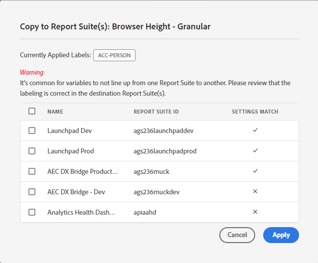

# Ver/administrar el etiquetado de privacidad para la gobernanza de datos

El cuadro de diálogo **[!UICONTROL Etiquetado de privacidad para la gobernanza de datos]** proporciona información general sobre las etiquetas de privacidad y los espacios de nombres de un grupo de informes. También puede exportar la configuración a un archivo .csv desde aquí.

## Ver etiquetas de privacidad {#view-privacy}

1. Inicie sesión en Adobe Experience Cloud.
2. Vaya a **[!UICONTROL Analytics]** > **[!UICONTROL Administrador]** > **[!UICONTROL Todos los administradores]** > **[!UICONTROL Configuración y recopilación de datos]** > **[!UICONTROL Gobernanza de datos]**.

   >[!NOTE]
   >
   >Si no visualiza este elemento de menú, debe añadirlo a un [perfil de producto en Admin Console](/help/admin/admin-console/permissions/product-profile.md) con permisos para esta funcionalidad o se le debe haber proporcionado acceso a un grupo de informes dentro de Admin Console.

3. En la parte superior derecha, seleccione un grupo de informes cuyas etiquetas de privacidad desee ver o administrar.

   

| Configuración | Descripción |
| --- | --- |
| **[!UICONTROL Nombre del componente]** | Esta columna enumera todos los componentes (dimensiones, métricas) que forman parte de este grupo de informes. |
| **[!UICONTROL Identidad]** | Las etiquetas “I” de datos de identidad se utilizan para categorizar los datos que podrían usarse para identificar a una persona específica o ponerse en contacto con ella. [Más información](/help/admin/tools/privacy-labeling/labels.md#data-privacy-identity-labels) |
| **[!UICONTROL Confidencialidad]** | Las etiquetas de datos confidenciales “S” se utilizan para categorizar datos confidenciales, como datos geográficos. En el futuro, se presentarán etiquetas de datos confidenciales adicionales para identificar otros tipos de información confidencial. [Más información](/help/admin/tools/privacy-labeling/labels.md#sensitive-data-labels) |
| **[!UICONTROL Acceso a RGPD]** | Las etiquetas de gobernanza de datos confieren a los usuarios la capacidad de clasificar datos que reflejen consideraciones relacionadas con la privacidad y condiciones contractuales a fin de cumplir las normativas y las políticas corporativas. [Más información](/help/admin/tools/privacy-labeling/labels.md#data-privacy-access-labels) |
| **[!UICONTROL Eliminación de RGPD]** | Se requiere una etiqueta de eliminación únicamente para los campos que contienen un valor que pueda permitir la visita con los datos del sujeto (por ejemplo, que permita la identificación del sujeto). [Más información](/help/admin/tools/privacy-labeling/labels.md#data-privacy-delete-labels) |
| Espacio de nombres **&#x200B;**&#x200B;| Cuando etiquete una variable como ID-DEVICE o ID-PERSON, se le solicitará que proporcione un espacio de nombres. Puede utilizar un espacio de nombres definido anteriormente o definir uno nuevo. |
| **[!UICONTROL Categoría]** | Hace referencia al tipo de componente, como componente estándar, variable de conversión, etc. |

{style="table-layout:auto"}

## Copiado de etiquetas de privacidad a un grupo de informes  {#copy-to-rs}

Si desea aplicar la misma configuración de privacidad de datos a más de un grupo de informes, siga estos pasos:

1. Seleccione la variable que desea copiar. Tenga en cuenta que solo puede copiar las etiquetas para una variable a la vez.
1. Haga clic en **[!UICONTROL Copiar en los grupos de informes]** en la parte inferior del cuadro de diálogo gobernanza de datos.

   

1. La pantalla resultante muestra el nombre de la variable, las etiquetas aplicadas actualmente que está intentando copiar, los grupos de informes y sus ID, y si coincide la configuración de los grupos de informes de destino.

   

   >[!IMPORTANT]
   >
   >Tenga en cuenta que todos los grupos de informes que seleccione deben estar asignados a su organización de Experience Cloud.

   Cuando copia las etiquetas de una variable o establece variables en distintos grupos de informes, la copia se dirige a la variable de la posición correspondiente en el grupo de informes de destino. Para los componentes estándar, las variables de lista y los eventos de éxito, las etiquetas se copiarán en la variable con el **mismo nombre** en el grupo de informes de destino.

   Sin embargo, para las variables de conversión (eVars) y las dimensiones de tráfico (props), la copia se realizará en la variable con el **mismo número** en el grupo de informes de destino. Por ejemplo, eVar12 se copiará en eVar12 de todos los grupos de informes de destino. Los nombres de estas variables se ignorarán en la determinación del destino de la copia. Si la variable correspondiente no está habilitada en el grupo de informes de destino, la copia de dicha variable fallará.

   Cuando copia las etiquetas de las clasificaciones definidas para una variable, las etiquetas se copiarán a una clasificación en la variable correspondiente en el grupo de informes de destino (como eVar7 a eVar7) cuyo nombre es idéntico al de la clasificación que se está copiando. De lo contrario, no se realizará la copia de las etiquetas de dicha clasificación.

1. Marque la casilla situada junto a uno o varios grupos de informes en los que coincida la configuración.
1. Haga clic en **[!UICONTROL Aplicar]**.

   Se muestra un mensaje de estado tras aplicar un conjunto de etiquetas. El mensaje de estado incluirá los nombres de cualquier variable o clasificación de destino y sus grupos de informes para los cuales no se ha podido realizar la copia.

   >[!IMPORTANT]
   >
   >Siempre debe comprobar los grupos de informes de destino para garantizar que las etiquetas se copian correctamente. Esto resulta especialmente importante en el caso de variables que tienen etiquetas de ID o DEL.

## Exportación a archivo .csv {#export-csv}

Puede descargar un archivo CSV que contiene todas las definiciones de etiquetas actuales para todas las variables de los grupos de informes seleccionados. Le recomendamos que su equipo legal revise sus opciones de etiquetado, algo que esta opción facilita. En lugar de tener que realizar la revisión con una sesión iniciada en la interfaz de usuario de gobernanza de datos, puede compartir el archivo .CSV con ellos.

1. Haga clic en **[!UICONTROL Exportar CSV]** en la parte superior derecha y se muestra este cuadro de diálogo:

   

1. Seleccione uno o varios grupos de informes para los que desea exportar toda la configuración de la gobernanza de datos.

## Editar etiquetas de privacidad {#edit}

Consulte [Asignación o edición de etiquetas de privacidad de grupos de informes](/help/admin/tools/privacy-labeling/labeling-overview.md).
