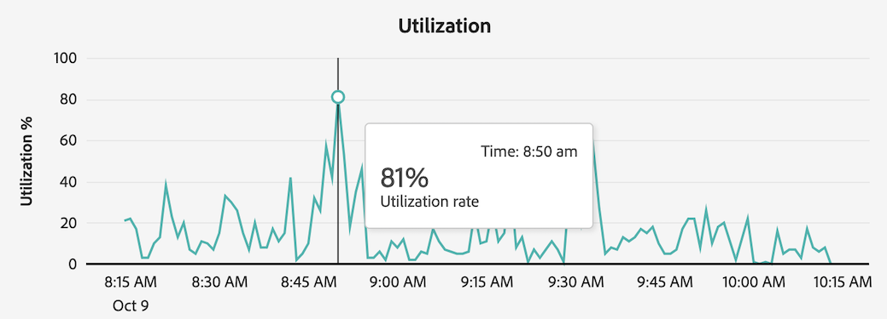
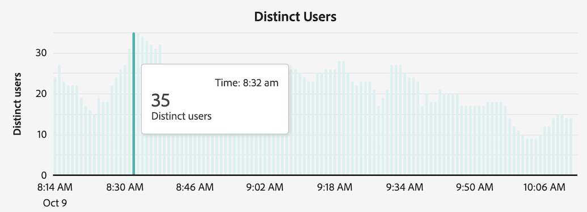
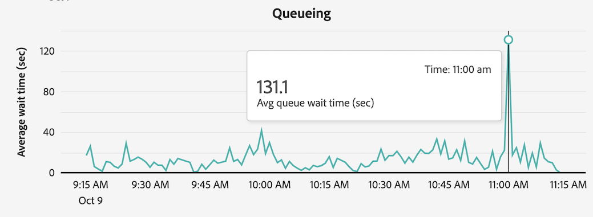
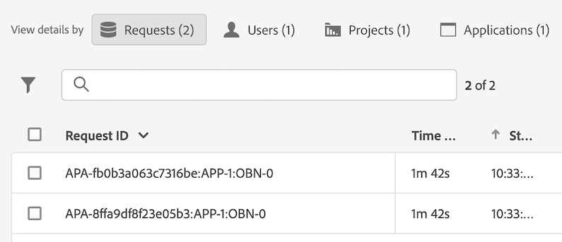

# Ver actividad de creación de informes en el Administrador de actividades de creación de informes

El [!UICONTROL Administrador de actividades de creación de informes] permite a los administradores diagnosticar y corregir rápidamente los problemas de capacidad de creación de informes durante las horas de mayor actividad de creación de informes.

Para obtener más información sobre el Administrador de actividades de creación de informes, incluidas las ventajas clave y los requisitos de los permisos, consulte [Información general sobre el Administrador de actividades de creación de informes](/help/admin/tools/reporting-activity-manager/reporting-activity-overview.md).

## Vista de las actividades de creación de informes de todos los grupos de informes {#view-all-report-suites}

<!-- markdownlint-disable MD034 -->

>[!CONTEXTUALHELP]
>id="cja_tools_reportingactivitymanager_connections"
>title="Conexiones"
>abstract="Esta tabla muestra las conexiones para las que tiene derechos para administrar la actividad de creación de informes. La información sobre cada conexión está disponible en cada columna de la tabla."

<!-- markdownlint-enable MD034 -->

<!-- markdownlint-disable MD034 -->

>[!CONTEXTUALHELP]
>id="tools_reportingactivitymanager_connections"
>title="Conexiones"
>abstract="Esta tabla muestra las conexiones para las que tiene derechos para administrar la actividad de creación de informes. La información sobre cada conexión está disponible en cada columna de la tabla."

<!-- markdownlint-enable MD034 -->

1. En Adobe Analytics, diríjase a **[!UICONTROL Administrador]** > **[!UICONTROL Administrador de actividades de creación de informes]**.

   Se muestra una lista de los grupos de informes base habilitados.

   

1. (Opcional) Puede buscar o filtrar la lista de grupos de informes:

   * Utilice el campo de búsqueda para buscar un grupo de informes determinado. Empiece a escribir el nombre o ID del grupo de informes y la lista de grupos de informes se actualiza a medida que escribe.

   * Seleccione el icono [!UICONTROL **Filtro**]  para ampliar la lista de opciones de filtro. Puede filtrar por [!UICONTROL **Favoritos**] o [!UICONTROL **Estado**].

     Para marcar un grupo de informes como favorito, seleccione el icono de estrella a la izquierda del nombre del grupo de informes.

     <!-- (does this option still exist?) 1. (Optional) Select **[!UICONTROL Refresh]** at the top-right to refresh the data. -->

1. Ver información de utilización de cada grupo de informes. Los datos que se muestran en la tabla representan la actividad de creación de informes del grupo de informes en el momento en que se cargó la página por última vez.

   Las columnas disponibles son las siguientes:

   | Elemento de la IU | Descripción |
   | --- | --- |
   | **[!UICONTROL Grupo de informes]** | El grupo de informes base cuya actividad de creación de informes está monitorizando. |
   | **[!UICONTROL Grupos de informes virtuales]** | Muestra todos los grupos de informes virtuales que se alimentan de este grupo de informes base. Los grupos de informes virtuales añaden complejidad a las solicitudes de creación de informes debido a los niveles adicionales de filtrado y segmentación aplicados. Todas las solicitudes que provienen de los grupos de informes virtuales se combinan en el grupo de informes base. |
   | **[!UICONTROL Utilización de la capacidad]** | El porcentaje de la capacidad de creación de informes del grupo de informes que se está utilizando en tiempo real. 
**Nota** Una capacidad de uso del 100 % no significa necesariamente que se deban cancelar inmediatamente las solicitudes de creación de informes. Una capacidad de uso del 100 % puede ser saludable si el tiempo medio de espera es razonable. Por otro lado, una capacidad de uso del 100 % podría indicar un problema si el número de solicitudes en cola también aumenta.
 |
   | **[!UICONTROL Solicitudes en cola]** | El número de solicitudes en espera de ser procesadas. <!-- ??? --> |
   | **[!UICONTROL Tiempo de espera en cola]** | El tiempo medio de espera antes de que las solicitudes empiecen a procesarse. <!-- ???? --> |
   | **[!UICONTROL Estado]** | Los posibles estados son: <ul><li>[!UICONTROL **Activo**] (azul): los informes se han ejecutado en el grupo de informes en las últimas 2 horas. Los datos que se muestran en la tabla representan la capacidad de creación de informes del grupo de informes en el momento en que se cargó la página por última vez.</li><li>[!UICONTROL **Inactivo**] (gris): no se ha ejecutado ningún informe en el grupo de informes en las últimas 2 horas, por lo que no se muestran datos para el grupo de informes.</li></ul> |

   {style="table-layout:auto"}

## Vista de la actividad de creación de informes de un grupo de informes individual

1. En Adobe Analytics, seleccione [!UICONTROL **Administrador**] > [!UICONTROL **Administrador de actividad de creación de informes**].

1. Seleccione el vínculo del título del grupo de informes del que desea ver los detalles.

   Los datos de la actividad de creación de informes se muestran para el grupo de informes seleccionado.

   <!-- Need to update this screenshot:  -->

1. (Opcional) Cuando una conexión se carga por primera vez en el Administrador de actividades de creación de informes, los datos mostrados representan las métricas de utilización actuales. Para ver las métricas actualizadas después de la carga inicial, seleccione el botón [!UICONTROL **Actualizar**] para actualizar manualmente la página.

1. Utilice los gráficos y las tablas disponibles para comprender la actividad de creación de informes en el grupo de informes.

   * [Visualización de gráficos](#view-graphs)

   * [Visualización de la tabla](#view-table)

### Visualización de gráficos

Los siguientes gráficos están disponibles para ayudarle a comprender mejor la actividad que se produce en el grupo de informes.

Si los gráficos no están visibles, seleccione el botón [!UICONTROL **Mostrar gráficos**].

#### Gráfico de utilización {#utilization}

El gráfico de utilización muestra la utilización de creación de informes de un grupo de informes seleccionado durante las últimas 2 horas.

Pase el puntero por encima del gráfico para ver los momentos específicos en los que el porcentaje de capacidad de uso fue mayor durante ese minuto.

* **Eje X**: la capacidad de uso de creación de informes durante las últimas 2 horas.
* **Eje Y**: el porcentaje de capacidad de uso de informes, por minuto.

  

#### Gráfico de usuarios distintos

El gráfico de usuarios independientes muestra la actividad de creación de informes de un grupo de informes seleccionado durante las últimas 2 horas.

Pase el puntero por encima del gráfico para ver los momentos específicos en los que la cantidad máxima de usuarios fue mayor durante ese minuto.

* **Eje X**: la actividad de creación de informes durante el último lapso de tiempo de 2 horas.
* **Eje Y**: el número de usuarios que han realizado solicitudes de informes, por minuto.

  

#### Gráfico de solicitudes

El gráfico Solicitudes muestra el número de solicitudes procesadas y en cola para el grupo de informes seleccionado durante las últimas 2 horas.

Pase el puntero por encima del gráfico para ver los puntos en el tiempo en los que la cantidad máxima de solicitudes fue mayor en ese minuto.

* **Eje X**: El número de solicitudes procesadas y completadas durante el último lapso de tiempo de 2 horas.
* **Eje Y**: el número de solicitudes procesadas (en verde) y solicitudes en cola (en púrpura), por minuto.

  

#### Gráfico de puesta en cola

El gráfico En cola muestra el tiempo medio de espera de cola (en segundos) para las solicitudes de creación de informes del grupo de informes seleccionado durante las últimas 2 horas.

Pase el puntero por encima del gráfico para ver los momentos específicos en los que el tiempo medio de espera máximo fue mayor durante ese minuto.

* **Eje X**: el tiempo medio de espera en cola para las solicitudes de informes durante el último lapso de tiempo de 2 horas.
* **Eje Y**: el tiempo medio de espera (en segundos).

  

### Visualización de la tabla {#view-table}

Cuando visualice la tabla, tenga en cuenta lo siguiente:

* Puede elegir ver los datos eligiendo cualquiera de las siguientes pestañas en la parte superior de la tabla de datos: [!UICONTROL **Solicitud**], [!UICONTROL **Usuario**], [!UICONTROL **Proyecto**] o [!UICONTROL **Aplicación**].

* Puede buscar o filtrar la lista de conexiones:

   * Utilice el campo de búsqueda para buscar una conexión específica. Empiece a escribir el nombre o ID de la conexión y la lista de actualizaciones de las conexiones se actualizará a medida que escriba.

   * Seleccione el icono [!UICONTROL **Filtro**]  para expandir la lista de opciones de filtro. Puede filtrar por [!UICONTROL **Estado**], [!UICONTROL **Complejidad**], [!UICONTROL **Aplicación**], [!UICONTROL **Usuario**] o [!UICONTROL **Proyecto**].

   * Puede seleccionar [!UICONTROL **Ocultar gráficos**] para mostrar solamente la tabla.

#### Vista de los datos por solicitud

Cuando selecciona la pestaña [!UICONTROL **Solicitud**], las siguientes columnas están disponibles en la tabla:

| Columna | Descripción |
| --- | --- |
| [!UICONTROL **ID de solicitud**] | Un ID único que se puede utilizar para solucionar problemas. Para copiar el identificador, seleccione la solicitud y luego seleccione la opción [!UICONTROL **Copiar ID de solicitud**]. |
| [!UICONTROL **Tiempo de ejecución**] | Cuánto tiempo lleva ejecutándose la consulta. |
| [!UICONTROL **Hora de inicio**] | Cuando la solicitud comenzó a procesarse (según la hora local del administrador). |
| [!UICONTROL **Tiempo de espera**] | El tiempo que la consulta ha estado esperando antes de procesarse. El valor suele ser &quot;0&quot; cuando hay suficiente capacidad. |
| [!UICONTROL **Aplicación**] | Las aplicaciones compatibles con el [!UICONTROL Administrador de actividades de creación de informes] son: <ul><li>IU de Analysis Workspace</li><li>Proyectos programados de Workspace</li><li>Report Builder</li><li>IU del generador: Segmento, Métricas calculadas, Anotaciones, Públicos, etc.</li><li>Llamadas de API desde la API 1.4 o 2.0</li><li>Alertas</li><li>Vínculos para compartir con cualquiera</li><li>Cualquier otra aplicación que consulte el motor de informes de Analytics.</li></ul> |
| [!UICONTROL **Usuario**] | El usuario que ha iniciado la consulta. 
**Nota:** Si el valor de esta columna es [!UICONTROL **No reconocido**], significa que el usuario se encuentra en una compañía de inicio de sesión en la que no tiene permisos administrativos.
 |
| [!UICONTROL **Proyecto**] | Nombres de proyectos de Workspace guardados, ID de informes de API, etc. (Los metadatos pueden variar entre distintas aplicaciones). |
| [!UICONTROL **Estado**] | Indicadores de estado: <ul><li>**Ejecución**: la solicitud está siendo procesada en este momento.</li><li>**Pendiente**: la solicitud está esperando a procesarse.</li></ul> |
| [!UICONTROL **Complejidad**] | No todas las solicitudes requieren la misma cantidad de tiempo para procesarse. La complejidad de la solicitud puede ayudar a tener una idea general sobre el tiempo necesario para procesar la solicitud. 
Entre los posibles valores están:
 <ul><li>[!UICONTROL **Bajo**]</li><li>[!UICONTROL **Medio**]</li><li>[!UICONTROL **Alto**]</li></ul>Este valor se ve influido por los valores de las siguientes columnas:<ul><li>[!UICONTROL **Límites mensuales**]</li><li>[!UICONTROL **Columnas**]</li><li>[!UICONTROL **Segmentos**]</li></ul> |
| [!UICONTROL **Límites mensuales**] | El número de meses que se incluyen en una solicitud. Más límites mensuales aumenta la complejidad de la solicitud. |
| [!UICONTROL **Columnas**] | El número de métricas y desgloses de la solicitud. Más columnas aumenta la complejidad de la solicitud. |
| [!UICONTROL **Segmentos**] | El número de segmentos aplicados a la solicitud. Más segmentos aumenta la complejidad de la solicitud. |

{style="table-layout:auto"}

#### Vista de los datos por usuario

Al seleccionar la pestaña [!UICONTROL **Usuario**], las siguientes columnas están disponibles en la tabla:

| Columna | Descripción |
| --- | --- |
| [!UICONTROL **Usuario**] | El usuario que ha iniciado la consulta. Si el valor de esta columna es [!UICONTROL **No reconocido**], significa que el usuario se encuentra en una compañía de inicio de sesión en la que no tiene permisos administrativos. |
| [!UICONTROL **Número de solicitudes**] | Número de solicitudes iniciadas por el usuario. |
| [!UICONTROL **Número de proyectos**] | El número de proyectos asociados al usuario. <!-- ??? --> |
| [!UICONTROL **Aplicación**] | Las aplicaciones compatibles con el [!UICONTROL Administrador de actividades de creación de informes] son: <ul><li>IU de Analysis Workspace</li><li>Proyectos programados de Workspace</li><li>Report Builder</li><li>IU del generador: Segmento, Métricas calculadas, Anotaciones, Públicos, etc.</li><li>Llamadas de API desde la API 1.4 o 2.0</li><li>Alertas</li><li>Vínculos para compartir con cualquiera</li><li>Cualquier otra aplicación que consulte el motor de informes de Analytics.</li></ul> |
| [!UICONTROL **Complejidad media**] | La complejidad media de las solicitudes iniciadas por el usuario. 
No todas las solicitudes requieren la misma cantidad de tiempo para procesarse. La complejidad de la solicitud puede ayudar a tener una idea general sobre el tiempo necesario para procesar la solicitud.

El valor de esta columna se basa en una puntuación que viene determinada por los valores de las columnas siguientes:
<ul><li>[!UICONTROL **Límites mensuales medios**]</li><li>[!UICONTROL **Columnas medias**]</li><li>[!UICONTROL **Segmentos medios**]</li></ul> |
| [!UICONTROL **Límites mensuales medios**] | El número medio de meses que se incluyen en las solicitudes. Más límites mensuales aumenta la complejidad de la solicitud. |
| [!UICONTROL **Columnas medias**] | El número medio de métricas y desgloses en las solicitudes incluidas. Más columnas aumenta la complejidad de la solicitud. |
| [!UICONTROL **Segmentos medios**] | El número medio de segmentos aplicados a las solicitudes incluidas. Más segmentos aumenta la complejidad de la solicitud. |

{style="table-layout:auto"}

#### Vista de los datos por proyecto

Al seleccionar la pestaña [!UICONTROL **Proyecto**], las siguientes columnas están disponibles en la tabla:

| Columna | Descripción |
| --- | --- |
| [!UICONTROL **Proyecto**] | El proyecto en el que se han iniciado las solicitudes. |
| [!UICONTROL **Número de solicitudes**] | El número de solicitudes asociadas al proyecto. |
| [!UICONTROL **Número de usuarios**] | El número de usuarios asociados al proyecto. <!-- ??? --> |
| [!UICONTROL **Aplicación**] | Las aplicaciones compatibles con el [!UICONTROL Administrador de actividades de creación de informes] son: <ul><li>IU de Analysis Workspace</li><li>Proyectos programados de Workspace</li><li>Report Builder</li><li>IU del generador: Segmento, Métricas calculadas, Anotaciones, Públicos, etc.</li><li>Llamadas de API desde la API 1.4 o 2.0</li><li>Alertas</li><li>Vínculos para compartir con cualquiera</li><li>Cualquier otra aplicación que consulte el motor de informes de Analytics.</li></ul> |
| [!UICONTROL **Complejidad media**] | La complejidad media de las solicitudes incluidas en el proyecto. 
No todas las solicitudes requieren la misma cantidad de tiempo para procesarse. La complejidad de la solicitud puede ayudar a tener una idea general sobre el tiempo necesario para procesar la solicitud.

El valor de esta columna se basa en una puntuación que viene determinada por los valores de las columnas siguientes:
<ul><li>[!UICONTROL **Límites mensuales medios**]</li><li>[!UICONTROL **Columnas medias**]</li><li>[!UICONTROL **Segmentos medios**]</li></ul> |
| [!UICONTROL **Límites mensuales medios**] | El número medio de meses que se incluyen en las solicitudes. Más límites mensuales aumenta la complejidad de la solicitud. |
| [!UICONTROL **Columnas medias**] | El número medio de métricas y desgloses en las solicitudes incluidas. Más columnas aumenta la complejidad de la solicitud. |
| [!UICONTROL **Segmentos medios**] | El número medio de segmentos aplicados a las solicitudes incluidas. Más segmentos aumenta la complejidad de la solicitud. |

{style="table-layout:auto"}

#### Vista de datos por aplicación

Al seleccionar la pestaña [!UICONTROL **Aplicación**], las siguientes columnas están disponibles en la tabla:

| Columna | Descripción |
| --- | --- |
| [!UICONTROL **Aplicación**] | La aplicación donde se han iniciado las solicitudes. |
| [!UICONTROL **Número de solicitudes**] | El número de solicitudes asociadas a la aplicación. |
| [!UICONTROL **Número de usuarios**] | El número de usuarios asociados a la aplicación. <!--???--> |
| [!UICONTROL **Número de proyectos**] | El número de proyectos asociados a la aplicación. <!--???--> |
| [!UICONTROL **Complejidad media**] | La complejidad media de las solicitudes asociadas a la aplicación. 
No todas las solicitudes requieren la misma cantidad de tiempo para procesarse. La complejidad de la solicitud puede ayudar a tener una idea general sobre el tiempo necesario para procesar la solicitud.

El valor de esta columna se basa en una puntuación que viene determinada por los valores de las columnas siguientes:
El valor de esta columna se basa en una puntuación que viene determinada por los valores de las columnas siguientes:<ul><li>[!UICONTROL **Límites mensuales medios**]</li><li>[!UICONTROL **Columnas medias**]</li><li>[!UICONTROL **Segmentos medios**]</li></ul> |
| [!UICONTROL **Límites mensuales medios**] | El número medio de meses que se incluyen en las solicitudes. Más límites mensuales aumenta la complejidad de la solicitud. |
| [!UICONTROL **Columnas medias**] | El número medio de métricas y desgloses en las solicitudes incluidas. Más columnas aumenta la complejidad de la solicitud. |
| [!UICONTROL **Segmentos medios**] | El número medio de segmentos aplicados a las solicitudes incluidas. Más segmentos aumenta la complejidad de la solicitud. |

{style="table-layout:auto"}

<!--

## Frequently asked questions {#faq}

| Question | Answer |
| --- | --- |
|  |  |

{style="table-layout:auto"}

-->