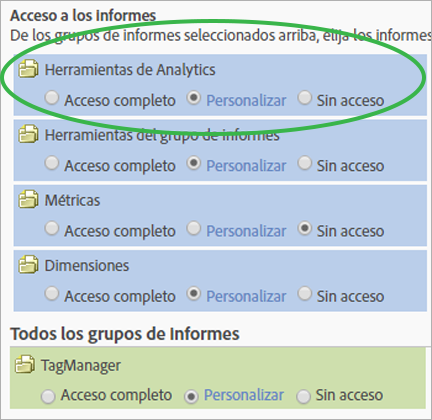

# Personalizar permisos para las herramientas de Analytics

>[!IMPORTANT]
>
>La administración de usuarios y productos se ha trasladado a la [Admin Console](https://helpx.adobe.com/es/enterprise/using/admin-console.html). Adobe le avisará cuando deba migrar a sus usuarios. Cuando se hayan migrado todos los clientes, se retirará el contenido de ayuda de **[!UICONTROL Analytics]** > **[!UICONTROL Administración]** > **[!UICONTROL Administración de usuarios]**.

Habilite permisos de usuario para elementos generales (facturación, registros, etc.), administración de la empresa, herramientas, acceso a servicios web, Report Builder e integración de Data Connectors.

**[!UICONTROL Administración de usuarios]** > **[!UICONTROL Grupos]** > **[!UICONTROL Acceso a todos los informes]** > **[!UICONTROL Herramientas de Analytics]** > **[!UICONTROL Personalizar]**

>[!NOTE]
>
>En la versión de otoño de 2016 (20 de octubre) se añadieron cambios en la administración de grupos. Consulte [Cambios administrativos: Otoño de 2016](/help/admin/user-management2/c-user-management/permissions-changes.md) para ver un resumen de los cambios.

## Acceso a los informes - Herramientas de Analytics

Haga clic en **[!UICONTROL Personalizar]** para seleccionar los elementos a los que tendrá acceso este grupo.

## Descripciones de los campos

Las opciones de esta página pertenecen a los grupos de informes seleccionados en la página [!UICONTROL Definir grupos de usuarios].

| Elemento | Descripción |
|--- |--- |
| **General** |  |
| [Administrador de códigos](/help/admin/admin/code-manager-admin.md) | Habilita el permiso para descargar el código de recopilación de datos para plataformas móviles y web. |
| Administrador de códigos - Servicios Web | Permite a los usuarios que no son administradores acceder al Administrador de códigos por medio de Servicios Web. |
| [Registros](/help/admin/admin/logs.md) | Habilita el permiso para acceder a los archivos de registro, los cuales ayudan a saber cuándo inician sesión los usuarios, el uso que se hace del sistema, los accesos, los grupos de informes y los cambios de administración. |
| Registros - Servicios Web | Permite a los usuarios que no son administradores acceder a los registros de las herramientas de administración por medio de Servicios Web. |
| [Administración del tráfico](/help/admin/c-traffic-management/traffic-management.md) | La página Administración del tráfico permite especificar los cambios esperados en el volumen del tráfico. |
| Administración de permisos | Otorga acceso a las páginas de administración de usuarios en las herramientas de administración a los usuarios que no son administradores. Estos usuarios disponen de permisos de lectura, pero no de escritura. |
| Permisos (escritura) - Servicios Web | Permite a los usuarios que no son administradores leer y escribir la configuración de permisos en Administración de usuarios, dentro de Servicios Web. Esta configuración se refiere específicamente a las acciones de permisos indicadas en la API de administración. |
| Permisos (lectura) - Servicios Web | Permite a los usuarios que no son administradores ver la configuración de permisos bajo Administración de usuarios, en Servicios Web. Esta configuración se refiere específicamente a las acciones de permisos indicadas en la API de administración. |
| **Administración de la empresa** |  |
| [Seguridad](/help/admin/company/security-manager.md) | Otorga permiso para acceder a la página Administrador de seguridad para controlar el acceso a los datos de los informes. Las opciones incluyen contraseñas seguras, caducidad de las contraseñas, restricciones de inicio de sesión de direcciones IP y restricciones de dominio de correo electrónico. |
| Información sobre asistencia | Otorga permiso para acceder a Información de soporte técnico en Configuración de la empresa. |
| [Servicios Web](/help/admin/company/web-services-admin.md) | Permite acceder a la página Servicios Web dentro de la interfaz de las herramientas de administración ([!UICONTROL Configuración de la empresa] > [!UICONTROL Servicios Web]). La API de Servicios Web proporciona acceso programático a servicios de Adobe Analytics que le permiten duplicar y aumentar la funcionalidad disponible por medio de la interfaz de usuario. |
| Inicio de sesión único (heredado) | Otorga acceso a la página de inicio de sesión único en las herramientas de administración. **Nota:** El inicio de sesión único en Adobe Experience Cloud se implementa mediante la [vinculación de cuentas](https://docs.adobe.com/content/help/es-ES/core-services/interface/manage-users-and-products/organizations.html) entre Experience Cloud y las correspondientes soluciones. |
| [Acciones pendientes](/help/admin/company/pending-actions-admin.md) | Concede permiso para administrar las acciones pendientes en [!UICONTROL Configuración de la empresa]. |
| [Promoción conjunta de marca](/help/admin/company/co-branding-admin.md) | Concede permiso para promocionar Analytics de manera conjunta. |
| [Preferencias](/help/admin/admin/preferences-manager.md) | Otorga permiso para acceder a [!UICONTROL Administrador de preferencias]. |
| [Ocultar grupos de informes](/help/admin/company/c-hide-report-suites.md) | Concede permiso para ocultar grupos de informes en la interfaz de usuario de Adobe Analytics. |
| **Herramientas** | Estas opciones otorgan acceso a las herramientas de Analytics (interfaces y aplicaciones), así como a funciones avanzadas, como segmentación y métricas calculadas. |
| [Datos actuales](https://docs.adobe.com/content/help/es-ES/analytics/analyze/reports-analytics/current-data.html) | Concede permiso para usar la función Datos actuales en la generación de informes. |
| Acceso a Servicio Web | Permite a los usuarios que no son administradores acceder a Servicios Web. Genera credenciales para Servicios Web. |
| [Report Builder](https://docs.adobe.com/content/help/es-ES/analytics/analyze/report-builder/report-builder-setup/t-install-arb.html) | Otorga a los miembros de este grupo acceso a licencias para el [!UICONTROL Report Builder]. |
| Acceso a [Analysis Workspace](https://docs.adobe.com/content/help/es-ES/analytics/analyze/analysis-workspace/home.html) | Concede a los usuarios acceso a Analysis Workspace, la interfaz de generación de informes recomendada para [!DNL Adobe Analytics]. |
| [Reports &amp; Analytics](https://docs.adobe.com/content/help/es-ES/analytics/landing/an-key-concepts.html) | Concede a los usuarios acceso a Reports &amp; Analytics. |
| [Creación de métricas calculadas](https://docs.adobe.com/content/help/es-ES/analytics/components/calculated-metrics/cm-overview.html) | Concede a los usuarios permiso para crear métricas calculadas. |
| [Creación de segmentos](https://docs.adobe.com/content/help/es-ES/analytics/components/segmentation/seg-home.html) | Otorga a los usuarios permiso para crear segmentos. |
| **Data Connectors** |  |
| Integraciones (Crear, Actualizar o Eliminar) | Concede permiso para crear, actualizar y eliminar integraciones de conector de datos. |
