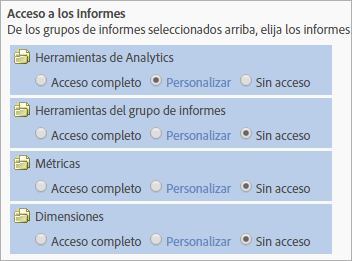

# Personalizar el acceso a los informes: Resumen

>[!IMPORTANT]
>
>La administración de usuarios y productos se ha trasladado a la [Admin Console](https://helpx.adobe.com/es/enterprise/using/admin-console.html). Cuando se hayan migrado todos los clientes, se retirará el contenido de ayuda de **[!UICONTROL Analytics]** > **[!UICONTROL Herramientas de administración]** > **[!UICONTROL Administración de usuarios]**.

Personalice los permisos de grupo a las herramientas de Analytics, las herramientas de grupos de informes, las métricas y las dimensiones.

**[!UICONTROL Agregar nuevo grupo]** > **[!UICONTROL Acceso a informes]**

La sección [!UICONTROL Acceso a informes] de la página [!UICONTROL Definir grupo de usuarios] proporciona acceso a categorías que le permiten personalizar permisos en un nivel granular.

Por ejemplo, puede crear un grupo con acceso a varias herramientas de Analytics ([!UICONTROL Analysis Workspace], [!UICONTROL Reports &amp; Analytics] y [!UICONTROL Report Builder]), con permiso para métricas y dimensiones concretas (incluidas eVars) y funciones como la creación de segmentos o métricas calculadas.

## Qué debe saber sobre los permisos {#section_3D25D4A5BD044008870C5B98F696244E}

<table id="table_DB7806E05E2040EC9A4CB7C3596879EC"> 
 <thead> 
  <tr> 
   <th colname="col1" class="entry"> Elemento </th> 
   <th colname="col2" class="entry"> Descripción </th> 
  </tr> 
 </thead>
 <tbody> 
  <tr> 
   <td colname="col1"> 
Acceso de administrador y grupos predefinidos 
 </td> 
   <td colname="col2"> 
 Los grupos predefinidos ya no son obligatorios para los administradores. Los administradores ahora tienen acceso a todos los elementos (herramientas, métricas, dimensiones), así como al acceso al servicio Web, al Report Builder y al Activity Map. 
 
El objetivo de los grupos es conceder acceso a los usuarios que no son administradores, o restringirlo. 
 </td> 
  </tr> 
  <tr> 
   <td colname="col1"> 
Grupos personalizados 
 </td> 
   <td colname="col2"> 
 Los grupos personalizados han reemplazado a los grupos predefinidos. Los grupos predefinidos existentes se migrarán a grupos personalizados; el nombre del grupo se mantendrá. Se conservarán los grupos personalizados que se hayan podido crear, incluida su configuración. No obstante, observará que la ubicación de los ajustes de configuración ha cambiado. Por ejemplo, los ajustes de configuración de la empresa (en Admin Console personalizado) están ahora en <a href="/help/admin/user-management2/c-customize-report-access/groups-analytics-tools.md">Personalizar herramientas de Analytics</a>. 
 
 Los usuarios que pertenecen a  Acceso a todos los informes se han migrado a un grupo personalizado con acceso a: 
 
    <ul id="ul_7E1B443DEEF7452E85FEB30CA0BBC8BE"> 
     <li id="li_A510C2A4129340E0AB08EEBDBE4AEAD9">Todas las dimensiones </li> 
     <li id="li_8BA1D7A2527C4F10AC93108B9E87F418">Todas las métricas </li> 
     <li id="li_265830A2C6B94AF28720DA99980EAA51">Todos los grupos de informes </li> 
     <li id="li_685B99DEAB814D7B9C11B14AA4CB8CD4">Informe de canal </li> 
     <li id="li_B35420302AAB42509BD6AF0FA6349BF8">Detección de anomalías </li> 
     <li id="li_3787E4696C454D3ABD1D75F6C282A9A2">Informe en tiempo real </li> 
     <li id="li_3797DF9C40D1426588819116362962F5">Acceso a Analysis Workspace </li> 
    </ul> 
Los administradores pueden eliminar los grupos personalizados y también crear los suyos propios, ya que todos los ajustes de configuración que antes estaban disponibles en grupos predefinidos se pueden personalizar bajo el ajuste Acceso a informes, en Definir grupos de usuarios</a>. 
 </td> 
  </tr> 
  <tr> 
   <td colname="col1"> 
Permisos en el nivel de dimensión 
 </td> 
   <td colname="col2"> 
Puede personalizar permisos para incluir o excluir el acceso a dimensiones (además del acceso a métricas). 
 
    <ul id="ul_DA5A54223673474E9151AF979DA50659"> 
     <li id="li_C3E82F7BC07A4F2F83A85D3D511292CC"> 
Se han migrado automáticamente a las nuevas categorías todas las dimensiones y métricas actuales dentro de grupos personalizados. Si un grupo existente tiene métricas habilitadas, se le asignarán todas las dimensiones que puedan recibir permisos por primera vez (eVars y según el contenido) y métricas de forma predeterminada. 
 </li> 
     <li id="li_CC56F9181CC14AB59318628E72F2E8C9"> Permisos del Importador de clasificaciones (anteriormente, SAINT): el acceso a las clasificaciones viene determinado por el acceso a la <a href="https://docs.adobe.com/content/help/es-ES/analytics/components/classifications/c-classifications.html">variable</a> en la cual se basa la clasificación. </li> 
    </ul> 
Consulte <a href="/help/admin/user-management2/c-customize-report-access/groups-dimensions.md"> Personalizar permisos para dimensiones</a> 
 </td> 
  </tr> 
  <tr> 
   <td colname="col1"> 
<a href="https://helpx.adobe.com/enterprise/using/admin-console.html"> Adobe Admin Console</a> 
 </td> 
   <td colname="col2"> 
Solo se recomienda para clientes nuevos o clientes cuyas empresas estén <a href="https://docs.adobe.com/content/help/es-ES/core-services/interface/about-core-services/core-services.html">aprovisionadas en Experience Cloud</a>. Se ha planificado la migración de los clientes existentes de Analytics al sistema de administración de identidades de Experience Cloud. 
 
Encontrará más información en <a href="https://docs.adobe.com/content/help/es-ES/analytics/admin/user-product-management/user-management/migrate-users/c-migration-tool.html">Migración de usuarios de Analytics a Admin Console</a>. 
 </td> 
  </tr> 
  <tr> 
   <td colname="col1"> 
Según el contenido 
 </td> 
   <td colname="col2"> 
Según el contenido incluye variables que le permiten administrar los permisos para las métricas relacionadas con integraciones con la solución Experience Cloud. Puede administrar permisos para datos Social, Mobile u otros datos que se hayan insertado a través de una integración con Experience Cloud. Estos permisos aparecerán habilitados de manera predeterminada. 
 </td> 
  </tr> 
  <tr> 
   <td colname="col1"> 
Permisos o informes obsoletos 
 </td> 
   <td colname="col2"> 
Se eliminarán los siguientes informes obsoletos: 
 
    <ul id="ul_C0415CFF0562472297272EC58ECC0774"> 
     <li id="li_62B1CE33B1454987B878B321EB40D62E">Resumen mensual </li> 
     <li id="li_71CD776D212540A18F9B083D2E11A296">Página principal del visitante </li> 
     <li id="li_406200AD68C74D11B5F53988A4E76A68">Complementos de Netscape </li> 
     <li id="li_A124637D69C94C78921C8B028D890541">Visitantes clave </li> 
     <li id="li_5C26FF95371B4F3080FF75C7F8DE0F72">Páginas vistas por los visitantes clave </li> 
     <li id="li_E7E262BD0CF64E16B838F995F6A13B8A">Breve esquema visual del visitante </li> 
     <li id="li_0EDC74625C0D4B1A992FCA49B648E4C0">DRM </li> 
     <li id="li_ACC92E6EA188409486E7C943F26B9DAC">Protocolos de red </li> 
     <li id="li_6E18C4D12377416A8124BBD13164B03A">Versión de Java </li> 
     <li id="li_1599265E59EF4F34BB406356410C9E68">Longitud de la dirección URL del marcador </li> 
     <li id="li_3035442010984C409089B21E03DB7BCC">Transmisión de número de dispositivo </li> 
     <li id="li_6B2163ED8FC84EBF933D97A504B4D527">PTT </li> 
     <li id="li_0EB8A4A7619B45DF87109B183A7C69C8">Compatibilidad con Decoration Mail </li> 
     <li id="li_989FAC662F7344E6BDDC517B79D4581E">Información </li> 
     <li id="li_F1FB7F8E415443F3B63F6D11D59A04AB">Servicio de información </li> 
    </ul> 
Estos informes: 
 
    <ul id="ul_F71505C59F734EA9B541BF8AB9F9388F"> 
     <li id="li_7D461907B895447280E69CF1520DF47C">Están disponibles para Marcadores. </li> 
     <li id="li_27BA2DD6BA4C446FBAA06B6C76CD171F">No se incluyen en la nueva categoría de permiso de Dimensiones. </li> 
     <li id="li_504E9D8421714406A0F37DEF1E10E34B">Ya no se pueden editar sus permisos. </li> 
     <li id="li_0022E8DCA07344C793847E8282EFBEEF">Conservarán el acceso para grupos personalizados con acceso actual. </li> 
    </ul> </td> 
  </tr> 
 </tbody> 
</table>

