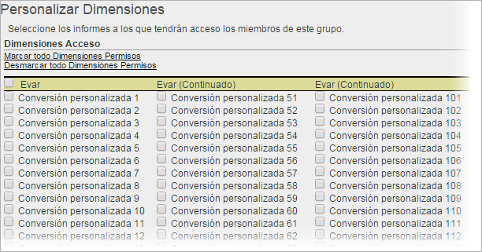

# Personalizar permisos para dimensiones

>[!IMPORTANT]
>
>La administración de usuarios y productos se va a trasladar a [Admin Console](https://helpx.adobe.com/es/enterprise/using/admin-console.html). Adobe le avisará cuando deba migrar a sus usuarios. Cuando se hayan migrado todos los clientes, se retirará el contenido de ayuda de **[!UICONTROL Analytics]** > **[!UICONTROL Herramientas de administración]** > **[!UICONTROL Administración de usuarios]**.

Personalice el acceso de usuarios a nivel granular con eVars, informes de tráfico, informes de soluciones e informes de rutas.

**[!UICONTROL Administración de usuarios]** > **[!UICONTROL Grupos]** > **[!UICONTROL Acceso a informes]** > **[!UICONTROL Dimensiones]** > **[!UICONTROL Personalizar]**

>[!IMPORTANT]
>
>Algunas dimensiones no pueden recibir permisos en este momento. Estas dimensiones son: Longitud del marcador móvil, Número del dispositivo móvil, DRM móvil, Servicios de información móvil, Máquina virtual Java móvil, Decoración de correo móvil, Protocolos de red móvil, Sistema operativo móvil, Pulsar para hablar móvil.
>
>Estas dimensiones están disponibles para todos los usuarios, independientemente de otros permisos.

Las opciones de esta página pertenecen a los grupos de informes seleccionados en la página [!UICONTROL Definir grupos de usuarios].

Conozca la información que sigue sobre la categoría de permisos Dimensión.

* Las eVars 1 a 250 obtienen permisos de forma individual.
* Todos los informes de tráfico son dimensiones.
* Los informes de Vídeo y Móvil son dimensiones, al igual que otros informes de soluciones de Analytics (Experience Manager, Advertising Cloud, Social, etc.).
* Los informes de rutas están disponibles si un usuario tiene acceso a la dimensión primaria.
* Se han migrado automáticamente a las nuevas categorías todas las dimensiones y métricas actuales dentro de grupos personalizados. Si un grupo existente tiene métricas habilitadas, se le asignarán todas las dimensiones que puedan recibir permisos por primera vez (eVars y según el contenido) y métricas de forma predeterminada.
* Permisos del Importador de clasificaciones (anteriormente, SAINT): el acceso a las clasificaciones viene determinado por el acceso a la [variable](https://docs.adobe.com/content/help/es-ES/analytics/components/classifications/c-classifications.html) en la cual se basa la clasificación.

Para obtener más información, consulte [Cambios en los permisos de usuario y grupo](https://docs.adobe.com/content/help/es-ES/analytics/admin/user-product-management/user-management/permissions-changes.html).

**Personalizar dimensiones**

Los elementos que siguen son dimensiones para las cuales se pueden asignar permisos.

<table id="table_F37D74A1619A4560A5F5651E855DAF1C"> 
 <thead> 
  <tr> 
   <th colname="col1" class="entry"> Elemento </th> 
   <th colname="col2" class="entry"> Descripciones </th> 
  </tr> 
 </thead>
 <tbody> 
  <tr> 
   <td colname="col1"> 
 <a href="/help/admin/admin/conversion-var-admin/conversion-var-admin.md"> eVars </a> 
 </td> 
   <td colname="col2"> 
Las eVars 1 a 250 obtienen permisos de forma individual. Las eVars son variables de conversión personalizadas que se emplean para segmentar las métricas de éxito de conversión de segmentos en los informes personalizados. 
 </td> 
  </tr> 
  <tr> 
   <td colname="col1"> 
 <a href="https://docs.adobe.com/content/help/es-ES/analytics/implementation/vars/page-vars/evar.html"> Propriétés </a> 
 </td> 
   <td colname="col2"> 
Las props son variables de tráfico personalizadas. 
 
Consulte <a href="https://docs.adobe.com/content/help/en/analytics/implementation/vars/page-vars/evar.html">Props de tráfico y eVars de conversión</a> en Implementación de Analytics. 
 </td> 
  </tr> 
  <tr> 
   <td colname="col1"> 
 <a href="https://docs.adobe.com/content/help/es-ES/analytics/implementation/vars/page-vars/page-variables.html"> Jerarquía </a> 
 </td> 
   <td colname="col2"> 
 La variable de jerarquía (hierN) determina la ubicación de una página en la jerarquía del sitio o en la estructura de páginas. 
 </td> 
  </tr> 
  <tr> 
   <td colname="col1"> 
 <a href="https://docs.adobe.com/content/help/en/analytics/implementation/vars/page-vars/page-variables.html"> Listvar </a> 
 </td> 
   <td colname="col2"> 
 Similar a cómo funcionan las props de lista, las variables de lista permiten incluir varios valores dentro de la misma solicitud de imagen. 
 </td> 
  </tr> 
  <tr> 
   <td colname="col1"> 
Estándar 
 </td> 
   <td colname="col2"> 
Hace referencia a dimensiones dimensiones (integradas) en Analytics. 
 </td> 
  </tr> 
  <tr> 
   <td colname="col1"> 
 <a href="https://helpx.adobe.com/es/support/experience-manager.html"> AEM </a> 
 </td> 
   <td colname="col2"> 
Adobe Experience Manager 
 </td> 
  </tr> 
  <tr> 
   <td colname="col1"> 
 <a href="https://helpx.adobe.com/es/support/advertising-cloud.html"> AMO </a> 
 </td> 
   <td colname="col2"> 
Adobe Advertising Cloud 
 </td> 
  </tr> 
  <tr> 
   <td colname="col1"> 
 <a href="https://docs.adobe.com/content/help/es-ES/analytics/analyze/activity-map/activity-map.html"> Página de </a> 
 </td> 
   <td colname="col2"> 
 Dimensiones de los informes de Activity Map: Página de Activity Map; Vínculo de Activity Map; Región de Activity Map; Vínculo de Activity Map por región; Activity Map XY 
 </td> 
  </tr> 
  <tr> 
   <td colname="col1"> 
 <a href="https://docs.adobe.com/content/help/es-ES/media-analytics/using/media-overview.html"> Mobile </a> 
 </td> 
   <td colname="col2"> 
Adobe Mobile Services 
 </td> 
  </tr> 
  <tr> 
   <td colname="col1"> 
 Comscore 
 </td> 
   <td colname="col2"> 
Esta integración de partners ya no está activa. 
 </td> 
  </tr> 
  <tr> 
   <td colname="col1"> 
 <a href="https://docs.adobe.com/content/help/en/media-analytics/using/media-overview.html"> Nielsen </a> 
 </td> 
   <td colname="col2"> 
Esta integración de partners ya no está activa. 
 </td> 
  </tr> 
  <tr> 
   <td colname="col1"> 
 Social 
 </td> 
   <td colname="col2"> 
No se usa. 
 </td> 
  </tr> 
 </tbody> 
</table>
