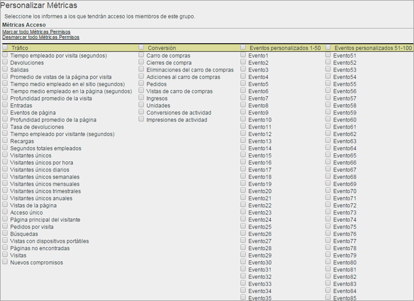

# Personalizar permisos de métricas

>[!IMPORTANT]
>
>User and product management is moving to the [Admin Console](https://helpx.adobe.com/enterprise/using/admin-console.html). Adobe le avisará cuando deba migrar a sus usuarios. After all customers have migrated, help content for **[!UICONTROL Analytics]** &gt; **[!UICONTROL Admin Tools]** &gt; **[!UICONTROL User Management]** will be retired.

Habilite permisos para métricas de tráfico, métricas de conversión, eventos personalizados, eventos de soluciones y reconocimiento de contenido.

**[!UICONTROL Administración]** de usuarios &gt; **[!UICONTROL Grupos]** &gt; **[!UICONTROL Acceso a informes]** &gt; **[!UICONTROL Métricas]** &gt; **[!UICONTROL Personalizar]**

Las opciones de la página Personalizar métricas se aplican a los grupos de informes seleccionados en la página [!UICONTROL Definir grupos de usuarios].

## Eventos de soluciones

In addition to [Custom Events](https://marketing.adobe.com/resources/help/en_US/sc/implement/events.html), this category includes Analytics solution events, including Experience Manager (AEM), Advertising Cloud (AMO), Mobile, Video, and Social.). A cada uno de los grupos personalizados con métricas se le añadirán todos los eventos de soluciones de Analytics que se agreguen como métricas nuevas.

Puede definir permisos para eventos personalizados y para eventos de soluciones de Analytics (AEM, AMO, Móvil, Vídeo y Social).

A cada uno de los grupos personalizados con métricas se le añadirán todos los eventos de soluciones de Analytics que se agreguen como métricas nuevas.

See [Metrics overview](/help/components/c-variables/c-metrics/metricslist.md) for information about metrics used in Analytics.

## Según el contenido

Según el contenido incluye variables que le permiten administrar los permisos para las métricas relacionadas con integraciones con la solución Experience Cloud. You can manage permissions on [!DNL Social], [!DNL Mobile], or any other data that was inserted through a [!DNL Experience Cloud] integration. Estos permisos aparecerán habilitados de manera predeterminada.
