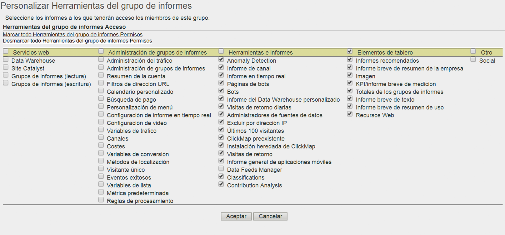

# Personalizar herramientas de grupos de informes

>[!IMPORTANT]
>
>La administración de usuarios y productos se va a trasladar a [Admin Console](https://helpx.adobe.com/es/enterprise/using/admin-console.html). Adobe le avisará cuando deba migrar a sus usuarios. Cuando se hayan migrado todos los clientes, se retirará el contenido de ayuda de **[!UICONTROL Analytics]** > **[!UICONTROL Herramientas de administración]** > **[!UICONTROL Administración de usuarios]**.

Habilite permisos de usuario para Acceso a la API, Administración de grupos de informes, Herramientas e informes, y Elementos de tablero.

**[!UICONTROL Administración de usuarios]** > **[!UICONTROL Grupos]** > **[!UICONTROL Acceso a informes]** > **[!UICONTROL Herramientas del grupo de informes]** > **[!UICONTROL Personalizar]**

La página [!UICONTROL Personalizar herramientas del grupo de informes] concede a los miembros de un grupo acceso a los elementos que siguen.

## Descripciones de los campos

Las opciones de esta página pertenecen a los grupos de informes seleccionados en la página [!UICONTROL Definir grupos de usuarios].

| Elemento | Descripción |
|--- |--- |
| **Servicios Web** |  |
| Estas opciones permiten a los usuarios hacer llamadas al método de Data Warehouse y extraer ajustes de configuración de grupos de informes. |  |
| Data Warehouse | Permite a los usuarios que no son administradores hacer llamadas mediante los métodos de Data Warehouse por medio de la API de Servicios Web. Consulte [Data Warehouse: Documentación para desarrolladores](/help/export/data-warehouse/data-warehouse.md) |
| Grupos de informes (lectura) | Permite a los usuarios que no son administradores utilizar los métodos de grupos de informes en la API. |
| Grupos de informes (escritura) | Permite a los usuarios que no son administradores utilizar los métodos de grupos de informes en la API. |
| **Administración de grupos de informes** |  |
| Estas opciones otorgan acceso a los elementos de menú dentro de Administración > Grupos de informes > Editar configuración ([Administrador de grupos de informes](/help/admin/c-manage-report-suites/report-suites-admin.md)) |  |
| [Administración del tráfico](/help/admin/c-traffic-management/traffic-management.md) | Otorga permiso a Administración del tráfico. |
| [Administración de grupos de informes](/help/admin/c-manage-report-suites/report-suites-admin.md) | Concede permiso para administrar grupos de informes. |
| [Resumen de la cuenta](/help/admin/admin/general-acct-settings-admin.md) | Concede permiso para editar configuración de la cuenta para un grupo de informes. |
| [Filtros de dirección URL](/help/admin/admin/internal-url-filter-admin.md) | Concede permiso para acceder a los filtros de URL internos en los grupos de informes. Los filtros de URL internos se utilizan para determinar qué referentes (o páginas de referentes) son internos del sitio. |
| [Calendario personalizado](/help/admin/admin/custom-calendar.md) | Otorga permiso para editar el calendario personalizado. |
| [Búsqueda de pago](https://docs.adobe.com/content/help/es-ES/analytics/admin/admin-tools/paid-search-detection/paid-search-detection.html) | La detección de búsqueda de pago diferencia entre búsquedas pagadas y naturales en los informes Motores de búsqueda y Palabras clave de búsqueda. |
| [Personalización de menús](/help/admin/admin/customize-menus.md) | Personalice los menús de los informes que ve un usuario en Reports &amp; Analytics. |
| [Configuración de informes en tiempo real](/help/admin/admin/realtime/t-realtime-admin.md) | Permisos para configurar análisis de informes en tiempo real. |
| [Configuración de vídeo](/help/admin/admin/video-management.md) | Permisos para designar un conjunto de variables de conversión personalizadas (eVars) y de eventos personalizados para utilizarlos para hacer rastreos y generar informes en vídeo. |
| [Clasificaciones de vídeo](https://docs.adobe.com/content/help/es-ES/media-analytics/using/media-overview.html) | Permiso para designar un conjunto de variables de conversión personalizadas (eVars) y de eventos personalizados para utilizarlos para hacer rastreos y generar informes en vídeo. |
| [Variables de tráfico](/help/admin/admin/c-traffic-variables/traffic-var.md) | Permiso para correlacionar datos personalizados con eventos concretos relacionados con el tráfico. |
| [Clasificaciones de tráfico](/help/admin/admin/c-traffic-variables/traffic-classifications.md) | Consolidado en clasificaciones (en Herramientas e informes). |
| [Canales](/help/components/c-marketing-channels/analyze-mc.md) | Otorga permiso para acceder a las opciones de Canales de marketing en Administrador del grupo de informes > Editar configuración > Canales de marketing. |
| [Costos](https://docs.adobe.com/content/help/es-ES/analytics/components/marketing-channels/analyze-mc.html) | Habilita el permiso para acceder a Canales de marketing > Costos de canal de mercadotecnia, en el Administrador de grupos de informes. |
| [Variables de conversión](/help/admin/admin/conversion-var-admin/conversion-var-admin.md) | La variable de conversión de perspectiva personalizada (o eVar) se coloca en el código de Adobe en las páginas web del sitio seleccionadas. Su principal función es segmentar las métricas de éxito de conversión en los informes de marketing personalizados. |
| [Métodos de búsqueda](/help/admin/admin/finding-methods.md) | Le permite identificar cómo reciben crédito distintos informes de métodos de búsqueda para los eventos de éxito de conversión en el sitio. |
| [Clasificaciones de conversión](/help/admin/admin/conversion-var-admin/conversion-classifications.md) | Consolidado en clasificaciones (en Herramientas e informes). |
| [Visitante único](https://docs.adobe.com/content/help/en/analytics/admin/admin-tools/unique-visitor-variable/t-unique-visitor-variable.html) | Otorga permiso para especificar la variable única de visitante. |
| [Eventos de éxito](https://docs.adobe.com/content/help/en/analytics/admin/admin-tools/success-events/success-event.html) | Acciones que se pueden rastrear, como visualizaciones de productos, cierres de compra y adquisiciones. |
| [Jerarquías de clasificación](/help/admin/admin/conversion-var-admin/classification-hierarchies.md) | Consolidado en clasificaciones (en Herramientas e informes). |
| [Variables de lista ](https://docs.adobe.com/content/help/es-ES/analytics/implementation/vars/page-vars/page-variables.html) | También se conoce como List Var. Similar a cómo funcionan las props de lista, las variables de lista permiten incluir varios valores dentro de la misma solicitud de imagen. |
| [Medidas predeterminadas](/help/admin/admin/default-metrics.md) | Reports &amp; Analytics muestra un conjunto predeterminado de métricas en todos los informes de conversión, a menos que algún usuario seleccione un conjunto personalizado de métricas. Las medidas seleccionadas se muestran a todos los usuarios del grupo de informes asociado. |
| [Reglas de procesamiento](https://docs.adobe.com/content/help/en/analytics/admin/admin-tools/processing-rules/processing-rules.html) | Concede acceso a las reglas de procesamiento, lo que simplifica la recopilación de datos y gestiona el contenido al enviarlo a los informes. |
| **Herramientas e informes** |  |
| [Detección de anomalías](https://docs.adobe.com/content/help/es-ES/analytics/analyze/analysis-workspace/virtual-analyst/anomaly-detection/anomaly-detection.html) | Concede permiso para acceder a Detección de anomalías, que constituye un método estadístico para determinar el cambio experimentado en una métrica determinada respecto a los datos anteriores. |
| [Informe de canal](/help/components/c-marketing-channels/analyze-mc.md) | Concede permiso para informes Canal de marketing, los cuales se encuentran en Informes > Informes de canal de marketing. |
| [Informe en tiempo real](/help/admin/admin/realtime/t-realtime-admin.md) | Otorga acceso al informe en tiempo real. |
| [Páginas de bots](/help/admin/admin/bot-removal/bot-rules.md) | **Nota: Las páginas de bots están destinadas a informes y análisis específicos, no a la administración de reglas de bots. Actualmente, no hay permisos para permitir la edición de reglas de bots.** Las reglas de bots permiten eliminar de un grupo de informes el tráfico generado por arañas de web y bots conocidos. Al eliminar el tráfico de bots, la medición de la actividad de los usuarios en el sitio web es más exacta. |
| [Bots](/help/admin/admin/bot-removal/bot-rules.md) | **Nota: Los bots están destinados a informes específicos de Reports &amp; Analytics, no a la administración de reglas de bots. Actualmente, no hay permisos para permitir la edición de reglas de bots.** Los bots permiten eliminar de un grupo de informes el tráfico generado por arañas de web y bots conocidos. Al eliminar el tráfico de bots, la medición de la actividad de los usuarios en el sitio web es más exacta. |
| [Informe del Data Warehouse personalizado](/help/export/data-warehouse/data-warehouse.md) | El Data Warehouse hace referencia a la copia de datos sin procesar para su almacenamiento y para elaborar informes personalizados, que se pueden ejecutar filtrando los datos. Puede solicitar informes para mostrar las relaciones de datos avanzadas que hay entre los datos sin procesar en función de sus propias preguntas. |
| Visitas de retorno diario | (Heredado) Informe que muestra el número de visitantes que vieron el sitio web más de una vez en un día determinado. Un día se define como el último período de 24 horas. |
| [Administrador de fuentes de datos](/help/admin/admin/data-sources.md) | La función Fuentes de datos permite importar datos a Analytics desde fuentes sin conexión. |
| [Excluir por dirección IP](/help/admin/admin/exclude-ip.md) | Se pueden excluir datos de las direcciones IP específicas, por ejemplo, las actividades de sitio web internas, las pruebas del sitio y el uso por parte de los empleados, de los informes. |
| ClickMap heredado | Otorga acceso al menú para la herramienta de superposición heredada ClickMap. |
| Instalación heredada de ClickMap | Otorga derechos de instalación para la herramienta heredada de ClickMap. |
| Visitas de retorno | Informe que muestra el número de visitas en las que el número de visitas es mayor que 1. El informe de visitas de retorno incluye visitantes sin cookies. |
| [Importador/Exportador de clasificaciones](https://docs.adobe.com/content/help/es-ES/analytics/components/classifications/classifications-importer/c-working-with-saint.html) y [Generador de reglas](https://docs.adobe.com/content/help/es-ES/analytics/components/classifications/classifications-rulebuilder/classification-rule-builder.html) | Consolidado en clasificaciones (ver más adelante). |
| Administrador de fuentes de datos | Concede derechos a la Fuente de datos de Analytics. |
| Clasificaciones | Combina los siguientes permisos: “Clasificaciones de tráfico”, “Clasificaciones de vídeo”, “Clasificaciones de conversión”, “Jerarquías de clasificación”, “Administrador de clasificaciones” e “Importador/Exportador de clasificaciones y Generador de reglas”.  Nota: Con este permiso, los usuarios pueden editar las clasificaciones de todos los grupos de informes, no solo los seleccionados. |
| [Análisis de contribución](https://docs.adobe.com/content/help/es-ES/analytics/analyze/analysis-workspace/virtual-analyst/contribution-analysis/ca-tokens.html) | Concede permisos para utilizar los análisis de contribución en Analysis Workspace. |
| **Elementos de tablero** |  |
| La configuración de Elementos de panel le permite acceder a [informes breves](https://docs.adobe.com/content/help/es-ES/analytics/admin/server-call-usage/server-call-usage-dashboard.html) en Reports &amp; Analytics:, Mis informes recomendados, Informe breve de resumen de la empresa, Imagen, Informe breve de KPI/medición, Totales de grupos de informes, Texto, Informe breve, Informe breve de resumen de uso y Recursos web |  |
| **Otro** |  |
| Social | Controla el acceso al menú Administración social en el Administrador de grupos de informes. |
