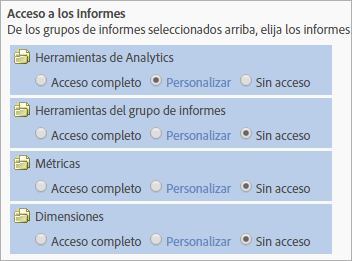

# Cambios en los permisos de usuarios y grupos

>[!IMPORTANT]
>
>La administración de usuarios y productos se ha trasladado al [Admin Console](https://helpx.adobe.com/es/enterprise/using/admin-console.html). Adobe le avisará cuando deba migrar a sus usuarios. Cuando se hayan migrado todos los clientes, se retirará el contenido de ayuda de **[!UICONTROL Analytics]** > **[!UICONTROL Herramientas de administración]** > **[!UICONTROL Administración de usuarios]**.

## ¿Qué ha cambiado? {#section_2C205DE94155441B9E9D3E4C46CCF2EE}

**[!UICONTROL Administración]** > **[!UICONTROL Administración de usuarios]** > **[!UICONTROL Grupos]**

>[!NOTE]
>
>Debido al alto número de combinaciones de permisos posibles, no se puede proporcionar documentación que describa todos los métodos API que se pueden utilizar en cada combinación de permisos. Por lo general, los usuarios no administradores a los que se les otorga acceso a Servicios Web tendrán acceso de solo lectura a los métodos API. Por lo tanto, no tendrán acceso de escritura en los métodos.

Debido a que la API y la interfaz utilizan el mismo sistema para dar permisos, los permisos que un administrador de la interfaz (Adobe Admin Console) haya concedido a un usuario que no es administrador determinado serán los mismos que este tendrá en la API.

<table id="table_D1DB0DE37752450BBCCA44DB760BB505"> 
 <thead> 
  <tr> 
   <th colname="col1" class="entry"> Mejora </th> 
   <th colname="col2" class="entry"> Descripción </th> 
  </tr> 
 </thead>
 <tbody> 
  <tr> 
   <td colname="col1"> 
Cambios en Acceso a informes (personalizar grupos) 
 </td> 
   <td colname="col2"> 
  Agregar nuevo grupo &gt; Acceso a informes 
 
La sección Acceso a informes en la página Definir grupo de usuarios se ha optimizado para cuatro categorías, lo que permite personalizar permisos a nivel granular. 
 
 </img> 
 
Elementos anteriormente en 
 
    <ul id="ul_16D5EF18D57D4608AEEDEC40D90D8828"> 
     <li id="li_F29E84C6228A464C8807F09205AEAAC6"> 
 <a href="/help/admin/user-management2/c-customize-report-access/groups-analytics-tools.md"> Herramientas de Analytics</a>: habilite permisos de usuario para elementos de General (facturación, registros, etc.), Administración de la empresa, Herramientas, Acceso a servicio Web, Report Builder e integración de Data Connectors. 
 
 <b>Nota:</b> Las configuraciones de empresa de la categoría Personalizar Admin Console se han trasladado a las herramientas de Analytics. 
 </li> 
     <li id="li_A6EB788162A2455E94CE54B9279A854D"> 
 <a href="/help/admin/user-management2/c-customize-report-access/groups-report-suite-tools.md"> Herramientas del grupo de informes</a>: habilite permisos de usuario para Servicios Web, Administración de grupos de informes, Herramientas e informes y Elementos de tablero. 
 </li> 
     <li id="li_EDB0255E009B4F1CAFAF53966B41363C"> 
 <a href="/help/admin/user-management2/c-customize-report-access/groups-metrics.md"> Métricas</a>: habilite permisos para tráfico, conversión, eventos personalizados, eventos de soluciones, reconocimiento de contenido, etc. 
 </li> 
     <li id="li_8DAE87D1DEF54803A9C6FE31C01F0FB0"> 
 <a href="/help/admin/user-management2/c-customize-report-access/groups-dimensions.md"> Dimensiones</a>: personalice el acceso de los usuarios a nivel granular con eVars, informes de tráfico, informes de soluciones e informes de rutas. 
 </li> 
    </ul> 
Por ejemplo, puede crear un grupo con acceso a varias herramientas de Analytics (Analysis Workspace, Reports &amp; Analytics y Report Builder), con permiso para métricas y dimensiones concretas (incluidas eVars) y funciones como la creación de segmentos o métricas calculadas. 
 </td> 
  </tr> 
  <tr> 
   <td colname="col1"> 
Cambios en los grupos predefinidos 
 </td> 
   <td colname="col2"> 
 <b>Acceso de administrador:</b> los grupos predefinidos ya no son obligatorios para los administradores. Los administradores ahora tienen acceso a todos los elementos (herramientas, métricas y dimensiones), así como acceso a servicio web, Report Builder y Activity Map. 
 
En adelante, el objetivo de los grupos será conceder acceso a los usuarios que no son administradores, o restringirlo. 
 
 <b>Grupos personalizados:</b> los grupos personalizados han reemplazado a los grupos predefinidos. Los grupos predefinidos existentes se migrarán a grupos personalizados; el nombre del grupo se mantendrá. Se conservarán los grupos personalizados que se hayan podido crear, incluida su configuración. No obstante, observará que la ubicación de los ajustes de configuración ha cambiado. Por ejemplo, los ajustes de configuración de la empresa (en Admin Console personalizado) están ahora en <a href="/help/admin/user-management2/c-customize-report-access/groups-analytics-tools.md">Personalizar herramientas de Analytics</a>. 
 
 Los usuarios que pertenecen a  Acceso a todos los informes se han migrado a un grupo personalizado con acceso a: 
 
    <ul id="ul_696A9243F5FD4AF187352C2F4B1CFDC2"> 
     <li id="li_683A0A3BB7214CFFBC61D5A4CD237F48">Todas las dimensiones </li> 
     <li id="li_D8FDBF6A32224731AB706315DEA0A03E">Todas las métricas </li> 
     <li id="li_65ABE5C95D43444D88E63EE95C9AED05">Todos los grupos de informes </li> 
     <li id="li_7ED1505590144B38B3B9851BAA6BBB49">Informe de canal Permiso </li> 
     <li id="li_F718FE1FCF9A4B05AB933CA3F105F3EC">Permiso de informes de detección de anomalías </li> 
     <li id="li_527BD52007E846FE8B5F71AB3C12F695">Permiso de informes en tiempo real </li> 
     <li id="li_AFFB58C7FB644AC8A85E2D76BA7D51F5">Permiso de acceso a Analysis Workspace </li> 
    </ul> 
Los administradores pueden eliminar los grupos personalizados y también crear los suyos propios, ya que todos los ajustes de configuración que antes estaban disponibles en grupos predefinidos se pueden personalizar bajo el ajuste Acceso a informes, en <a href="/help/admin/user-management2/c-user-groups/groups.md">Definir grupos de usuarios</a>. 
 </td> 
  </tr> 
  <tr> 
   <td colname="col1"> 
Permisos en el nivel de dimensión 
 </td> 
   <td colname="col2"> 
Puede personalizar permisos para incluir o excluir el acceso a dimensiones (además del acceso a métricas). 
 
    <ul id="ul_DA5A54223673474E9151AF979DA50659"> 
     <li id="li_C3E82F7BC07A4F2F83A85D3D511292CC"> 
Se han migrado automáticamente a las nuevas categorías todas las dimensiones y métricas actuales dentro de grupos personalizados. Si un grupo existente tiene métricas habilitadas, se le asignarán todas las dimensiones que puedan recibir permisos por primera vez (eVars y según el contenido) y métricas de forma predeterminada. 
 </li> 
     <li id="li_CC56F9181CC14AB59318628E72F2E8C9"> Permisos del Importador de clasificaciones (anteriormente, SAINT): el acceso a las clasificaciones viene determinado por el acceso a la <a href="https://docs.adobe.com/content/help/es-ES/analytics/components/classifications/c-classifications.html">variable</a> en la cual se basa la clasificación. </li> 
    </ul> 
Consulte <a href="/help/admin/user-management2/c-customize-report-access/groups-dimensions.md">Personalizar permisos para dimensiones</a> 
 </td> 
  </tr> 
  <tr> 
   <td colname="col1"> 
Admin Console 
 </td> 
   <td colname="col2"> 
Solo se recomienda para clientes nuevos o clientes cuyas empresas estén <a href="https://docs.adobe.com/content/help/es-ES/core-services/interface/about-core-services/core-services.html">aprovisionadas en Experience Cloud</a>. Se ha planificado la migración de los clientes existentes de Analytics al sistema de administración de identidades de Experience Cloud. 
 
Encontrará más información en <a href="https://helpx.adobe.com/es/enterprise/using/manage-permissions-and-roles.html"> Administrar permisos de producto en Admin Console</a>. 
 </td> 
  </tr> 
 </tbody> 
</table>

## Preguntas más frecuentes sobre cambios en permisos {#section_02809EFC95054B40A089E6C6E4FACA13}

Aquí incluimos información importante sobre actualizaciones nuevas y planificadas y cómo afectarán a su entorno administrativo.

<table id="table_1E93F45C66E841E6882FB602509F30A3"> 
 <thead> 
  <tr> 
   <th colname="col1" class="entry"> Pregunta </th> 
   <th colname="col2" class="entry"> Respuesta </th> 
  </tr> 
 </thead>
 <tbody> 
  <tr> 
   <td colname="col1">¿Qué cambios se han producido en los permisos en la versión de <b>julio de 2016</b>? </td> 
   <td colname="col2"> 
 <b>Acceso a todos los grupos de informes</b> 
 
A la hora de añadir grupos de informes que incluir en un grupo, puede especificar Acceso a todos los grupos de informes. Esta opción aplica permisos de grupo a todos los grupos de informes actuales o futuros. 
 
Para habilitar esta función, vaya a Administración de usuarios &gt; Grupos &gt; Añadir nuevo grupo de usuarios y seleccione Acceso a todos los grupos de informes. 
 
 
 </td> 
  </tr> 
  <tr> 
   <td colname="col1"> 
¿Debo usar Admin Console para administrar a los usuarios, o debo usar el sistema existente de administración de usuarios de Analytics? 
 </td> 
   <td colname="col2"> 
Los cambios realizados en Analytics &gt; Administración &gt; Administración de usuarios no se reflejan en Admin Console. Por lo tanto, solo deberán seguir utilizándolo los clientes nuevos que ya usan Admin Console para administrar sus usuarios y sus grupos. Se ha planificado la migración de la administración de grupos de Analytics existente a Admin Console. 
 </td> 
  </tr> 
  <tr> 
   <td colname="col1"> 
¿Qué cambios se realizaron en la versión de <b>octubre de 2016</b> en cuanto a permisos? 
 </td> 
   <td colname="col2"> 
Se implementaron las siguientes mejoras con respecto a la interfaz de Herramientas de administración: 
 
 
     <ul id="ul_2A31E8DC17A94B7FABDBA9C87C3947EF"> 
      <li id="li_AE2ECCA01CC64D30B109BE74379EE474">Cambios de permisos como se describe en <a href="/help/admin/user-management2/c-user-management/permissions-changes.md">Cambios administrativos: Otoño de 2016</a>. </li> 
      <li id="li_33CB2B6A2E5F45BE97CC5E0983AF280E">Se han eliminado los informes de tráfico obsoletos que ya no estaban en el menú. </li> 
      <li id="li_57234CF27E1D405987DE89312CD62C52">Permisos para clasificaciones: El acceso a las clasificaciones vendrá determinado por el acceso a la variable para la que sea la clasificación. </li> 
     </ul> 
 </td> 
  </tr> 
  <tr> 
   <td colname="col1"> 
¿Tengo que hacer algo para migrar usuarios? 
 </td> 
   <td colname="col2"> 
No, las migraciones de permisos se producirán de manera transparente. 
 
 
     <ul id="ul_654F85286EC04416B3E0BA725EBE10AD"> 
      <li id="li_8050B8941F794103B82A0ADF0930D216">Todos los informes de tráfico actuales en un grupo personalizado se migrarán automáticamente a la nueva categoría de dimensión. </li> 
      <li id="li_B97079DB29A346B98D066F11AB7F94AF">Si un grupo personalizado tiene métricas habilitadas, se le asignarán automáticamente todas las dimensiones que puedan recibir permisos por primera vez (variables eVars y de soluciones). </li> 
      <li id="li_F1219EF490DA473BA15F2B215F2995AE"> A los grupos personalizados que tengan al menos una métrica se les otorgará automáticamente acceso a todas las dimensiones eVars y otras dimensiones según contenido, <b>excepto</b> a las dimensiones de tráfico que acaben de quedar disponibles (antes informes de tráfico). </li> 
      <li id="li_F494CE6144A04A6199CFBBA1D7BEA32B">Cada grupo predefinido cambiará a un permiso. Estos nuevos permisos se agregarán a una nueva categoría Herramientas de Analytics. </li> 
      <li id="li_2FCD9254FC3C4FD7871EEF9453E5CE1E">A cada uno de los grupos personalizados con métricas se le añadirán todos los eventos de soluciones de Analytics que se agreguen como métricas nuevas. </li> 
      <li id="li_34C4560769B64F28A4E83BAE71065DCC">Todos los usuarios que antes estaban en Acceso a todos los informes se agregarán al nuevo grupo personalizado. Acceso a todos los informes dejará de existir. </li> 
     </ul> 
 </td> 
  </tr> 
  <tr> 
   <td colname="col1"> 
¿Qué no va a cambiar? 
 </td> 
   <td colname="col2"> 
Seguirán sin poderse asignar permisos a los atributos de visitantes. 
 </td> 
  </tr> 
 </tbody> 
</table>

## Referencia rápida para permisos {#section_A3FDD8259F524B21A5489833533D1B28}

En la tabla siguiente se muestran distintas tareas y dónde pueden llevarse a cabo (dependiendo del estado de la empresa).

>[!NOTE]
>
>*`migrated user`* y *`Experience Cloud user`* hacen referencia a usuarios que han aceptado una invitación por correo electrónico para unirse a Experience Cloud. Si no se acepta la invitación por correo electrónico, los usuarios seguirán siendo usuarios de Analytics y no podrán gestionarse desde Admin Console. (Una excepción es cuando se produce la migración mediante [un Federated ID o un Enterprise ID](https://helpx.adobe.com/es/enterprise/using/set-up-identity.html). En este caso, el usuario se migra cuando el administrador migra a los usuarios uno a uno).

<table id="table_B68FD00FC5D24823A86BB69558C0327C"> 
 <thead> 
  <tr> 
   <th colname="col1" class="entry"> Tarea </th> 
   <th colname="col2" class="entry"> Empresa de inicio de sesión sin haber migrado </th> 
   <th colname="col3" class="entry"> Empresa en proceso de migración </th> 
   <th colname="col4" class="entry"> Empresa de inicio de sesión después de completar su migración </th> 
  </tr> 
 </thead>
 <tbody> 
  <tr> 
   <td colname="col1"> Crear un usuario </td> 
   <td colname="col2"> 
Admin Console (al crear un usuario y agregarlo a una <a href="https://docs.adobe.com/content/help/es-ES/core-services/interface/manage-users-and-products/admin-getting-started.html">configuración de producto</a> de Analytics, se crea también la cuenta de usuario en Analytics). 
 
 <a href="/help/admin/user-management2/c-user-management/t-add-user-account.md"> Herramientas de administración</a> 
 </td> 
   <td colname="col3"> 
 <a href="https://adminconsole.adobe.com/enterprise/"> Admin Console</a> 
 </td> 
   <td colname="col4"> 
 <a href="https://adminconsole.adobe.com/enterprise/"> Admin Console</a> 
 </td> 
  </tr> 
  <tr> 
   <td colname="col1"> Editar un usuario </td> 
   <td colname="col2"> 
 <a href="/help/admin/user-management2/c-user-management/t-add-user-account.md"> Herramientas de administración</a> 
 </td> 
   <td colname="col3"> 
 <a href="https://adminconsole.adobe.com/enterprise/"> Admin Console</a> 
 
 Herramientas de administración: la edición en las herramientas de administración para usuarios migrados se limita a la administración de claves de API y a eliminar o transferir recursos. 
 </td> 
   <td colname="col4"> 
 <a href="https://adminconsole.adobe.com/enterprise/"> Admin Console</a> 
 
 Herramientas de administración: la edición se limita a la administración de claves de API y a eliminar y transferir recursos. 
 </td> 
  </tr> 
  <tr> 
   <td colname="col1"> Eliminar un usuario </td> 
   <td colname="col2"> 
Admin Console para usuarios de Experience Cloud 
 
Herramientas de administración: para todos los usuarios, pero para los usuarios de Experience Cloud solo elimina el usuario de Analytics asignado, no la cuenta de Experience Cloud. 
 </td> 
   <td colname="col3"> 
Admin Console para usuarios migrados. 
 
Herramientas de administración: para usuarios solo de Analytics. 
 </td> 
   <td colname="col4"> 
Admin Console 
 
 Herramientas de administración: Tras eliminar un usuario de Experience Cloud, o desvincular su cuenta en Admin Console, podrá eliminar el inicio de sesión en Analytics desde las Herramientas de administración. 
 </td> 
  </tr> 
  <tr> 
   <td colname="col1"> Iniciar sesión en Analytics </td> 
   <td colname="col2"> 
 <b>Experience Cloud: </b>  marketing.adobe.com. Solo disponible para usuarios de Experience Cloud. 
 
 <b>Analytics (heredado):</b> sc.omniture.com. Para usuarios solo de Analytics y para usuarios de Experience Cloud con sus credenciales de Analytics 
 </td> 
   <td colname="col3"> 
 marketing.adobe.com: solo disponible para usuarios de Experience Cloud. 
 
  sc.omniture.com: para usuarios solo de Analytics y para usuarios de Experience Cloud con sus credenciales de Analytics. 
 
Durante el proceso de migración, los administradores pueden deshabilitar la capacidad de inicio de sesión en omniture.com para usuarios concretos. 
 </td> 
   <td colname="col4"> 
Admin Console 
 </td> 
  </tr> 
  <tr> 
   <td colname="col1"> Crear un grupo </td> 
   <td colname="col2"> 
Admin Console: Cuando se cree un grupo en Admin Console, aparecerá un grupo asignado en Analytics en las Herramientas de administración, si bien no se podrá cambiar el nombre de este grupo asignado desde las Herramientas de administración, ni tampoco se podrá eliminar de las Herramientas de administración. 
 
Herramientas de administración. 
 </td> 
   <td colname="col3"> 
Admin Console (<a href="https://docs.adobe.com/content/help/en/core-services/interface/manage-users-and-products/admin-getting-started.html">crear configuración de producto</a>) 
 </td> 
   <td colname="col4"> 
Admin Console (<a href="https://docs.adobe.com/content/help/en/core-services/interface/manage-users-and-products/admin-getting-started.html">crear configuración de producto</a>) 
 </td> 
  </tr> 
  <tr> 
   <td colname="col1"> Editar usuarios en un grupo </td> 
   <td colname="col2"> 
Admin Console: Solo para usuarios de Experience Cloud 
 
Herramientas de administración: desde las herramientas de administración se puede editar la pertenencia de los usuarios solo de Analytics y de los usuarios de Experience Cloud a grupos. No obstante, si un usuario de Experience Cloud forma parte de un grupo en Admin Console, no podrá eliminarse del grupo en las Herramientas de administración. 
 </td> 
   <td colname="col3"> 
Admin Console: Solo usuarios de Experience Cloud 
 
 Herramientas de administración: en las herramientas de administración se siguen pudiendo agregar o eliminar de los grupos los inicios de sesión solo en Analytics. 
 </td> 
   <td colname="col4"> 
Admin Console 
 </td> 
  </tr> 
  <tr> 
   <td colname="col1"> Editar permisos para un grupo </td> 
   <td colname="col2"> 
Admin Console: Puede editar los grupos creados en Admin Console. 
 
Herramientas de administración: puede editar permisos para cualquier grupo. 
 </td> 
   <td colname="col3"> 
Admin Console 
 </td> 
   <td colname="col4"> 
Admin Console 
 </td> 
  </tr> 
  <tr> 
   <td colname="col1"> Eliminar un grupo </td> 
   <td colname="col2"> 
Admin Console: Solo puede eliminar grupos creados en Admin Console. 
 
Herramientas de administración: puede eliminar solo los grupos creados desde las herramientas de administración. 
 </td> 
   <td colname="col3"> 
Admin Console 
 </td> 
   <td colname="col4"> 
Admin Console 
 </td> 
  </tr> 
  <tr> 
   <td colname="col1"> Cambiar el estado de administración de un usuario </td> 
   <td colname="col2"> 
Admin Console: Solo para usuarios de Experience Cloud. 
 
Herramientas de administración 
 </td> 
   <td colname="col3"> 
Admin Console: Solo para usuarios de Experience Cloud. 
 
Herramientas de administración: solo para usuarios de Analytics. 
 </td> 
   <td colname="col4"> 
Admin Console 
 </td> 
  </tr> 
 </tbody> 
</table>
