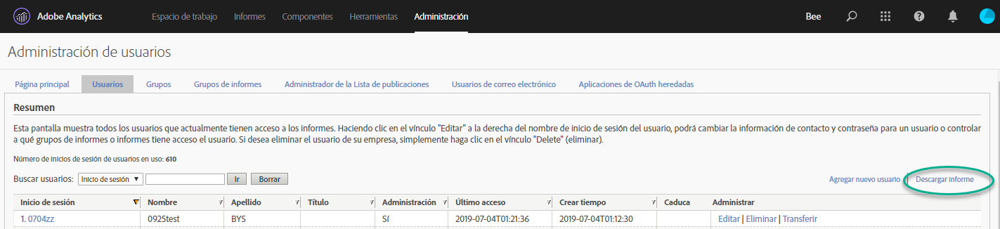
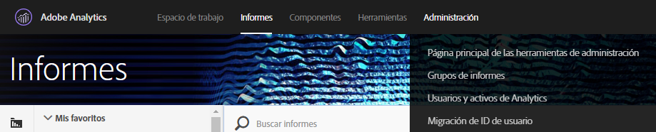
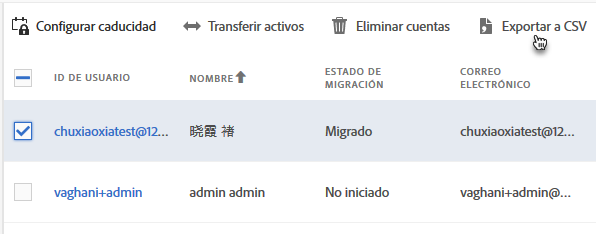
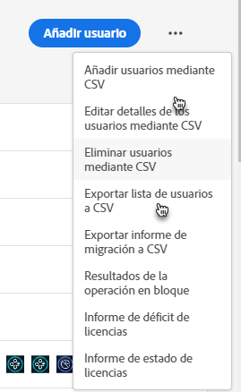
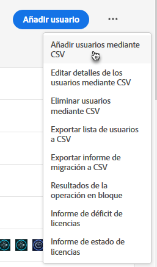
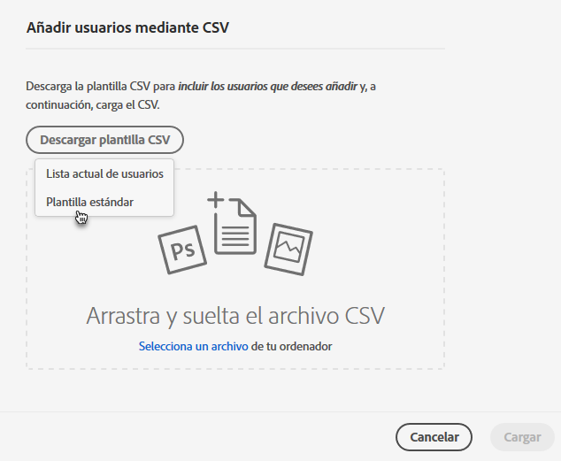
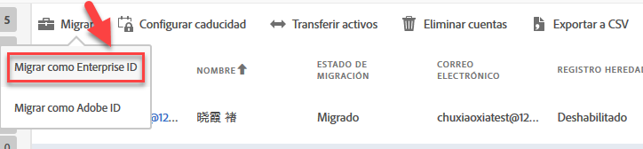

# Migre las cuentas de usuario de Analytics para Enterprise ID y Federated ID{#migrate-analytics-user-accounts-for-enterprise-and-federated-ids}

Cómo migrar cuentas de usuario como Enterprise ID o Federated ID a Admin Console.

## Requisitos previos {#prereqs}

Requisitos previos para administrar usuarios en Admin Console.

Si desea obtener nuevos dominios y directorios, siga los pasos para:

* Configurar un directorio
* Configurar dominios
* Vincular dominios a directorios

Consulte [Configuración de un sistema de identidad](https://helpx.adobe.com/enterprise/using/set-up-identity.html) para obtener ayuda.

Si otra unidad o equipo comercial ya ha creado un directorio, siga los pasos de [apoderamiento de directorios](https://helpx.adobe.com/enterprise/using/set-up-identity.html#Directorytrusting) para establecer el directorio en la organización que utiliza para Analytics.

## Migración de las cuentas de usuario para Enterprise ID y Federated ID {#task-0cfb3e4400fd4ab58e4d9704528b05fa}

En este procedimiento hará lo siguiente:

* Download a user login list from **[!UICONTROL Analytics]** &gt; **[!UICONTROL Analytics Users &amp; Assets]**.

* Download a current users list from the **[!UICONTROL Admin Console]** &gt; **[!UICONTROL Users]**.

* Comparar las listas (buscando duplicados, de forma que no pueda sobrescribir datos de cuenta en Admin Console).
* Upload a finished [!DNL .csv] (from **[!UICONTROL Admin Console]** &gt; **[!UICONTROL Users]**) with Enterprise ID or Federated ID users to the Admin Console.

Si debe migrar cuentas de usuario de Adobe ID existentes a Enterprise ID o Federated ID, póngase en contacto con el servicio de atención al cliente de Adobe y solicite un [cambio de identidades de usuario por lotes](https://helpx.adobe.com/enterprise/using/bulk-operations.html).

**Para migrar cuentas de usuario**

1. Download the Analytics user logins file ( [!DNL User Logins List.tab]) from Analytics User Management, using one of the following methods (depending on whether you already migrated users).
   1. *Antes de la migración,* vaya a **[!UICONTROL Administración]** &gt; Administración **[!UICONTROL de usuarios (heredada)]** &gt; **[!UICONTROL Editar usuarios]** y haga clic en **[!UICONTROL Descargar informe]**.

      

      El vínculo Descargar informe solo se muestra a los clientes que no han migrado usuarios.

   1. *Si ya ha migrado usuarios,* vaya a **[!UICONTROL Analytics]** &gt; Usuarios **[!UICONTROL de Analytics y Recursos]**.

      

   1. On the [!DNL Users] page, select users, then click **[!UICONTROL Export to CSV]**.

      

   1. Abra el archivo descargado [!DNL User List.csv] en Excel.

      Esté preparado para copiar los valores *`Email`*, *`First Name`* y *`Last Name`* en un [!DNL sample.csv] archivo (descrito en el paso siguiente).

      >[!IMPORTANT]
      >
      >Los valores del archivo CSV deben estar delimitados por comas.

      **Sugerencia**: Durante este paso, Adobe recomienda racionalizar la lista de usuarios para que solo se incluya a los que tengan un ID de correo electrónico válido en la migración de Enterprise ID o Federated ID.

1. En Admin Console, descargue una lista de usuarios de Admin Console:

   1. Navigate to [Admin Console](http://adminconsole.adobe.html/#) &gt; **[!UICONTROL Users]**, then click [Export users list to CSV](https://helpx.adobe.com/enterprise/using/users.html).

      

   1. Compare the two files: the existing Admin Console users in the exported [!DNL .csv] file ( [!DNL sample.csv], in this example) with the users in the Analytics [!DNL User Logins List.csv] file.

      >[!IMPORTANT]
      >
      >Si encuentra duplicados, elimínelos del [!DNL User Logins List.csv] archivo de Analytics. Este paso es útil para sobrescribir los permisos de usuario de Experience Cloud existentes en Admin Console y le proporciona una lista de cuentas a migrar.

1. Descargue la plantilla CSV de Admin Console:
   1. On the Users tab, click **[!UICONTROL Add users by CSV]**, then **[!UICONTROL Download CSV Template]**.

      

   1. Choose **[!UICONTROL Standard Template]**.

      This step downloads a [!DNL sample.csv] template file.

      

1. Copie los valores *`Email`*, *`First Name`* y *`Last Name`* de columna de [!DNL User Logins List.tab] a las columnas correspondientes de la [!DNL sample.csv] plantilla.

   **Ejemplo de archivo de plantilla**

   

1. In the template ( [!DNL sample.csv]), complete the following required fields:

<table id="table_1B5EEFDB5BD8436EB760BE5FFAB1CF02"> 
 <thead> 
  <tr> 
   <th colname="col1" class="entry"> Campo </th> 
   <th colname="col2" class="entry"> Descripción </th> 
  </tr>
 </thead>
 <tbody> 
  <tr> 
   <td colname="col1"> 
Correo electrónico 
 </td> 
   <td colname="col2"> 
Se ha copiado de Lista de inicios de sesión de usuario.tab. 
 </td> 
  </tr> 
  <tr> 
   <td colname="col1"> 
Nombre 
 </td> 
   <td colname="col2"> 
Se ha copiado de Lista de inicios de sesión de usuario.tab. 
 </td> 
  </tr> 
  <tr> 
   <td colname="col1"> 
Apellidos 
 </td> 
   <td colname="col2"> 
Se ha copiado de Lista de inicios de sesión de usuario.tab. 
 </td> 
  </tr> 
  <tr> 
   <td colname="col1"> 
Tipo de identidad 
 </td> 
   <td colname="col2"> 
 Federated ID o  Enterprise ID. 
 </td> 
  </tr> 
  <tr> 
   <td colname="col1"> 
Dominio 
 </td> 
   <td colname="col2"> 
Asegúrese de que los dominios de las columnas  El dominio y la columna  Correo electrónico coinciden con los dominios establecidos en los <a href="/help/admin/user-management2/user-migration/c-migration-tool/migrate-enterprise.md#prereqs" format="dita" scope="local"> requisitos previos</a>. 
 </td> 
  </tr> 
  <tr> 
   <td colname="col1"> 
Código del país 
 </td> 
   <td colname="col2"> </td> 
  </tr> 
 </tbody> 
</table>

For more information about the fields in the [!DNL .csv] file, see [CSV file format](https://helpx.adobe.com/enterprise/using/users.html).

>[!NOTE]
>
>Otras columnas, como *`Product Configurations`* y *`Admin Roles`* pueden estar en blanco.

1. On the Users tab in the Admin Console, upload the template file by clicking **[!UICONTROL Add users by CSV]** (as shown in Step 3.).
1. En Analytics, ejecute la herramienta de migración (como se describe en [Migrar cuentas](/help/admin/user-management2/user-migration/c-migration-tool/t-migrate-users.md#task-f3355f3b14a340feae58cfa04c0ba1c9)de usuario de Analytics).
1. Click **[!UICONTROL Migrate]** &gt; **[!UICONTROL Migrate as Enterprise IDs]**.

   

   When you click **[!UICONTROL Migrate]**, user are linked to the Enterprise ID/Federated ID account in Admin Console. The permissions of the legacy user account in Analytics will match the permissions granted to the Enterprise/Federated ID login in **[!UICONTROL Admin Console]** &gt; **[!UICONTROL Analytics]** &gt; **[!UICONTROL Product Profiles]**. El ID de usuario se muestra en el bloque Migración completada. Puede desactivar su acceso a [!DNL my.omniture.com] heredado.

   After migrating users, the status under the Migration Status column changes from *`Not Initiated`* to *`Migrated`*.

   Los usuarios de Adobe ID que se muestran en la herramienta de migración también se pueden migrar en este proceso. Aún deben iniciar sesión con su Adobe ID hasta que se realice un cambio de identidad. Póngase en contacto con el servicio de atención al cliente para obtener ayudar con un cambio de identidad.
