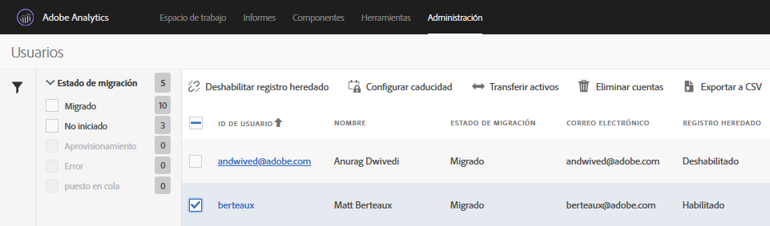

# Desactivación de inicios de sesión heredados{#disable-legacy-logins}

Aprenda a desactivar los inicios de sesión heredados para usuarios de Analytics.

Una vez que los usuarios hayan migrado del sistema de administración de usuarios de Analytics heredado a Admin Console de Adobe, puede desactivar los inicios de sesión heredados. Una vez hecho, si un usuario intenta usar el inicio de sesión heredado, se lo redirigirá al inicio de sesión de Experience Cloud.

1. Open the Migration tool in **[!UICONTROL Analytics]** &gt; **[!UICONTROL Admin]** &gt; **[!UICONTROL User ID Migration]**.
1. In the [!DNL User Information] section, locate the domain containing the users you want to work with, then click **[!UICONTROL Select Users]**.
1. Seleccione los usuarios con los inicios de sesión heredados que desea desactivar.

   

   The users that are eligible will have a status of *`Migrated`* under the Migration Status column. No puede desactivar el inicio de sesión heredado de un usuario hasta que se haya migrado.
1. Click **[!UICONTROL Disable Legacy Login]**, then click **[!UICONTROL Done]**.

   Desactivar inicio de sesión heredado indica cuál de sus usuarios puede continuar utilizando el nombre de usuario y contraseña de [!DNL my.omniture.com] heredados.

   No puede desactivar los inicios de sesión heredados de un usuario que aún está por migrar. Una vez desactivado, el usuario deberá usar su Experience Cloud ID para iniciar sesión en Analytics y poder acceder.

