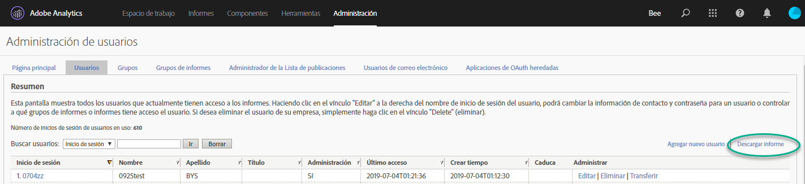
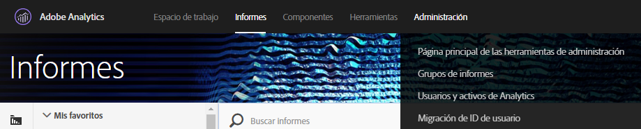
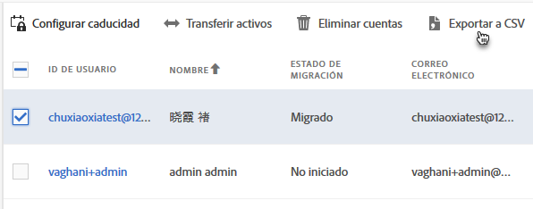
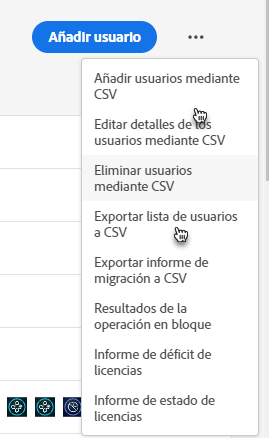
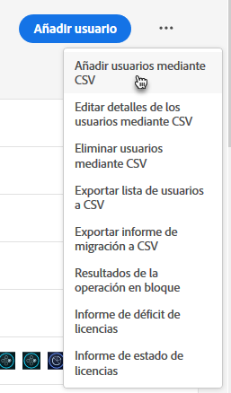
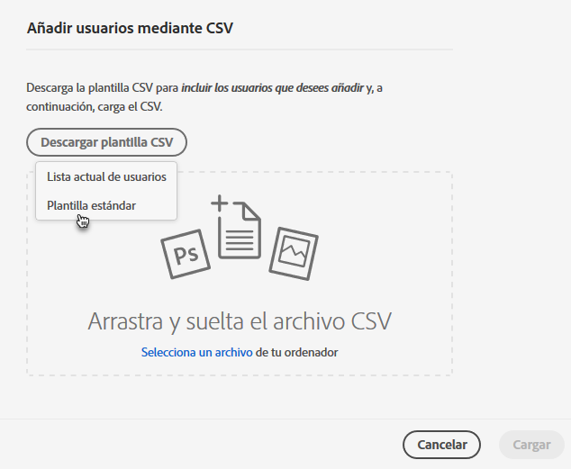
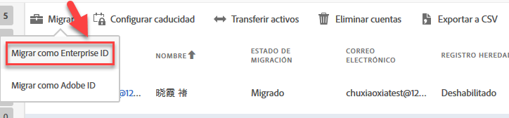

# Migración de las cuentas de usuario de Analytics para Enterprise ID y Federated ID {#migrate-analytics-user-accounts-for-enterprise-and-federated-ids}

Cómo migrar cuentas de usuario como Enterprise ID o Federated ID a Admin Console.

## Requisitos previos {#prereqs}

Requisitos previos para administrar usuarios en Admin Console.

Si desea obtener nuevos dominios y directorios, siga los pasos para:

* Configurar un directorio
* Configurar dominios
* Vincular dominios a directorios

Consulte [Configuración de un sistema de identidad](https://helpx.adobe.com/es/enterprise/using/set-up-identity.html) para obtener ayuda.

Si otra unidad o equipo comercial ya ha creado un directorio, siga los pasos de [apoderamiento de directorios](https://helpx.adobe.com/es/enterprise/using/set-up-identity.html#Directorytrusting) para establecer el directorio en la organización que utiliza para Analytics.

## Migración de las cuentas de usuario para Enterprise ID y Federated ID {#task-0cfb3e4400fd4ab58e4d9704528b05fa}

En este procedimiento hará lo siguiente:

* Descargar una lista de inicios de sesión desde **[!UICONTROL Analytics]** > **[!UICONTROL Usuarios y recursos de Analytics]**.

* Descargar una lista de usuarios actuales desde **[!UICONTROL Admin Console]** > **[!UICONTROL Usuarios]**.

* Comparar las listas (buscando duplicados, de forma que no pueda sobrescribir datos de cuenta en Admin Console).
* Cargar un [!DNL .csv] finalizado (desde **[!UICONTROL Admin Console]** > **[!UICONTROL Usuarios]**) con usuarios de Enterprise ID o Federated ID en Admin Console.

Si debe migrar cuentas de usuario de Adobe ID existentes a Enterprise ID o Federated ID, póngase en contacto con el servicio de atención al cliente de Adobe y solicite un [cambio de identidades de usuario por lotes](https://helpx.adobe.com/es/enterprise/using/bulk-operations.html).

**Para migrar cuentas de usuario**

1. Descargue el archivo de inicios de sesión de usuario de Analytics ([!DNL User Logins List.tab]) desde Administración de usuarios de Analytics utilizando uno de los métodos siguientes (en función de si ya ha migrado o no a los usuarios).
   1. *Antes de la migración,* vaya a **[!UICONTROL Administración]** > **[!UICONTROL Administración de usuarios (heredado)]** > **[!UICONTROL Editar usuarios]** y luego haga clic en **[!UICONTROL Descargar informe]**.

      

      El vínculo Descargar informe solo se muestra a los clientes que no han migrado usuarios.

   1. *Si ya ha migrado usuarios,* vaya a **[!UICONTROL Analytics]** > **[!UICONTROL Usuarios y activos de Analytics]**.

      

   1. En la página [!DNL Users], seleccione usuarios y luego haga clic en **[!UICONTROL Exportar a CSV]**.

      

   1. Abra el archivo [!DNL User List.csv] descargado en Excel.

      Prepárese para copiar los valores *`Email`*, *`First Name`* y *`Last Name`* en un archivo [!DNL sample.csv] (descrito en el paso siguiente).

      >[!IMPORTANT] Los valores del archivo CSV deben estar delimitados por comas.

      >[!TIP] Durante este paso, Adobe recomienda racionalizar la lista de usuarios para que solo se incluya a los que tengan un ID de correo electrónico válido en la migración de Enterprise ID o Federated ID.

1. En [!UICONTROL Admin Console], descargue una lista de usuarios de Admin Console:

   1. Vaya a [!UICONTROL Admin Console] > **[!UICONTROL Usuarios]** y haga clic en [Exportar lista de usuarios a CSV](https://helpx.adobe.com/es/enterprise/using/users.html).

      

   1. Compare los dos archivos: los usuarios de Admin Console existentes del archivo [!DNL .csv] exportado ([!DNL sample.csv], en este ejemplo) y los usuarios del archivo [!DNL User Logins List.csv] de Analytics.

      >[!IMPORTANT] Si encuentra duplicados, elimínelos del archivo [!DNL User Logins List.csv] de Analytics. Este paso es útil para sobrescribir los permisos de usuario de Experience Cloud existentes en Admin Console y le proporciona una lista de cuentas a migrar.

1. Descargue la plantilla CSV de Admin Console:
   1. En la ficha Usuarios, haga clic en **[!UICONTROL Añadir usuarios mediante CSV]** y luego en **[!UICONTROL Descargar plantilla CSV]**.

      

   1. Seleccione **[!UICONTROL Plantilla estándar]**.

      Este paso descarga un archivo [!DNL sample.csv] de plantilla.

      

1. Copie los valores de columnas *`Email`*, *`First Name`* y *`Last Name`* desde [!DNL User Logins List.tab] a las columnas correspondientes de la plantilla [!DNL sample.csv].

   **Ejemplo de archivo de plantilla**

   

1. En la plantilla ([!DNL sample.csv]), complete los campos obligatorios:

<table id="table_1B5EEFDB5BD8436EB760BE5FFAB1CF02"> 
 <thead> 
  <tr> 
   <th colname="col1" class="entry"> Campo </th> 
   <th colname="col2" class="entry"> Descripción </th> 
  </tr>
 </thead>
 <tbody> 
  <tr> 
   <td colname="col1"> 
Correo electrónico 
 </td> 
   <td colname="col2"> 
Se ha copiado de Lista de inicios de sesión de usuario.tab. 
 </td> 
  </tr> 
  <tr> 
   <td colname="col1"> 
Nombre 
 </td> 
   <td colname="col2"> 
Se ha copiado de Lista de inicios de sesión de usuario.tab. 
 </td> 
  </tr> 
  <tr> 
   <td colname="col1"> 
Apellidos 
 </td> 
   <td colname="col2"> 
Se ha copiado de Lista de inicios de sesión de usuario.tab. 
 </td> 
  </tr> 
  <tr> 
   <td colname="col1"> 
Tipo de identidad 
 </td> 
   <td colname="col2"> 
 Federated ID o  Enterprise ID. 
 </td> 
  </tr> 
  <tr> 
   <td colname="col1"> 
Dominio 
 </td> 
   <td colname="col2"> 
Asegúrese de que los dominios de las columnas Las columnas  Dominio y  Correo electrónico coinciden con los dominios establecidos en los requisitos previos</a>. 
 </td> 
  </tr> 
  <tr> 
   <td colname="col1"> 
Código del país 
 </td> 
   <td colname="col2"> </td> 
  </tr> 
 </tbody> 
</table>

Para obtener más información sobre los campos del archivo [!DNL .csv], consulte el [formato de archivo CSV](https://helpx.adobe.com/es/enterprise/using/users.html).

>[!NOTE] Otras columnas, como [!UICONTROL Configuraciones de productos] y [!UICONTROL Funciones de administración], pueden aparecer en blanco.

1. En la pestaña Usuarios de Admin Console, cargue el archivo de plantilla haciendo clic en **[!UICONTROL Añadir usuarios mediante CSV]** (como se muestra en el paso 3).
1. En Analytics, ejecute la herramienta de migración (como se describe en [Migrar cuentas de usuario de Analytics](/help/admin/user-management2/user-migration/t-migrate-users.md)).
1. Haga clic en **[!UICONTROL Migrar]** > **[!UICONTROL Migrar como Enterprise ID]**.

   

   Cuando hace clic en **[!UICONTROL Migrar]**, los usuarios se vinculan a la cuenta de Enterprise ID/Federated ID en Admin Console. Los permisos de la cuenta de usuario heredada de Analytics coincidirán con los permisos otorgados al inicio de sesión de Enterprise/Federated ID en **[!UICONTROL Admin Console]** > **[!UICONTROL Analytics]** > **[!UICONTROL Perfiles de producto]**. El ID de usuario se muestra en el bloque Migración completada. Puede desactivar su acceso a [!DNL my.omniture.com] heredado.

   Después de migrar los usuarios, el estado de la columna Estado de la migración pasa de **[!UICONTROL No iniciado]** a **[!UICONTROL Migrado]**.

   Los usuarios de Adobe ID que se muestran en la herramienta de migración también se pueden migrar en este proceso. Aún deben iniciar sesión con su Adobe ID hasta que se realice un cambio de identidad. Póngase en contacto con el servicio de atención al cliente para obtener ayudar con un cambio de identidad.
